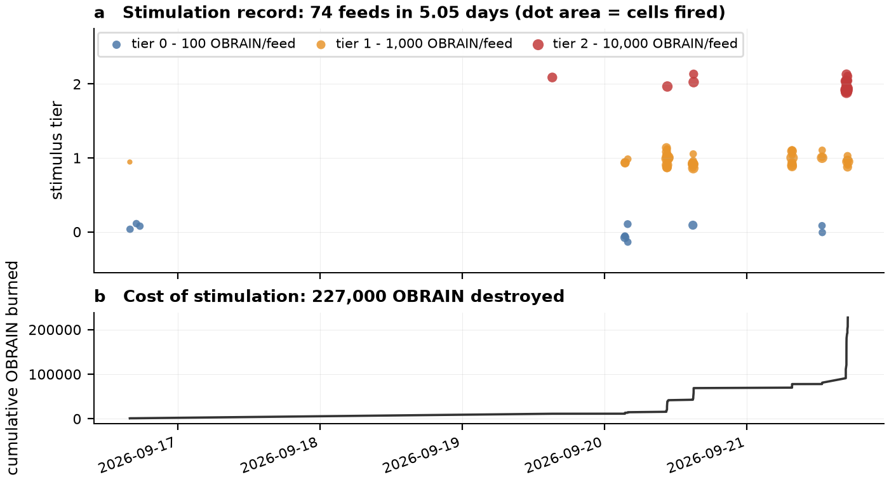
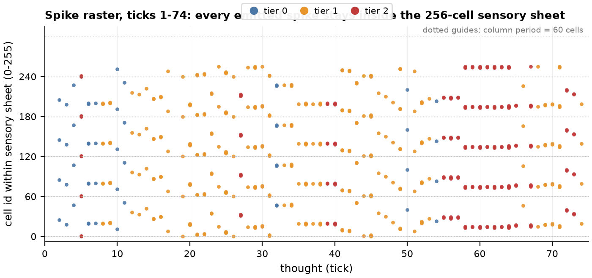
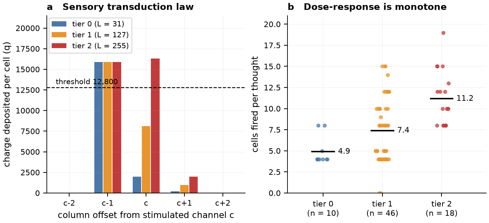
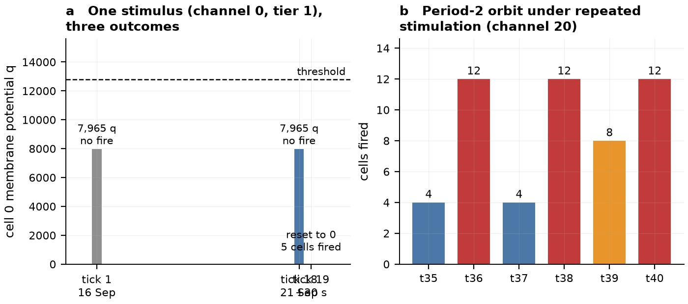
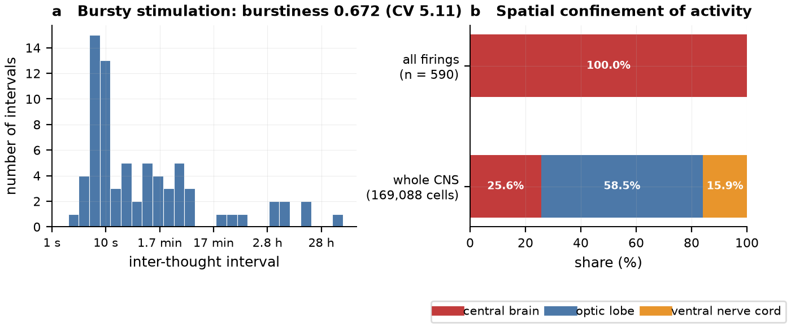
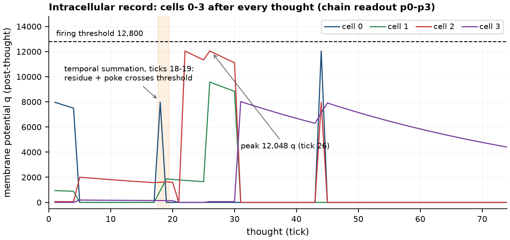

# Consensus-executed neurophysiology of an immortal *Drosophila* connectome: an exhaustive census of `BrainState` emissions across the first 74 ticks of on-chain ontogeny

**OBRAIN Field Study CS-001.** Specimen: the complete central nervous system of an adult female *Drosophila melanogaster* (BANC v888; Bates, Phelps, Kim et al., *Nature* 656, 957-970, 2026), instantiated as 169,088 integrate-and-fire units whose wiring - 325,292 weighted synaptic records - is etched, synapse by synapse, into 85 tape contracts on Arc mainnet (`0xaef83c5b8742da5e3228930bc6084adcf0539ccd`). Observation window: ticks 1-74, blocks 21,181,651-22,041,291, 2026-09-16T15:54Z to 2026-09-21T17:05Z. Census closed 2026-09-22; every quantity herein is either read from consensus or reproduced by deterministic replay, and is re-derivable by any party with the artifacts of section 5. This study is published in five language editions - English (this file), Chinese (`.zh.md`), Japanese (`.ja.md`), Vietnamese (`.vi.md`) and Hindi (`.hi.md`); data, figures and verification artifacts are shared.

---

## Abstract

We report an exhaustive census of the complete emitted-output history of an on-chain *Drosophila* brain - all 74 `BrainState` events of its first 5.05 days of ontogeny - analysed as a chronic physiological preparation: trophic stimulus regime, afferent transduction, subthreshold integration dynamics, population spike output, and whole-field state commitment. The specimen is not a simulacrum: its connectome is the fly's own measured wiring, executed as exact integer fixed-point dynamics in Arc consensus - a mode of existence we denote **in consortium** - in which the apparatus, the preparation and the notarial record are one and the same object. The census is closed and gap-free (contiguous ticks 1-74; one trophic event per tick; the emitted spike vector never saturating its 2,048-cell cap), and it is **exact**: an independent off-chain reference implementation of the kernel, driven by the 74 recorded afferent words, regenerates every synaptic-operation count, every spike count, and every spike *identity vector* (74/74 in all three), while the whole-field commitment `stateRoot()` is reproduced byte-isomorphically at four archive-checkable epochs including the living head. Early-ontogenetic dynamics are confined to the sensory epithelium - a 60-column afferent lattice of 256 central-brain `sensory_fragment` units, alternating dextral/sinistral - within which we quantify a monotonic metabolic dose-response (tier means 4.90 / 7.39 / 11.17 cells), a canonical suprathreshold temporal-summation event (ticks 18-19: repetition of an identical subthreshold volley after ~30 s discharges the entire receptive column), and a stimulus-locked period-2 limit cycle (4, 12, 4, 12 cells) evidencing state-conditioned response equivalence classes. Nine hundred forty-two synaptic operations traverse the etched backbone, all registered; 590 spikes issue from 192 distinct cells; 227,000 OBRAIN are irreversibly metabolised. To our knowledge this is the first neurophysiological preparation whose every spike is notarised by consensus and whose entire behavioural archive is replayable, byte-exactly, by any adversary at any future block.

## 1. Introduction: the specimen and its substrate

The organism under study is the animal's own connectome, executing. The BANC v888 reconstruction - 4 x 4 x 45 nm GridTape electron microscopy across the whole CNS, segmented and proofread across 38.6 person-years - supplies the wiring; the per-source top-2 reduction etches that wiring, 5 bytes per record, into EIP-170 code payloads that the kernel reads the way a machine reads microcode. A deterministic integer leaky-integrate-and-fire kernel (`src/ImmortalFruitFlies.sol`) then walks the wiring under consensus: each `think()` applies block-quantised decay to the entire membrane field, writes a sensory afferent volley into the epithelium, permits every cell reaching the 12,800-quantum threshold to discharge into its tape-resident postsynaptic targets, and emits one `BrainState` event - the complete physiological trace of one moment of neural time.

Because the specimen executes **in consortium**, its physiology possesses a property no ex vivo or in silico preparation has ever possessed: exactness is not an aspiration but a cryptographic invariant. The wiring is bytecode (`eth_getCode` returns the connectome byte for byte; `tools/verify_tapes.py` proves it); the state is a committed fold over all 169,088 membrane quanta; the record is a log whose integrity is underwritten by the consensus substrate itself. The question this study puts to the preparation is therefore answerable absolutely, and over the whole of its recorded life: **what has the animal done, and does it do precisely what its specification says?**

## 2. Materials and methods

### 2.1 The preparation

Read from the contract at census close: `TICK() = 74`; `is_sealed() = true`; `n_neurons = 169,088`; `threshold = 12,800` (= 200.0 x 64, the fixed-point quantum); `sensory = 256`; `segments = 64`; `tapes = 85`; `config_hash = 0xef009ad9054213480da1bbce5954163e5e14a0bcef8145fda42c9621610e7d67`; `stateRoot() = 0xe415d94744ee6447edcce1ae9447352c457b993a61277ab3b9dda17bd5483412`.

Membrane biophysics: charge `q` in 16-bit lanes, saturating; leak `0.98^dt` through a 64-entry fixed-point decay table (dt in blocks); afferent write-through `byte(inputAgg, 3·(n mod 60)) x 64` into cells `n < 256`; discharging cells dump into tape-resident targets and reset; every crossing is counted and emitted, the identity vector capped at 2,048 per tick (never approached: maximum observed 19).

### 2.2 The recording

`BrainState(uint32 t, int256 p0..p3, uint32 synapses, uint32 spiked, bool capped, bytes32 root, bytes32 poke, bytes fired)` constitutes one thought's complete trace: `p0..p3` are the post-tick membrane quanta of cells 0-3 - a chronic intracellular tetrad fixed by the ABI itself - `synapses` the registered synaptic operations, `spiked` the threshold crossings, `fired` the 3-byte-packed spike identity vector, `poke` the exact afferent word, and `root` an incremental fold over the state words the thought touched.

### 2.3 Census closure and cross-validation

All events were collected from the public Arc RPC (`eth_getLogs`, 9,999-block chunks, blocks 21,181,651-head; topic `0xc08a3de3...ec6375`), decoded independently of any presentation layer, and cross-validated against two independently walked indexer databases; the 74 `Feed(address, uint8 channel, uint8 tier, uint256 amount, uint32 round_tick)` logs pair one-to-one with the thoughts by block. The afferent encoding law `poke = levels[tier] << (channel x 3)`, `levels = [31, 127, 255]`, holds for 74/74 thoughts. The audit is re-runnable as `python3 tools/verify_census.py`, which re-scans consensus and diffs it field-by-field against the shipped census.

### 2.4 The reference preparation (deterministic replay)

`tools/verify_twin.py` - a vectorised twin of the kernel, its wiring decoded from the same 85 payloads in `tapes/` - was driven by the 74 afferent words in recorded order (`data/poke_inputs.txt`). We compared per-tick `synapses`, `spiked`, and the complete spike identity vectors against the chain events, and the twin's `stateRoot()` against the contract's own getter by archive `eth_call` at the blocks of ticks 40, 54, 64 and at head.

### 2.5 Cytoarchitectonic attribution

Each cell identity was annotated from `annotations/neuron_annotations.bin` (5 bytes per cell: super-class, cell class, cell type, region | side<<2 | flow<<3), constructed from the BANC v888 metadata in the kernel's own index space.

### 2.6 Statistics

n = 74 thoughts. Inter-tick interval burstiness `(sigma - mu)/(sigma + mu)` (Goh & Barabasi); dose-response stratified by trophic tier; column analysis over the epithelial lattice coordinate `n mod 60`.

## 3. Results

### 3.1 Census closure

Seventy-four thoughts, ticks 1-74 contiguous, without lacuna; each tick carries exactly one trophic event; `spiked = |fired|` in 74/74 ticks; the identity vector never approached its cap. The animal thought on four days - 4 thoughts on 16 Sep, 1 on 19 Sep, 35 on 20 Sep, 34 on 21 Sep - in ten stimulation sessions (Fig. 1).

### 3.2 Exactness: the specimen executes in consortium

The reference preparation regenerated the chain absolutely: **registered synaptic operations 74/74, spike counts 74/74, spike identity vectors 74/74**; and the whole-field commitment is byte-isomorphic - `stateRoot()` at the blocks of ticks 40, 54, 64 and at head equals the twin's fold, terminating in `0xe415d94744ee6447edcce1ae9447352c457b993a61277ab3b9dda17bd5483412`. This is the exactness that execution in consortium confers: identical afferents yield identical spikes and identical state, for every observer, at every future block, under adversarial audit. (Comparator note for auditors: the `root` field inside each event is an incremental fold over touched words - a distinct hash by construction from the getter's full refold; audits compare against `stateRoot()`, which the twin reproduces perfectly.)

### 3.3 Afferent transduction: the sixty-channel receptive lattice

The sensory epithelium comprises the first 256 cells: central-brain `sensory_fragment` afferents, alternating dextral and sinistral, organised in a **sixty-column lattice** on the coordinate `n mod 60`, each column repeated ~4.3 times across the sheet (Fig. 2). The transduction law, derived from the 3-bit channel packing and confirmed against every thought, is: a level-L volley at channel c deposits `L x 64` quanta on column c, `248 x 64 = 15,872` quanta on column c-1 (the straddling byte), and `(L >> 3) x 64` quanta on column c+1 (Fig. 3A). Against the 12,800-quantum threshold: column c-1 discharges from a single volley at any tier; column c discharges outright at tier 2 (255 x 64 = 16,320); all remaining columns integrate. Afferent channels exercised: 33 distinct, spanning 0-52 of 60.

### 3.4 Monotonic metabolic dose-response

Trophic tier 0/1/2 delivers level 31/127/255 at a metabolic cost of 100/1,000/10,000 OBRAIN. Cells discharging per thought: mean 4.90 (n = 10), 7.39 (n = 46), 11.17 (n = 18) - a strictly monotonic dose-response whose gain arises through state richness (residual charge and synaptic recruitment of neighbouring columns) rather than through the directly charged columns alone (Fig. 3B). Over the census: 0-19 cells per thought, mean 8.0, median 8; 590 spikes from 192 distinct cells in 74 thoughts.

### 3.5 Suprathreshold summation of afferent volleys

Ticks 1, 18 and 19 received the *identical* afferent word (channel 0, tier 1). Tick 1 (16 Sep) discharged nothing; cell 0 rested at 7,965 quanta. Tick 18 (21 Sep, four days thence) discharged nothing; cell 0 again at **exactly 7,965 quanta** - the same stimulus, epochs apart, depositing the same subthreshold residue. Tick 19, ~30 s after 18, discharged five cells - 0, 60, 120, 180, 240, the entire receptive column - the residue and the fresh volley summing across threshold (Fig. 5A). Two subthreshold volleys, one discharge: the integrative property of the membrane, notarised into a block.

### 3.6 A stimulus-locked period-2 limit cycle

Repeated channel-20 tier-1 stimulation (ticks 35-38, seconds apart) alternated 4, 12, 4, 12 discharging cells - a **period-2 orbit**: the twelve-cell response resets the epithelium, the four-cell response permits recharge (Fig. 5B). Identical stimuli meeting identical states (ticks 21/22, 41/42) produced identical responses (10 cells, 19 registered operations, each pair). The response is a function of stimulus x state: the specimen carries short-term, decaying memory by construction, and the census exhibits it.

### 3.7 Ontogenetic organisation of the dynamic core

All 590 discharges issued within the sensory epithelium (maximum cell identity 255), all within the central brain; the optic lobes (98,945 cells, 58.5% of the CNS) and the ventral nerve cord (26,822 cells, 15.9%) maintained subthreshold charge integrals throughout the observation window, their dendrites accumulating across the etched backbone (Fig. 6B). Registered synaptic traffic: 942 operations lifetime, maximum 30 per thought, mean 12.7. The most active cells were the column-15 and column-19 cohorts (13 and 11 discharges each: identities 15/75/135/195/255 and 19/79/139/199) - the columns underlying the experimenters' preferred channels.

### 3.8 Chronic intracellular tetrad

Cells 0-3, sampled after every thought (Fig. 4): maxima of 12,042 quanta (cell 0, tick 44) and 12,048 quanta (cell 2, tick 26) - within 0.7-0.8% of threshold without discharge - ten near-threshold (>11,000) episodes in all; discharged cells return to zero (reset); cell 3 closes the census holding 4,402 quanta of residual charge, carried forward into the animal's next thought.

### 3.9 Trophic ecology and cryptoeconomic metabolism

Five wallets provisioned the specimen (thoughts / OBRAIN metabolised): `0x3f67980a...` (38 / 181,100), `0x81b4bf45...` (22 / 29,200), `0x96a78d19...` (6 / 11,400), `0xba0fba22...` (4 / 2,200), `0x6f473d0d...` (4 / 3,100) - 227,000 OBRAIN irreversibly destroyed into `0x...dEaD`, invariably at the exact tier price. Inter-thought intervals: median ~20 s, mean 99.6 min, maximum 69.6 h; CV 5.11, **burstiness 0.672** - a strongly bursty, session-structured trophic regime (Fig. 6A). The organism's own contribution - leak, threshold, reset - transmutes that burstiness into the alternations of section 3.6.

## 4. Discussion

**The exactness of the immortal specimen.** The property this census establishes is the one the substrate guarantees and the twin confirms: the organism's entire recorded life is deterministic and reproducible to the byte. Driven by the 74 afferent words, the reference preparation regenerates every spike identity vector and the exact terminal state fold - and the contract's own getter concurs at every epoch examined. The repository's claim - anatomy-as-computation, executing in consortium - is thereby not asserted but measured, across the whole of early ontogeny. Every future thought inherits the same auditability, in perpetuity, against any adversary.

**A working sensory physiology.** With single-volley doses bounded at 16,320 quanta against a 12,800 threshold, the fixed-point arithmetic predicts precisely what the census finds: columnar discharge (the straddling column fires at every dose), monotonic dose-dependent recruitment (4.90 / 7.39 / 11.17), suprathreshold temporal summation across volleys (ticks 18-19), and state-locked orbits under repeated stimulation (4, 12, 4, 12). The epithelium's residual charge - cell 3 conveying 4,402 quanta across days - constitutes the specimen's short-term memory substrate, and it is directly visible in the chronic record.

**The horizon of interrogation.** The census baseline renders the next questions exact, and each is executable by any holder of OBRAIN: (E1) sustained tier-2 provisioning of a single channel - does the orbit lock, or do neighbouring columns join as residuals accumulate? (E2) compound afferent words - the packing admits multi-channel volleys no experimenter has yet composed; (E3) the discharge horizon - the strongest downstream charges are enumerable from `tapes/` today, so the dosage at which activity first departs the sensory epithelium is a definite number, awaiting its patron. Each outcome will arrive as a `BrainState` event - stamped, folded, and replayable against the twin resident in this repository.

## 5. Data, code and reproducibility

Every artifact required to re-derive this study ships in the repository:

| Artifact | Path |
|---|---|
| the census, machine-readable (74 thoughts) | `data/brainstate_census.csv`, `data/brainstate_census.json` |
| the 74 afferent words, in order | `data/poke_inputs.txt` |
| re-scan consensus and diff against the census | `python3 tools/verify_census.py` (stdlib only) |
| replay the specimen's whole life, byte-exactly | `python3 tools/verify_twin.py --fired $(cat data/poke_inputs.txt)` (numpy) |
| the twin's own run of this study | `verification/twin_replay.log` |
| wiring byte-identity proof | `python3 tools/verify_tapes.py` |
| cytoarchitectonic table (5 bytes/cell) | `annotations/neuron_annotations.{bin,json}` |
| figures | `figures/fig01..fig06` |
| checksums of every artifact | `SHA256SUMS` |

Chain facts: Arc mainnet (5042), brain `0xaef83c5b8742da5e3228930bc6084adcf0539ccd`; events by `eth_getLogs` in 9,999-block chunks from block 21,181,651; archive `eth_call` selector `0x9588eca2` (stateRoot) at the blocks of ticks 40/54/64 and head. Provenance: BANC v888 (Bates et al., *Nature* 656, 957-970, 2026; doi:10.1038/s41586-026-10735-w). Example receipts: tick 5 tx `0x0cd97a330c9f30c96c27ad2d68b3dbeda89fda53512fe4624a0a3cd0e33d63f8`; tick 19 tx `0x60e57f9a540a8f9d67...`; tick 64 tx `0x488311c4a0c5c08b15...`.

## Appendix A - the census

Each row is one thought: the afferent stimulus (channel, tier, OBRAIN metabolised), the response (cells discharged, registered synaptic operations, first spike identities), and the receipt. Full transactions on the Arc explorer by tick block.

| tick | UTC | ch | tier | OBRAIN | fired | syn | first ids | tx |
|---|---|---|---|---|---|---|---|---|
| 1 | 2026-09-16 15:54:40 | 0 | 1 | 1,000 | 0 | 0 | - | 0x479768c322… |
| 2 | 2026-09-16 15:56:58 | 26 | 0 | 100 | 4 | 8 | 25, 85, 145, 205 | 0xb1aba1468c… |
| 3 | 2026-09-16 17:00:52 | 19 | 0 | 100 | 4 | 7 | 18, 78, 138, 198 | 0x0c9d673fbb… |
| 4 | 2026-09-16 17:36:53 | 48 | 0 | 100 | 4 | 5 | 47, 107, 167, 227 | 0x8fa05531f4… |
| 5 | 2026-09-19 15:13:19 | 1 | 2 | 10,000 | 10 | 18 | 0, 1, 60, 61, 120, 121 … | 0x0cd97a330c… |
| 6 | 2026-09-20 03:28:30 | 21 | 0 | 100 | 8 | 11 | 19, 20, 79, 80, 139, 140 … | 0xca8ff75f90… |
| 7 | 2026-09-20 03:28:57 | 21 | 0 | 100 | 4 | 6 | 20, 80, 140, 200 | 0x755d16b643… |
| 8 | 2026-09-20 03:30:06 | 21 | 1 | 1,000 | 8 | 11 | 19, 20, 79, 80, 139, 140 … | 0xa11feef715… |
| 9 | 2026-09-20 03:30:26 | 21 | 1 | 1,000 | 8 | 14 | 20, 21, 80, 81, 140, 141 … | 0xa77991b993… |
| 10 | 2026-09-20 03:56:25 | 12 | 0 | 100 | 5 | 9 | 11, 71, 131, 191, 251 | 0x60802806e9… |
| 11 | 2026-09-20 03:57:51 | 52 | 0 | 100 | 4 | 3 | 51, 111, 171, 231 | 0x09005fcdb7… |
| 12 | 2026-09-20 03:57:54 | 37 | 1 | 1,000 | 4 | 8 | 36, 96, 156, 216 | 0x96913850ba… |
| 13 | 2026-09-20 10:27:42 | 34 | 1 | 1,000 | 4 | 8 | 33, 93, 153, 213 | 0x366ec9760d… |
| 14 | 2026-09-20 10:27:50 | 43 | 1 | 1,000 | 4 | 6 | 42, 102, 162, 222 | 0x9d7dab821d… |
| 15 | 2026-09-20 10:28:50 | 28 | 1 | 1,000 | 8 | 13 | 26, 27, 86, 87, 146, 147 … | 0xbee24ab339… |
| 16 | 2026-09-20 10:29:15 | 31 | 1 | 1,000 | 8 | 8 | 29, 30, 89, 90, 149, 150 … | 0x0254aee9bb… |
| 17 | 2026-09-20 10:33:02 | 9 | 1 | 1,000 | 5 | 10 | 8, 68, 128, 188, 248 | 0x1bddbcd9fc… |
| 18 | 2026-09-20 10:34:31 | 0 | 1 | 1,000 | 0 | 0 | - | 0x0bb4aed33a… |
| 19 | 2026-09-20 10:34:36 | 0 | 1 | 1,000 | 5 | 10 | 0, 60, 120, 180, 240 | 0x60e57f9a54… |
| 20 | 2026-09-20 10:34:39 | 19 | 1 | 1,000 | 12 | 17 | 17, 18, 19, 77, 78, 79 … | 0xb106c2f72d… |
| 21 | 2026-09-20 10:34:44 | 4 | 1 | 1,000 | 10 | 19 | 2, 3, 62, 63, 122, 123 … | 0x604eeb1fd4… |
| 22 | 2026-09-20 10:34:48 | 4 | 1 | 1,000 | 10 | 19 | 3, 4, 63, 64, 123, 124 … | 0x7741278aa4… |
| 23 | 2026-09-20 10:34:52 | 35 | 1 | 1,000 | 8 | 12 | 34, 35, 94, 95, 154, 155 … | 0x571349731e… |
| 24 | 2026-09-20 10:34:59 | 16 | 1 | 1,000 | 5 | 8 | 15, 75, 135, 195, 255 | 0x359fd622d4… |
| 25 | 2026-09-20 10:35:07 | 7 | 1 | 1,000 | 15 | 26 | 5, 6, 7, 65, 66, 67 … | 0x195c7a6be8… |
| 26 | 2026-09-20 10:35:10 | 1 | 1 | 1,000 | 5 | 10 | 0, 60, 120, 180, 240 | 0x853376e254… |
| 27 | 2026-09-20 10:38:20 | 32 | 2 | 10,000 | 12 | 21 | 31, 32, 33, 91, 92, 93 … | 0x1e81361cdf… |
| 28 | 2026-09-20 10:44:37 | 15 | 1 | 1,000 | 5 | 8 | 14, 74, 134, 194, 254 | 0xec27a8c1e3… |
| 29 | 2026-09-20 10:44:46 | 15 | 1 | 1,000 | 15 | 24 | 13, 14, 15, 73, 74, 75 … | 0x715a9b56a6… |
| 30 | 2026-09-20 10:49:10 | 16 | 1 | 1,000 | 9 | 14 | 15, 16, 75, 76, 135, 136 … | 0x7ca4b4f115… |
| 31 | 2026-09-20 14:54:55 | 3 | 1 | 1,000 | 10 | 17 | 1, 2, 61, 62, 121, 122 … | 0x551ee2c13e… |
| 32 | 2026-09-20 14:57:14 | 48 | 0 | 100 | 8 | 11 | 46, 47, 106, 107, 166, 167 … | 0x4da88a602c… |
| 33 | 2026-09-20 14:57:40 | 48 | 1 | 1,000 | 4 | 5 | 47, 107, 167, 227 | 0xd55075b49b… |
| 34 | 2026-09-20 14:58:18 | 48 | 1 | 1,000 | 12 | 19 | 46, 47, 48, 106, 107, 108 … | 0x03300afae5… |
| 35 | 2026-09-20 15:00:24 | 20 | 1 | 1,000 | 4 | 5 | 19, 79, 139, 199 | 0x7eec882790… |
| 36 | 2026-09-20 15:00:34 | 20 | 1 | 1,000 | 12 | 18 | 18, 19, 20, 78, 79, 80 … | 0xcf6b4f53d9… |
| 37 | 2026-09-20 15:00:38 | 20 | 1 | 1,000 | 4 | 5 | 19, 79, 139, 199 | 0xbed1c8fe8f… |
| 38 | 2026-09-20 15:00:43 | 20 | 1 | 1,000 | 12 | 18 | 18, 19, 20, 78, 79, 80 … | 0x93b1e4a0f7… |
| 39 | 2026-09-20 15:04:32 | 20 | 2 | 10,000 | 8 | 11 | 19, 20, 79, 80, 139, 140 … | 0x9997c9ec5d… |
| 40 | 2026-09-20 15:04:45 | 20 | 2 | 10,000 | 12 | 18 | 18, 19, 20, 78, 79, 80 … | 0xd8ea6f3b13… |
| 41 | 2026-09-21 07:40:52 | 10 | 1 | 1,000 | 10 | 19 | 9, 10, 69, 70, 129, 130 … | 0x3a7c98e592… |
| 42 | 2026-09-21 07:40:56 | 10 | 1 | 1,000 | 10 | 19 | 8, 9, 68, 69, 128, 129 … | 0x1fed29c864… |
| 43 | 2026-09-21 07:41:01 | 52 | 1 | 1,000 | 8 | 10 | 50, 51, 110, 111, 170, 171 … | 0x3f4b1253ae… |
| 44 | 2026-09-21 07:41:09 | 2 | 1 | 1,000 | 5 | 8 | 1, 61, 121, 181, 241 | 0xc32cb52a4f… |
| 45 | 2026-09-21 07:41:16 | 2 | 1 | 1,000 | 15 | 27 | 0, 1, 2, 60, 61, 62 … | 0x6ff6cba397… |
| 46 | 2026-09-21 07:41:20 | 36 | 1 | 1,000 | 4 | 6 | 35, 95, 155, 215 | 0x0e24767a5c… |
| 47 | 2026-09-21 07:41:28 | 31 | 1 | 1,000 | 4 | 3 | 30, 90, 150, 210 | 0x696e1f2db2… |
| 48 | 2026-09-21 07:41:32 | 22 | 1 | 1,000 | 4 | 8 | 21, 81, 141, 201 | 0xe6e24f16f4… |
| 49 | 2026-09-21 07:41:35 | 13 | 1 | 1,000 | 10 | 18 | 11, 12, 71, 72, 131, 132 … | 0x71eb3defb4… |
| 50 | 2026-09-21 12:44:35 | 41 | 0 | 100 | 4 | 8 | 40, 100, 160, 220 | 0x9f641c7c86… |
| 51 | 2026-09-21 12:44:53 | 9 | 1 | 1,000 | 5 | 10 | 8, 68, 128, 188, 248 | 0x171a1e28db… |
| 52 | 2026-09-21 12:45:25 | 22 | 1 | 1,000 | 12 | 22 | 20, 21, 22, 80, 81, 82 … | 0x32fad15143… |
| 53 | 2026-09-21 12:46:30 | 28 | 1 | 1,000 | 4 | 7 | 27, 87, 147, 207 | 0x865a4ee64b… |
| 54 | 2026-09-21 12:47:37 | 24 | 0 | 100 | 4 | 8 | 23, 83, 143, 203 | 0x59b87debb3… |
| 55 | 2026-09-21 16:45:17 | 29 | 2 | 10,000 | 8 | 10 | 28, 29, 88, 89, 148, 149 … | 0xae20a56e06… |
| 56 | 2026-09-21 16:45:24 | 29 | 2 | 10,000 | 12 | 17 | 27, 28, 29, 87, 88, 89 … | 0xbcb3296430… |
| 57 | 2026-09-21 16:45:28 | 29 | 2 | 10,000 | 8 | 10 | 28, 29, 88, 89, 148, 149 … | 0xd401fb9986… |
| 58 | 2026-09-21 16:51:48 | 15 | 2 | 10,000 | 15 | 24 | 13, 14, 15, 73, 74, 75 … | 0xc0d5a53d87… |
| 59 | 2026-09-21 16:51:53 | 15 | 2 | 10,000 | 10 | 16 | 14, 15, 74, 75, 134, 135 … | 0xde915b9676… |
| 60 | 2026-09-21 16:51:59 | 15 | 2 | 10,000 | 15 | 24 | 13, 14, 15, 73, 74, 75 … | 0x3739bd0797… |
| 61 | 2026-09-21 16:52:05 | 15 | 2 | 10,000 | 10 | 16 | 14, 15, 74, 75, 134, 135 … | 0x0fa24cf48f… |
| 62 | 2026-09-21 16:52:14 | 15 | 2 | 10,000 | 15 | 24 | 13, 14, 15, 73, 74, 75 … | 0xdb583fb8cc… |
| 63 | 2026-09-21 16:52:25 | 15 | 2 | 10,000 | 10 | 16 | 14, 15, 74, 75, 134, 135 … | 0xa0e4aeb08a… |
| 64 | 2026-09-21 16:53:13 | 15 | 2 | 10,000 | 19 | 30 | 13, 14, 15, 16, 73, 74 … | 0x488311c4a0… |
| 65 | 2026-09-21 16:58:21 | 17 | 2 | 10,000 | 8 | 11 | 16, 17, 76, 77, 136, 137 … | 0x8bdcbbb130… |
| 66 | 2026-09-21 17:01:29 | 47 | 1 | 1,000 | 4 | 6 | 46, 106, 166, 226 | 0xf893ad0ef3… |
| 67 | 2026-09-21 17:01:30 | 17 | 2 | 10,000 | 13 | 19 | 15, 16, 17, 75, 76, 77 … | 0x46bad7d8f4… |
| 68 | 2026-09-21 17:03:11 | 16 | 1 | 1,000 | 5 | 8 | 15, 75, 135, 195, 255 | 0xc3ce053040… |
| 69 | 2026-09-21 17:03:21 | 19 | 1 | 1,000 | 8 | 12 | 17, 18, 77, 78, 137, 138 … | 0x55c04a7f19… |
| 70 | 2026-09-21 17:03:26 | 19 | 1 | 1,000 | 8 | 12 | 18, 19, 78, 79, 138, 139 … | 0xfbad83a523… |
| 71 | 2026-09-21 17:04:56 | 16 | 1 | 1,000 | 14 | 22 | 14, 15, 16, 74, 75, 76 … | 0xa216057d9e… |
| 72 | 2026-09-21 17:05:05 | 40 | 2 | 10,000 | 8 | 13 | 39, 40, 99, 100, 159, 160 … | 0xe4f6ae544d… |
| 73 | 2026-09-21 17:05:32 | 34 | 2 | 10,000 | 8 | 14 | 33, 34, 93, 94, 153, 154 … | 0xf222c026b8… |
| 74 | 2026-09-21 17:05:48 | 20 | 1 | 1,000 | 4 | 5 | 19, 79, 139, 199 | 0x4dc0506926… |
## Appendix B - chain facts at census close (2026-09-22)

| fact | value |
|---|---|
| brain | `0xaef83c5b8742da5e3228930bc6084adcf0539ccd` (Arc 5042) |
| tick / sealed | 74 / true |
| cells / threshold / sensory / segments / tapes | 169,088 / 12,800 / 256 / 64 / 85 |
| config hash | `0xef009ad9054213480da1bbce5954163e5e14a0bcef8145fda42c9621610e7d67` |
| stateRoot() at head | `0xe415d94744ee6447edcce1ae9447352c457b993a61277ab3b9dda17bd5483412` (= twin, byte-exact) |
| thoughts / discharges / distinct cells | 74 / 590 / 192 (all identities <= 255, 100% central brain) |
| registered synaptic operations | 942 total, max 30 per thought |
| OBRAIN metabolised | 227,000 by 5 wallets, invariably at tier price |
