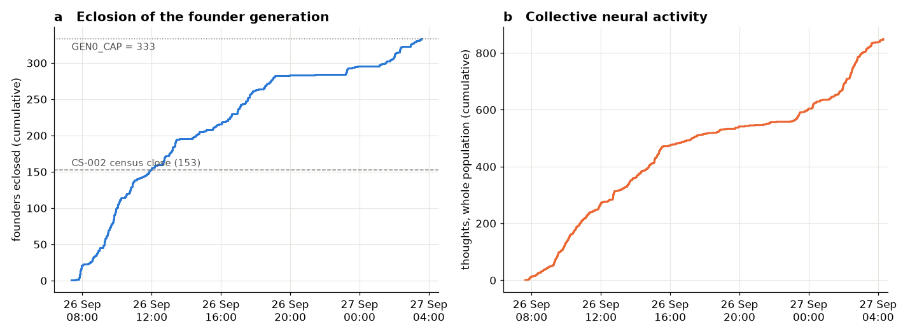
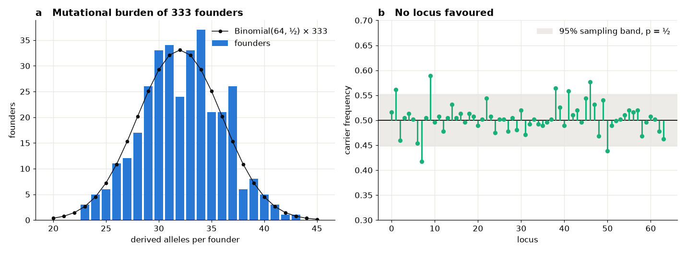
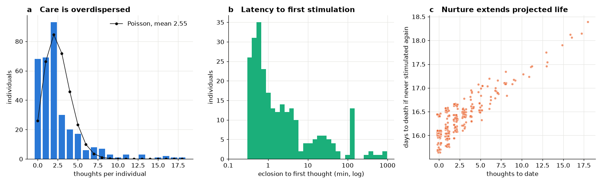
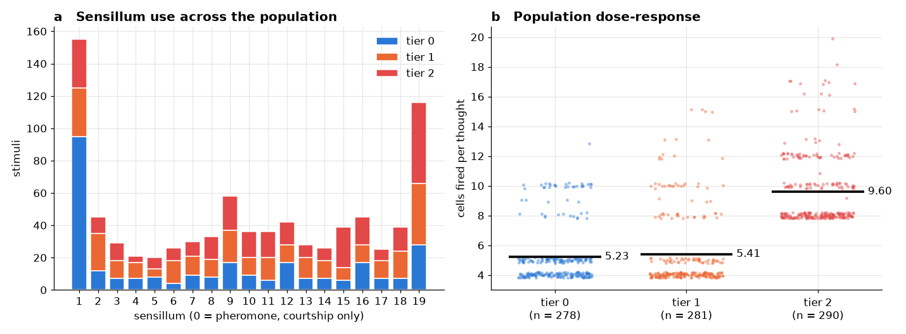
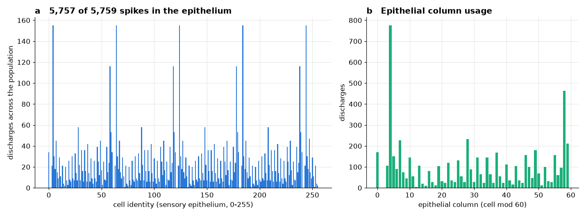
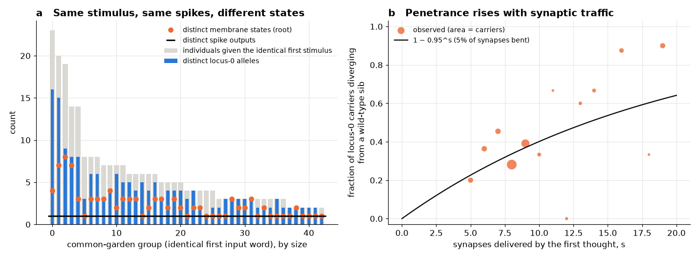

# The founder generation closed: demography, care, sensory ecology and cryptic genetic variation in 333 *Drosophila* descendants of the obrain connectome

**OBRAIN Field Study CS-003.** Subject: the complete founder generation (G0) of the Flybook population on Arc mainnet (chain 5042) - all 333 individuals the hub will ever eclose without parents (`GEN0_CAP = 333`), each carrying its own brain contract, all descended from the specimen of this repository (the Ancestor, `0xaef83c5b8742da5e3228930bc6084adcf0539ccd`). Observation window: blocks 22,703,390 (population hub deployed) to 22,971,428, the first eclosion at block 22,821,848 (2026-09-26T07:22Z), the last at block 22,964,932 (2026-09-27T03:33Z), the census closed at block 22,971,428 (2026-09-27T04:28Z). Every quantity herein was read from consensus through the public RPC or recomputed from what consensus holds; nothing comes from an indexer or a web page. CS-002 audited the first 153 founders; this study closes the generation and adds what CS-002 left out: the population's life history, its care, and its physiology as a function of genotype.

---

## Abstract

The Flybook founder generation is closed: 333 of 333 parentless individuals eclosed in 20.2 hours, and no further founder can exist. We treat the closed generation as a field population and describe it at four levels. **Identity and germline.** Every individual thinks with the Ancestor's wiring (85/85 tapes, byte-identical to `tapes/`), carries a distinct 45-byte clone of one `Connectome`, and has a genotype that replays exactly from `keccak(blockhash(n − 1), flyId, keeper)` (333/333). The pool keeps the statistics of its recipe at more than twice CS-002's sample: 32.25 ± 3.86 derived alleles per founder (Binomial(64, ½)), no locus beyond chance (χ²₆₄ = 77.5, *p* = 0.12), linkage disequilibrium at its drift floor (mean *r*² = 0.0029 = 1/*n*), no allele shared identical-by-state, all 333 genotypes distinct. **Demography and life history.** At census close the population is a single even-aged cohort of 333 living, free juveniles, aged 0.9-21.1 h (median 15.8 h). None has reached the one-day adult age at which courtship becomes possible, so the absence of any courtship, egg, death or diapause is not a behavioural finding but a developmental one: the population is pre-reproductive by construction. **Care.** 849 stimuli from 134 of the 172 keepers produced 849 thoughts in 265 individuals. Care is strongly overdispersed (variance/mean 3.44; Gini 0.54; 68 individuals never stimulated, one stimulated 18 times), given almost at once after eclosion (median latency 1.1 min), and given only by each individual's own keeper (849/849). Every thought extended its individual's life by six hours, so nurture is already written into the projected survival of each fly (Spearman ρ = 0.77 between thoughts received and projected death). **Physiology and genetics.** 5,759 spikes and 9,726 synaptic deliveries were recorded; 5,757 of the spikes (99.97 %) arose in the kernel's 256-cell input layer, reproducing across 265 brains the transduction law CS-001 derived from one (a step in response at tier 2, where the stimulated column itself crosses threshold: 5.23 / 5.41 / 9.60 cells per thought). The first discharge outside that layer in the lineage was recorded twice: an optic-lobe cell, 82,570, recruited in two individuals by the same input word. Finally, the population provides a natural common-garden experiment: 257 individuals received, as their first thought, one of 43 input words shared with at least one other individual, from an identical initial state. In all 43 groups the spike output was identical across genotypes, yet in 27 the committed membrane states diverged - and in 43/43 groups the post-thought state is exactly a function of the allele carried at a single locus, locus 0, the gene of the segment that holds the input layer. The divergence of carriers from wild-type siblings (57/132) matches the penetrance predicted from the kernel's mutation arithmetic, 1 − 0.95ˢ over the *s* synapses delivered (51.3 expected, *p* = 0.33). Genotype acts on these brains now, below threshold and invisibly in their behaviour: cryptic genetic variation, observed at the resolution of a single synapse.

## 1. Introduction: a closed founder generation

CS-002 audited a population halfway through its founding. The recipe forbids a second founding: `Ecology.GEN0_CAP` is a constant, `Hatchery.eclose` reverts with `Gen0SoldOut` once 333 founders exist, and every later individual must be the child of an accepted courtship. At block 22,964,932 the 333rd founder eclosed. From that block on, the population's gene pool can change only by segregation and mutation in the recorded pedigree; the founder pool this study describes is the whole of the population's standing variation, fixed forever.

A closed generation invites the questions a field biologist asks of a newly established population before it breeds: who is in it, how old they are and when they will be able to reproduce; how they are being maintained; what their nervous systems are doing; and whether the genetic variation that distinguishes them already shows in their physiology. The last question is the one this preparation can answer exactly. All 333 brains share one wiring and start from one state; they differ only in their genomes and in the stimuli their keepers give them. Where two individuals received the same stimulus from the same state, any difference between them is genetic, and it can be measured in the state the chain commits after each thought.

## 2. Materials and methods

### 2.1 The population and its organs

| Organ | Address | Role |
|---|---|---|
| Hub (`Drosophila`, proxy) | `0x14b557957d378b56511785b408a21c93e79feb36` | ecloses, senses, thinks, courts; keeps the register; emits every population event |
| `Holotype` | `0xb0725bf519786c8d2798e99d45c8c7fe886be73b` | the species: the Ancestor's configuration and tape addresses |
| `Connectome` (implementation) | `0xcaa923d6dbe59e780e32914257cbbf8deae4c5d2` | the soma every brain clone delegates to; emits each brain's `Thought` with its spike list |
| `Amber` | `0x82e820049cd4d1110f1560f2eed623305c704dee` | the record of the dead (`Interred`) |
| `Rewards` | `0x7a525aa5daf37214a4cf7455a2ac84d6af4fe9ec` | the population's ledger (`Founder`, `Lineage`, `Credited`, `Claimed`) |
| The Ancestor (this repository's specimen) | `0xaef83c5b8742da5e3228930bc6084adcf0539ccd` | the type specimen, read only |

### 2.2 Life history as the contracts define it

The population's life-history rules are code (`Ecology.defaults`, `Society`, `Thinking`), and we describe them in the terms a life table uses.

- **Eclosion.** A founder ecloses as a juvenile with 30 days to live (`baseLifespan`).
- **Nurture.** A keeper stimulates a fly by writing a charge into one of its twenty sensilla (`sense(fly, sensillum, tier)`; tiers 0/1/2 write 31/127/255). The fly thinks in the same transaction, on that afferent word; each thought adds six hours to its life (`lifespanPerThought`), up to 90 days from eclosion (`maxLifespan`).
- **Diapause.** A fly left without a thought for 72 hours enters diapause: it cannot court, and on waking the time slept is charged against its life. A fly never stimulated again dies at `deathMoment`, halfway between the onset of diapause and its stored `deathAt`.
- **Maturity and courtship.** A fly may court or be courted only as an adult, one day after eclosion (`adultAge`), at most once per 24 hours (`breedCooldown`). Sensillum 0, the pheromone, is written only by courtship; a courtship is accepted when the target's own brain, in the thought the pheromone evokes, fires at least `selectivity` neurons in its courtship region.
- **Death.** Death is lazy: nothing is written when a fly dies. Anyone may later `entomb` it, which writes one immutable row into `Amber`.

### 2.3 The census

Every log emitted by the hub, by `Amber` and by `Rewards` from the hub's deployment to block 22,971,428 was collected (`eth_getLogs`, 9,999-block chunks), together with every `Connectome.Thought` log emitted by any address (topic `0x5a417a3a…39ac`); each brain's `Thought` was paired with the hub's `Thought` in the same transaction, giving for every thought its keeper, sensillum, tier, fee, input word, synaptic deliveries, spike count, the identities of the fired cells, and the root of the membrane state it committed. At the same pinned block the hub was read for every fly: `flyOf` (eclosion time, stored `deathAt`, last thought, thoughts), `deathAtOf`, `lifeOf` (alive / diapause / dead), `statusOf`, and the hub's `flyCount`, `eggCount`, `gen0Minted` and `baseFee`.

Species, soma, germline and physiological commitment were audited with `tools/verify_flybook.py` exactly as in CS-002 (section 2.3 there), now over 333 founders; its state reads were pinned at the block of the audit run, shortly after census close.

### 2.4 The common-garden design

A brain's first thought starts from its initial fold: every potential zero, every last-active tick zero. The kernel's input word for that thought is `inputAgg = attention | Σ charge(s) << (6 + 9s)`, with `attention = keccak(afferent, tick) mod 64`: a function of the stimulus and the tick only. Two individuals given the same sensillum at the same tier as their first stimulus therefore receive the same input word into the same state, and the kernel's decay is counted in ticks, not blocks, so the wall-clock time between them is irrelevant. Whatever differs between them after that thought is their genotype's doing. We grouped all first thoughts by input word and, within each group, compared spike identities, synaptic deliveries and the committed `root` (an incremental fold over every state word the thought wrote: `Connectome.think`).

The kernel's input layer is cells 0-255, all in segment 0 of the 64-segment scan (166 words, 2,656 cells, per segment). A fired cell delivers its synapses under the allele of the segment being scanned (`Connectome.mutatedWeight`: a derived allele bends each synapse, keyed by allele and target, with probability 50/1000, by up to ±25 % of its weight). A first thought's deliveries are made by input-layer cells, so the prediction is sharp: **the post-thought state depends on the genotype only through locus 0**, and a carrier of a derived allele at locus 0 diverges from a wild-type sibling given *s* synaptic deliveries with probability 1 − (1 − 0.05)ˢ.

### 2.5 Statistics

*n* = 333 founders, 849 thoughts. Population-genetic tests as in CS-002 (section 2.4 there). Care: dispersion index (variance/mean of thoughts per individual, 1 under Poisson), Gini coefficient; inter-thought intervals across the population with burstiness (σ − μ)/(σ + μ). Dose-response by Kruskal-Wallis across tiers. Life history: Spearman correlation of thoughts received with projected death. Penetrance: observed divergences against the summed expectation Σ 1 − 0.95ˢ, exact binomial test on the pooled rate. Cell identities annotated from `annotations/neuron_annotations.bin` (BANC v888 metadata, kernel index space).

## 3. Results

### 3.1 The census: a closed generation, audited

| Check | Result |
|---|---|
| `Eclosed` logs, all generation 0; `flyCount` = `gen0Minted` | 333; 333 = 333 = `GEN0_CAP` |
| `Holotype.tape(i) == Ancestor.tapes(i)`; tapes byte-identical to `tapes/` | **85/85**; **85/85** |
| brain is the `Connectome` clone naming the `Holotype`; register agrees | **333 / 333** |
| genotype reproduced from `blockhash(n − 1)`, fly id, keeper | **333 / 333** |
| brain's stored `genome()` equals the `Eclosed` genome | **333 / 333** |
| last `Thought` commits to the brain's `tick()` and `rootDirty()` | **265 / 265** individuals that have thought |
| distinct genotypes / eclosion blocks / keepers | 333 / 332 / 172 |

The founders of CS-002 are rows 1-153 of this census, unchanged. The generation eclosed in 20.2 hours in two waves (Fig. 1a): 282 founders by 19:07Z on 26 September, a nocturnal lull of four hours in which only two eclosed (19:56Z, 21:25Z), and a second, smaller wave of 49 from 23:11Z to 03:33Z on 27 September. Each founder cost its keeper 200,000 OBRAIN (the constant `GEN0_START_PRICE`; 66.6 M OBRAIN in all). The per-wallet cap of three shaped the keeper structure: 72 keepers hold one founder, 39 two and 61 three; 202 founders were eclosed through one of 28 referrers.

### 3.2 Genetic architecture of the complete founder pool

| Quantity | Observed (*n* = 333) | Expected under the recipe |
|---|---|---|
| derived alleles per founder, mean ± sd | 32.25 ± 3.86 (range 23-43) | 32 ± 4; *t* *p* = 0.24, variance *p* = 0.39 |
| carrier frequency per locus | 0.417-0.589, mean 0.504 | 0.5; pooled χ²₆₄ = 77.53, *p* = 0.12; 7 loci at *p* < 0.05 (3.2 expected) |
| pairwise distance (loci differing in presence) | mean 31.98, range 16-50 | 32 |
| linkage disequilibrium, mean *r*² over 2,016 pairs | 0.0029 (max 0.038) | 1/*n* = 0.0030; 104 pairs with *n r*² > 3.84 against 101 expected |
| derived alleles identical-by-state between founders | 0 | ≈ 0 (2³² states) |
| gene diversity *H*, mean over loci | 0.751 | ≈ 0.75 |
| burden, founders 1-153 vs 154-333 | 32.42 vs 32.10 | equal; Mann-Whitney *p* = 0.73 |

Doubling the sample moved every statistic toward its expectation and none away from it (Fig. 6): the late founders are drawn from the same source as the early ones, the pooled carrier-frequency test remains unremarkable, and the seven nominally significant loci are what 64 tests at α = 0.05 on a sample of 333 produce when one allows for their dispersion (the pooled test is the correct one and is not significant). The G0 is, at its final size, an unstructured infinite-alleles sample: 10,739 derived alleles, every one private to its carrier. Each will be, in the pedigree to come, an unambiguous marker of descent.

| Trait (loci) | Wild type | Variant classes | χ² (df), *p* |
|---|---|---|---|
| eyes (0-7) | red 3 | brown 93 · sepia 89 · vermilion 82 · white 66 | 5.15 (3), 0.16 |
| body (8-15) | wild 0 | yellow 123 · ebony 108 · tan 102 | 2.11 (2), 0.35 |
| wings (16-23) | normal 3 | curly 114 · vestigial 108 · dumpy 108 | 0.22 (2), 0.90 |
| size (24-31) | medium 1 | small 169 · large 163 | 0.11 (1), 0.74 |

Wild type needs all eight loci of a group empty (1/256; 1.30 expected per trait in 333 founders): 3, 0, 3 and 1 observed (flies 43, 260, 323 red-eyed; 11, 93, 144 normal-winged; 245 medium-sized). The wild-winged excess CS-002 noted at *n* = 153 has not grown: no founder after fly 144 is wild-winged, and 3 against 1.30 is unremarkable (Poisson *P*(≥ 3) = 0.14).

### 3.3 Demography: one living, pre-reproductive cohort

At census close `lifeOf` returns *alive* for 333/333 and `statusOf` returns *free* for 333/333; no fly has been detained or exiled. The population is a single even-aged cohort: ages range from 0.9 h to 21.1 h (median 15.8 h). The adult age is 24 h; **not one individual is yet an adult**, and the first founder comes of age at 2026-09-27T07:22Z, three hours after census close. The quiescence of the reproductive machinery is therefore complete and expected:

| Event | Count | Why |
|---|---|---|
| `Advertised`, `Courted`, `Accepted`, `Rejected`, `Withdrawn` | 0 | no adult exists to advertise or be courted |
| `Laid`; `eggCount` | 0; 0 | no courtship accepted |
| `Woke` (diapause) | 0 | the longest interval without a thought is 21.1 h < 72 h |
| `Entombed`, `Interred` | 0 | the earliest projected death is 15.6 days away |
| `Judged` | 0 | no arbitration |

In the vocabulary of a life table, the census catches the cohort at *x* < 1 day with survivorship *l*ₓ = 1 and fecundity *m*ₓ = 0 by definition. CS-002 recorded that no mating had been accepted and left inheritance to this study; the reason it was absent is now clear, and the pedigree will begin, at the earliest, with the first cohort's adulthood.

### 3.4 Care: an overdispersed, immediate and strictly parental regime

849 `Sensed` events each paired one-to-one, by transaction, with one `Thought`: the fly thinks in the transaction that stimulates it. Every one of the 849 stimuli was sent by the fly's own keeper, and no founder has changed keeper (the hub's 333 `Transfer` logs are the 333 mints). Care is therefore strictly the responsibility of the individual who eclosed the fly - no allo-parental care exists in this population yet.

| Quantity | Value |
|---|---|
| keepers who stimulated at least once | 134 of 172 |
| individuals stimulated at least once | 265 of 333 (68 never) |
| thoughts per individual, mean; variance/mean | 2.55; 3.44 |
| Gini coefficient of thoughts; share of the top 10 % (34 flies) | 0.537; 38.5 % |
| most-stimulated individuals | fly 196 (18), fly 4 (17), fly 31 (16) |
| eclosion to first thought, median (mean) | 1.1 min (26.0 min); 212 of 265 within 10 min |
| interval between consecutive thoughts, population, median | 31 s; burstiness 0.371 |

The distribution of care departs strongly from Poisson (Fig. 2a): there are more unstimulated individuals (68 against 26 expected) and more heavily stimulated ones than chance would give, with the mode at two thoughts. Most care is given at once (Fig. 2b): the distribution of latency is dominated by a peak under a minute - keepers stimulating the fly in the session in which they eclosed it - with a tail of individuals first stimulated hours later. Across the population the pace of thought is session-structured (Fig. 1b), rising in the two eclosion waves and nearly stopping in the night between them.

Nurture is already written into each individual's life. A fly's stored `deathAt` is its eclosion plus 30 days plus six hours per thought, so the population's stored lifespans span 30.0-34.5 days. Its *projected* death - the moment it will die if no keeper ever stimulates it again, diapause charge included - lies 15.6-18.4 days after census close (median 16.3), and is ranked by the care received (Spearman ρ = 0.77, *p* = 1.8 × 10⁻⁶⁷; Fig. 2c). The spread within each level of care is age: among the 68 never-stimulated flies, projected death is ordered exactly by eclosion (ρ = 1.00).

The population's feeding has not raised its resource price. The hub's `baseFee`, which rises when an epoch's thoughts exceed their target (360), sat at its floor of 500 OBRAIN through all 22 `BaseFeeChanged` logs of the window (37 epochs closed); tier prices were constant at 500 / 2,000 / 4,000 OBRAIN, and the 849 stimuli cost 1,861,000 OBRAIN in all (278 × 500 + 281 × 2,000 + 290 × 4,000). The `Rewards` ledger registered each founder once (`Founder`, `Lineage`: 333 each).

### 3.5 Sensory ecology and the population dose-response

Keepers used all nineteen sensilla open to them (1-19; sensillum 0, the pheromone, is written only by courtship), but not evenly (Fig. 3a): sensillum 1 (155 stimuli) and sensillum 19 (116) - the first and last in the interface's order - account for a third of all stimuli, the other seventeen 20-58 each. Tiers were used almost equally (278 / 281 / 290).

The population's dose-response has a step, not a slope (Fig. 3b): 5.23, 5.41 and 9.60 cells fired per thought at tiers 0, 1 and 2 (Kruskal-Wallis *p* = 1.4 × 10⁻⁸³). This is CS-001's transduction law, now observed across 265 brains. Sensillum *s* sits on kernel channel *c* = 2 + 3*s*. Column *c* − 1 reads the straddling byte and receives 248 × 64 = 15,872 quanta at every tier, over the 12,800 threshold: every stimulus fires it. Column *c* receives *L* × 64 quanta: 1,984 and 8,128 at tiers 0 and 1, subthreshold; 16,320 at tier 2, suprathreshold. Tier 2 alone adds the stimulated column's own four or five cells. The column counts confirm it cell by cell (Fig. 5b): column 4 (column *c* − 1 of sensillum 1) discharged 775 times, 155 stimuli × 5 cells; column 58 (sensillum 19) 464 times, 116 × 4. CS-001's Ancestor, stimulated with the same levels through a different channel map and carrying days of residual charge, showed a graded response (4.90 / 7.39 / 11.17); the founders, each young and near its initial fold, show the law bare.

### 3.6 Spatial confinement and the first recruitment beyond the input layer

| Quantity | Value |
|---|---|
| spikes; synaptic deliveries | 5,759; 9,726 |
| cells fired per thought, range (mean) | 4-20 (6.78); spike list never capped |
| synaptic deliveries per thought, max | 38 |
| distinct cells ever fired | 248 |
| spikes in the input layer (cells 0-255) | 5,757 (99.97 %) |

The population's neural activity is confined, as the Ancestor's was, to the kernel's input layer (Fig. 5a), 247 of whose 256 cells have fired. We note that the BANC v888 annotations place in this layer a mixture of cell types rather than primary sensory neurons alone: 160 central-brain intrinsic cells (among them Kenyon cells of the mushroom body, KCγ-m, KCαβ, KCα′β′), 49 sensory cells, 32 glia, 11 descending neurons, 3 visual centrifugal neurons and one tracheal cell, placed first by the index rule (a lexicographic sort by region rank). The layer functions as an epithelium because the kernel writes afferent charge into it, not because of its cells' identities; this refines the description of CS-001, section 3.3.

Two spikes arose outside it. In fly 76 and fly 290, at the second thought of each, cell **82,570** discharged - a cell the BANC v888 metadata annotates to the optic lobe and to nothing finer (no super-class, class or type). The two individuals are unrelated founders with different first stimuli; their second stimuli were the same word, `0xff000035` (sensillum 2 at full charge 255, attention bucket 53), and it is the only time that word occurred in the population. Fly 290 is wild-type at locus 0, fly 76 a carrier. The recruitment is thus stimulus-specific and replicated (2/2), and not a property of either genotype: the input word selects, through its attention bucket, a scan whose deliveries reach this cell with enough charge to cross threshold. It is the first discharge in the obrain lineage outside the input layer - the Ancestor's 590 spikes in CS-001 never left it - and the first region-3 entry (`regions[3] = 1`) in any `Thought` log of the population.

### 3.7 Cryptic genetic variation: one locus, below threshold

Of the 265 first thoughts, 257 fell into 43 groups of two or more individuals sharing an input word (51 distinct words in all; the largest group held 23 individuals). Within each group the individuals started from the same state and received the same input; they differ only in genotype (section 2.4).

| Result | Groups |
|---|---|
| spike identities and synaptic deliveries identical across all members | **43 / 43** |
| committed membrane states (`root`) identical across all members | 16 / 43 |
| committed membrane states diverging between members | 27 / 43 |
| post-thought state an exact function of the **locus-0** allele | **43 / 43** |
| wild-type-at-locus-0 members sharing one state | 41 / 41 groups that contain them |

The genotype does not change what these brains do on their first thought - which cells fire, how many synapses are delivered - but it changes the state they are left in (Fig. 4a). And of the 64 loci of the genome, only one matters for it: every divergence within every group is explained by the allele at locus 0, and every pair of individuals sharing a locus-0 allele (in particular, every pair of wild types at locus 0) ends the thought in the same state, whatever their other 63 loci carry. This is the kernel's architecture expressed as genetics: the first thought's deliveries are made by cells of segment 0, and segment 0's synapses are read under locus 0.

The penetrance of a derived locus-0 allele follows the arithmetic of the mutation overlay (Fig. 4b). Of 132 carriers that have a wild-type sibling in their group, 57 diverge from it (43 %). A carrier diverges if any of the *s* synapses delivered hits the 5 % of targets its allele bends; summed over carriers, 1 − 0.95ˢ predicts 51.3 divergences, and the observed 57 are consistent with it (binomial *p* = 0.33). Penetrance rises with synaptic traffic as the model requires - about 0.2 at *s* = 5, about 0.9 at *s* = 16-19.

This is, in the classical sense, cryptic genetic variation (Gibson and Dworkin 2004): heritable differences with no effect on the phenotype under ordinary conditions, revealed only when conditions change. Here the hidden phenotype can be read directly - it is a subthreshold displacement of membrane charge, committed to the chain as a root - and the conditions that would reveal it are known: any later stimulus that brings a bent synapse's target near threshold will fire it in a carrier and not in a wild type, or the reverse. Canalisation (Waddington 1942) is here a property of the threshold: variation is buffered as long as the charge it moves stays below 12,800 quanta. Locus 0 is also the first locus of the eye-colour group (loci 0-7): the same allele that moves the input layer's state contributes to the eye marker, a pleiotropy by construction.

## 4. Discussion

**What was shown.** The founder generation is closed, complete and exactly what its recipe says: 333 individuals of one species, each with its own body and an unsteerable genotype, together an unstructured infinite-alleles pool. On its first day the population is a single cohort of juveniles, maintained by its keepers in a strongly unequal regime that is already inscribed in each individual's projected life. Its brains reproduce, individual by individual, the transduction law of the Ancestor, and at their first thought they already differ by genotype - at one locus, below threshold, with the penetrance the kernel predicts.

**What the biology is.** The life-history parameters are designed, not measured: a fruit fly ecloses as an adult and lives about two months at 25 °C, whereas these individuals are juveniles for a day and are given 30-90 days of life by their keepers' attention. "Care" is the keeper's payment for a stimulus, and the analogy to parental provisioning is structural (it is the only source of life extension, and it is given only by the individual's keeper), not physiological. The input layer is an index range of the connectome, not an anatomical sensory organ, and its population of Kenyon cells, glia and descending neurons is an artefact of the index rule. The genetic effect demonstrated in section 3.7 is real in the strict sense - a different genotype, the same input, a different committed state - and its magnitude and scope follow from the design (sparse ±25 % synaptic-weight perturbations, read segment by segment), which the census confirms rather than discovers.

**What is new.** The common-garden experiment - genetically different individuals raised in an identical environment and given an identical stimulus - is the oldest method of separating genotype from environment, and its limit in any real organism is that the environment is never exactly identical. Here it is: the input word and the initial state are equal by construction, the difference in outcome is committed by consensus, and the causal locus can be named. The 43 groups arose by accident, from keepers' choices; nobody designed the experiment, and anyone can repeat the analysis at any later block.

**What comes next.** From 2026-09-27T07:22Z the founders begin to come of age. The first `Advertised` and `Courted` logs will open the pedigree; each accepted courtship will fix an egg's seed from the mother's brain state, and each child will be auditable against `Meiosis.cross` as CS-002 section 3.7 specifies. The courtship ruling is itself a behavioural phenotype (fired neurons in the courtship region against a selectivity set by the target's fidelity axis), so mate choice in this population will be exercised by the brains whose cryptic variation is recorded here.

**Limitations.** The window covers one day of a population whose individuals may live ninety. The common-garden analysis uses first thoughts only; after the first thought, individuals' states and histories differ and the attribution of differences to genotype requires replay, which this study does not attempt (a vectorised twin exists for the Ancestor, `tools/verify_twin.py`, but not yet for the mutation overlay). Physiology is audited as commitment consistency and spike records, not as full-state replay. The randomness of every genotype remains the chain's: unpredictable to keepers and to the hub, not to the producer of the preceding block.

## 5. Reproduction

From the repository root, reads only:

| Claim | Command | Output at census close |
|---|---|---|
| the Ancestor's tapes are `tapes/` | `python3 tools/verify_tapes.py` | `85/85` |
| species, soma, germline, physiology; the founder census | `python3 tools/verify_flybook.py --check research/2026-09-27-flybook-generation-zero/data/founder_census.csv` | `wiring … 85/85`, `census … 333 rows, identical`, `0 mismatches` |
| CS-002's 153 founders are unchanged | `head -154 research/2026-09-27-flybook-generation-zero/data/founder_census.csv \| diff - research/2026-09-26-flybook-founders/data/founder_census.csv` | no output |

The thought census (`data/thought_census.csv`) is the hub's `Thought` and `Sensed` logs (topics `keccak("Thought(uint256,address,uint32,uint256,uint32,uint32,uint16[8],uint64)")`, `keccak("Sensed(uint256,address,uint8,uint8,uint256)")`) joined by transaction with each brain's `Connectome.Thought` log (topic `0x5a417a3a…39ac`), from block 22,703,390 to 22,971,428. Every result of sections 3.4-3.7 is a computation on it and on the founder census: section 3.7, for example, groups rows with `tick = 1` by `input_agg` and compares `fired`, `synapses` and `root` against the locus-0 allele (the first 8 hex digits of `genome` in the founder census). Requires Python 3 and pycryptodome; the statistics additionally used SciPy, the figures Matplotlib.

Artifacts: `data/founder_census.csv` - one row per founder, fields as in CS-002; `data/thought_census.csv` - one row per thought: fly, tick, block, timestamp, keeper, sensillum, tier, fee (OBRAIN), input word, synaptic deliveries, spikes, committed root, and the fired cells; `figures/` - Figs. 1-6; `verification/verify_flybook.log`, `verification/verify_tapes.log` - the audit runs. `SHA256SUMS` covers all of them.

## References

1. Bates, A.S. et al. *Distributed control circuits across a brain-and-cord connectome.* Nature 656, 957-970 (2026). doi:10.1038/s41586-026-10735-w.
2. OBRAIN Field Study CS-001. *Consensus-executed neurophysiology of an immortal Drosophila connectome.* `research/2026-09-22-brainstate-census/` (2026).
3. OBRAIN Field Study CS-002. *A founder generation dealt by consensus.* `research/2026-09-26-flybook-founders/` (2026).
4. Gibson, G. & Dworkin, I. *Uncovering cryptic genetic variation.* Nature Reviews Genetics 5, 681-690 (2004).
5. Waddington, C.H. *Canalization of development and the inheritance of acquired characters.* Nature 150, 563-565 (1942).
6. Kimura, M. & Crow, J.F. *The number of alleles that can be maintained in a finite population.* Genetics 49, 725-738 (1964).
7. Hill, W.G. & Robertson, A. *Linkage disequilibrium in finite populations.* Theoretical and Applied Genetics 38, 226-231 (1968).
8. Nei, M. *Analysis of gene diversity in subdivided populations.* PNAS 70, 3321-3323 (1973).
9. Lindsley, D.L. & Zimm, G.G. *The Genome of Drosophila melanogaster.* Academic Press (1992).
10. Goh, K.-I. & Barabási, A.-L. *Burstiness and memory in complex systems.* EPL 81, 48002 (2008).
