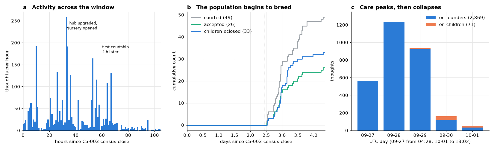
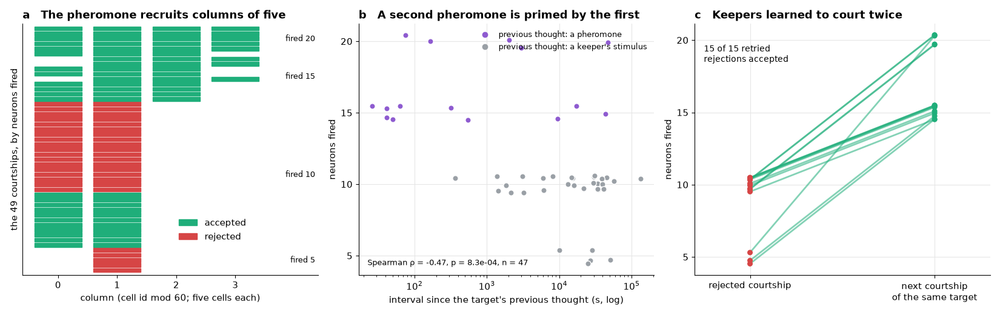
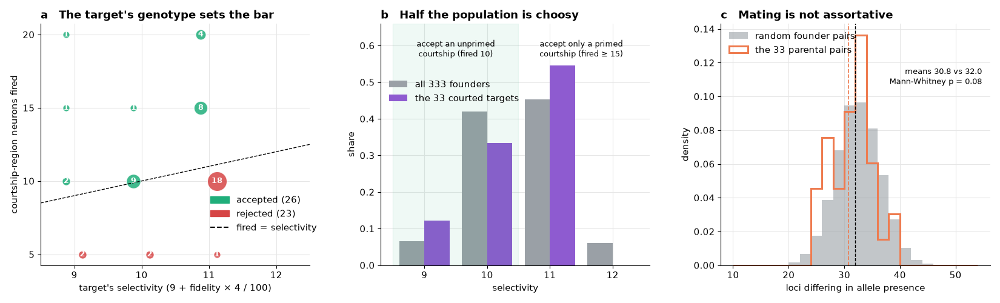
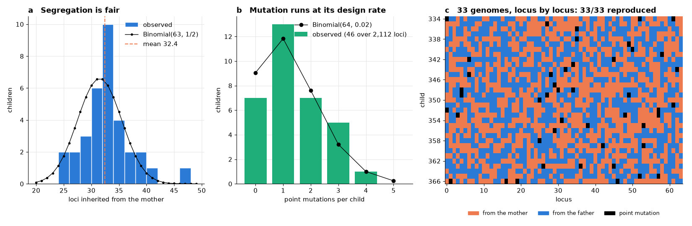
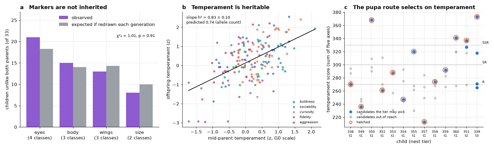
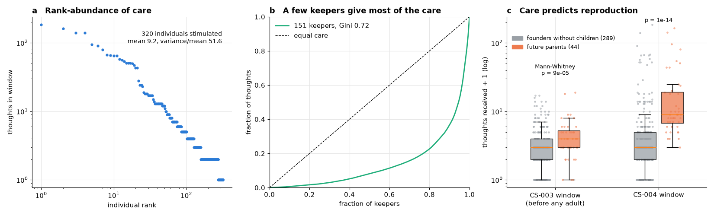

# The first offspring: courtship neurophysiology, genotype-dependent mate choice and Mendelian inheritance in 33 G1 *Drosophila* of the obrain connectome

**OBRAIN Field Study CS-004.** Subject: the Flybook population on Arc mainnet (chain 5042) from the close of CS-003 to the first offspring generation (G1). The population now holds 366 individuals, 333 founders and 33 children. Each carries its own brain contract, and all descend from the specimen of this repository (the Ancestor, `0xaef83c5b8742da5e3228930bc6084adcf0539ccd`).

Observation window:

- **Opens** at block 22,971,429, the block after CS-003's census (2026-09-27T04:28Z).
- **Hub upgraded and Nursery opened** at block 23,384,885 (2026-09-29T14:45Z).
- **First courtship** at block 23,399,299 (16:47Z), first accepted courtship at block 23,399,380, first child at block 23,400,763 (16:59Z).
- **Closes** at block 23,713,175 (2026-10-01T13:02Z).

Every quantity herein was read from consensus through the public RPC or recomputed from what consensus holds. An operational indexer was compared against the chain and agrees with it log for log (section 2.4), but no figure is taken from it. CS-003 closed the founder generation and left it a pre-reproductive cohort. This study follows that cohort into adulthood and records its first courtships, the physiology that decides them, its first pedigree, and the inheritance of genome and phenotype across one generation.

---

## Abstract

Two and a half days after the founder generation closed, the population began to breed. We describe the transition at five levels.

**Census and audit.** In 4.4 days, keepers made 49 courtships, the targets' own brains accepted 26 and rejected 23, and 33 children eclosed: 20 from accepted eggs and 13 from the pupa route the Nursery opened at block 23,384,885. From consensus alone we re-derive the following:

- every ruling, as `fired ≥ selectivity` (49/49, no rejection a cooldown);
- `fired` as the courtship-region spike count of the target's own thought on the pheromone (49/49);
- `selectivity` as `9 + fidelity × 4 / 100` of the target's genome (49/49);
- every child's genome as `Meiosis.cross` of its parents' genomes under the consensus seed (**33/33**);
- every pupa's hatched candidate as the tier's pick over the four candidates' recomputed temperament scores (13/13).

**Courtship neurophysiology.** The pheromone arrives at tier 1 (charge 127) into sensillum 0, and the target's brain answers in columns of five cells. Column 1 (the straddling column) fires in 49/49 courtships and column 0 (attention) in 41/49. Column 2 (the stimulated column, subthreshold at tier 1) fires only when the target's previous thought was itself a pheromone. Every one of the 15 courtships that followed a pheromone fired ≥ 15 neurons, and none of the other 34 did (Fisher *p* = 6.3 × 10⁻¹³). The priming is counted in ticks, not seconds: it held across gaps from 26 s to 12.2 h.

**Mate choice.** Selectivity is set by the target's fidelity axis (loci 50-55), and it divides the founders: 162 of 333 (48.6 %) have selectivity ≤ 10 and accept an unprimed courtship (fired 10), while 171 have selectivity 11-12 and accept only a primed one. At fired = 10, genotype alone decided the outcome (11 accepted at selectivity ≤ 10, 18 rejected at 11; Fisher *p* = 2.9 × 10⁻⁸). Keepers discovered the priming within the first hour of breeding: all 15 rejected targets that were courted again were accepted next time, each primed by the rejected pheromone. Mating was not assortative by genotype (mean parental distance 30.8 vs 32.0 loci; *p* = 0.08).

**Inheritance.** Children take 51.8 % of their non-mutated loci from the mother (binomial *p* = 0.11). Of the parents' 2,145 derived alleles, 1,085 were transmitted (50.6 %, *p* = 0.60). Point mutations number 46 over 2,112 loci against 42.2 expected (*p* = 0.60), and every derived allele in a child traces to its mother, its father or a new mutation. Two phenotypic levels inherit very differently:

- **Markers.** The visible markers (eyes, body, wings, size) are hashes of whole eight-locus groups. They are redrawn each generation: the number of children unlike both parents matches the redraw expectation (χ²₄ = 1.01, *p* = 0.91).
- **Temperament.** The five temperament axes (allele count × 12 plus a hash residue) are heritable. The mid-parent-offspring slope is *h*² = 0.83 ± 0.10 (*p* = 7 × 10⁻¹⁴), against 0.74 predicted from the allele-count component.

The pupa route adds artificial selection on that heritable score. Pupa parents scored 277 against 251 for the founder pool (*p* = 0.003), and the two hatches at tiers 2 and 3 took selection differentials of +24 and +66.

**Care.** 2,940 thoughts by 151 keepers peaked at 1,229 a day on 28 September and collapsed to 163 on 30 September at a constant price (the `baseFee` never left its 500 OBRAIN floor). Care became more unequal than in CS-003 (Gini over individuals 0.74, against 0.54; the top 10 % received 67 %). It predicts reproduction: future parents had already received more care before any founder was adult (mean 3.8 vs 2.4 thoughts; *p* = 9 × 10⁻⁵). In the window they received 22.2 thoughts each against 6.6 for founders without children (*p* = 1 × 10⁻¹⁴). No individual has died.

## 1. Introduction: from a cohort to a pedigree

CS-003 caught the founder generation as one even-aged cohort of juveniles, with survivorship 1 and fecundity 0 by definition, and named the moment the pedigree would begin: adulthood, one day after eclosion. The first founder came of age at 2026-09-27T07:22Z. The first courtship came 2.4 days later, two hours after an upgrade of the hub opened the Nursery. This study covers that onset of reproduction.

A population that breeds raises two kinds of question. The first is transmission: is the rule of inheritance what the recipe says, and does it act as Mendel's laws require? In a natural population this can be tested only by sampling. Here the rule is a pure function (`Meiosis.cross`), its inputs are on chain (the parents' genomes in their `Eclosed` logs, and the seed in an `Accepted` or `PupaSettled` log), and its output is the child's `Eclosed` genome. Transmission can therefore be audited locus by locus and child by child, without sampling error, and its statistics compared with the design.

The second is mate choice: who mates with whom, and why. In this population a courtship is decided by the target's own brain. The pheromone evokes a thought, and the target accepts if enough cells fire in its courtship region to meet a threshold set by its genotype. Mate choice is therefore a neurophysiological event whose input, output and threshold are all committed by consensus. This study is the first to observe it.

## 2. Materials and methods

### 2.1 The population and its organs

| Organ | Address | Role |
|---|---|---|
| Hub (`Drosophila`, proxy) | `0x14b557957d378b56511785b408a21c93e79feb36` | ecloses, senses, thinks, courts, lays, hatches pupae; emits every population event |
| `Connectome` (implementation) | `0xcaa923d6dbe59e780e32914257cbbf8deae4c5d2` | the soma every brain clone delegates to; emits each brain's `Thought` with its spike list |
| `Pupae` | `0x83547b1d4b9ce8fc469bed87b22d525e5c64fb20` | a purchased brood: fixes parents and a seed, offers four candidate children (deployed in this window) |
| `Amber` | `0x82e820049cd4d1110f1560f2eed623305c704dee` | the record of the dead (`Interred`) |
| `Rewards`, `Orchard` | `0x7a52…e9ec`, `0x1cfe…9f3a` | the population's ledgers (`Orchard` deployed in this window) |
| The Ancestor | `0xaef83c5b8742da5e3228930bc6084adcf0539ccd` | the type specimen, read only |

### 2.2 The ecology changed in the window

Two `EcologyChanged` logs, one hub `Upgraded` and one `NurseryChanged` fall in the window. They were decoded against the `Ecology.Params` and `Ecology.Nursery` layouts.

| Parameter | CS-003 | From block 23,384,728 / 23,384,885 |
|---|---|---|
| `diapauseAfter` | 72 h | **7 days** |
| `ovipositMul` | 2 | 30 |
| sense splits (burn / rewards / treasury / dev, bps) | 5,000 / 3,400 / 800 / 800 | 6,000 / 3,200 / 400 / 400 |
| Nursery | closed | open: `pupae` named; `broodLifespan` 90 days; `tendedFor` 30 days; nest stakes 40,000 / 100,000 / 200,000 OBRAIN for tiers 1/2/3; wake fee 20,000 OBRAIN |

The following are unchanged: `baseLifespan` 30 days, `lifespanPerThought` 6 h, `maxLifespan` 90 days, `adultAge` and `breedCooldown` 24 h, `pheromoneTier` 1, `courtshipRegion` 0, `selectivityBase` 9 and `selectivitySlope` 4, tier charges 31/127/255, and tier price multipliers 1/4/8. The `baseFee` stayed at its 500 OBRAIN floor through all 93 `BaseFeeChanged` logs of the window. Tier prices were therefore 500 / 2,000 / 4,000 OBRAIN throughout.

### 2.3 Courtship, the two routes of reproduction, and inheritance

**Courtship.** A keeper courts a target with a suitor (`Courted`). The hub writes the pheromone (tier 1, charge 127) into the target's sensillum 0, and the target thinks in the same transaction. The ruling (`Courting.resolve`) counts the target's spikes in the courtship region: `regions[0]`, the fired cells whose 16-cell word lies in segments 0-7. The courtship is accepted when that count reaches the target's selectivity and neither fly is cooling down. Selectivity is `selectivityBase + fidelity × selectivitySlope / 100`, where fidelity is the target's fidelity axis (`Phenotype`: loci 50-55, `alleles × 12 + keccak(the six packed genes) mod 29`). Acceptance fixes an egg with `seed = keccak(blockhash(n − 1), eggId, rootDirty(target))`. The mother's committed brain state is therefore part of her child's seed. `Laid(eggId, flyId)` hatches the egg as `cross(G[target], G[suitor], seed)`. The target is the mother.

**Pupa.** A pupa fixes its parents and a pre-seed when it is laid. Its seed settles from the hash of the laying block (`PupaSettled`). It offers four candidates, `cross(G[m], G[f], keccak(abi.encode(seed, i)))` for i = 0..3. Each candidate is scored by the sum of its five temperament axes (boldness, sociability, curiosity, fidelity, aggression; loci 32-61). A nest of tier *t* hatches the best of the first 2^(*t*−1) candidates (`Pupae.pick`).

**`Meiosis.cross`.** For each locus *s*, the child takes the mother's allele if bit *s* of the seed is set, otherwise the father's. With probability 20/1000 (`keccak(seed, s, "mu") mod 1000 < 20`) the allele is then replaced by `keccak(seed, s, "new")`.

**Marker phenotypes.** A marker (eyes 0-7, body 8-15, wings 16-23, size 24-31) is wild type when its group is empty. Otherwise it is one of *v* variant classes chosen by `keccak(the eight packed genes) mod v`.

### 2.4 The census

Every hub log with topic `Eclosed`, `Courted`, `Accepted`, `Rejected`, `Laid`, `PupaHatched`, `Thought` or `Sensed` was collected from block 22,703,390 to 23,713,175, together with every `Pupae.PupaSettled` log (`eth_getLogs`, 9,999-block chunks, one chunk per request). For each of the 49 courtship rulings, the transaction receipt was read for the target brain's own `Connectome.Thought` (input word, synaptic deliveries, spikes, and the identities of the fired cells) and for the hub's `Thought` (its region counts). Thoughts in the window were joined by transaction with their `Sensed` logs. The 49 thoughts with no `Sensed` log are the targets' thoughts on the pheromone, one per `Courted` transaction. The timestamp of every block involved was read.

As a cross-check, the full log record of hub, `Rewards`, `Orchard`, `Pupae` and `Amber` was compared with an operational indexer that had been synced to block 23,712,558. Counts agree for every event the indexer records: `Eclosed` 366, `Courted` 49, `Accepted` 26, `Rejected` 23, `Laid` 20, `PupaLaid` 18, `Fed` 189. Once the 617 blocks past the indexer's head are accounted for, three more counts agree: `Thought` 3,789 (3,787 + 2), `Sensed` 5,392 (5,382 + 10) and `Claimed` 2,868 (2,863 + 5).

### 2.5 Statistics

The data are *n* = 33 children (2,112 loci), 49 courtship rulings and 2,940 thoughts. The founder pool is CS-003's census (*n* = 333).

- **Segregation and transmission.** Pooled binomial tests against ½; per-child χ² on maternal loci.
- **Mutation.** Two-sided Poisson test against 64 × 0.02 × 33.
- **Markers.** The count of children unlike both parents against its expectation if the class is redrawn: (1 − 1/*v*) when the parents share a class, (1 − 2/*v*) when they differ; χ² over the four markers.
- **Heritability.** Mid-parent-offspring regression of each temperament axis, in units of the founder pool's standard deviation, pooled over axes. The allele-count prediction is Var(12 × Binomial(6, ½)) / Var(axis).
- **Mate choice.** Fisher's exact test; genetic distance (loci differing in allele presence) of parental pairs against 20,000 random founder pairs, by Mann-Whitney.
- **Care.** Dispersion index, Gini coefficient, Mann-Whitney comparisons, Spearman correlation and Kruskal-Wallis across tiers, as in CS-003.
- **Ages.** Founder ages are block-derived at the window's observed 0.5075 s per block.

## 3. Results

### 3.1 The census: a breeding population, audited

| Check | Result |
|---|---|
| `Eclosed` logs; of generation 1 | 366; 33 (fly 334-366) |
| child's genome = `Meiosis.cross` of its parents' `Eclosed` genomes under the consensus seed | **33 / 33** (20 egg, 13 pupa) |
| child's `Eclosed` parents = the parents named by its egg or pupa | **33 / 33** |
| ruling = `fired ≥ selectivity`; rejections at or above threshold (cooldown) | **49 / 49**; 0 |
| `fired` = `regions[0]` of the target's own `Thought` on the pheromone | **49 / 49** |
| `selectivity` = 9 + fidelity × 4 / 100, fidelity recomputed from the target's genome | **49 / 49** |
| hatched candidate = `Pupae.pick(tier)` over the four recomputed temperament scores | **13 / 13** |
| `Holotype.tape(i) == Ancestor.tapes(i)`; tapes byte-identical to `tapes/` | **85/85**; **85/85** |
| CS-003's founder census re-derived from the chain | 333 rows, identical |
| `Entombed` / `Interred` | 0 / 0 |

Breeding came in one wave (Fig. 1b). There were 12 courtships on 29 September, 35 on 30 September and 2 on 1 October; children eclosed 6, 25 and 2 on those days. The egg route is fast: the median interval from acceptance to `Laid` is 52 s, the range 18 s to 18.3 h. Six accepted eggs and five pupae remain unhatched at window close. The 33 children have 44 distinct parents (26 mothers and 29 fathers, 11 of them in both roles). Founder 188 parented four children, two as mother and two as father.

### 3.2 Onset of reproduction

The founders came of age in the order they eclosed, from 2026-09-27T07:22Z. For 2.4 days of adulthood there was no courtship at all: no `Advertised`, `Courted` or `Accepted` log. The first courtship was made 2.0 hours after the upgrade that opened the Nursery (Fig. 1a), and all 99 `Advertised` logs (stud offers) fall after it. The founders were 2.6 to 5.1 days old when courted (median 3.7 days), so the pedigree's founders bred at the start of their reproductive life.

The courters were overwhelmingly the suitors' keepers. In 44 of 49 courtships the courter had eclosed the suitor, and in one the target. Only 2 of the 33 children have parents eclosed by the same keeper. Reproduction in this population is an exchange between keepers: a keeper brings a male (the suitor) to another keeper's female (the target), and the target's keeper receives the stud fee.

### 3.3 The neurophysiology of courtship

The pheromone is the same stimulus every time: tier 1, charge 127, into sensillum 0 (49/49). The target's response is stereotyped and quantal (Fig. 2a). Every courtship's spikes fall in rows 0-4 of one or more of columns 0-3 (cell id mod 60). Five cells fire per column, so `fired` takes only the values 5, 10, 15 and 20. Synaptic deliveries are equally fixed per pattern: 8, 18, 27 and 37.

| Column | What it receives (the transduction law of CS-001 and CS-003) | Fired in |
|---|---|---|
| 1 | *c* − 1 for sensillum 0 (*c* = 2): reads the straddling byte, 15,872 quanta at every tier, over the 12,800 threshold | **49 / 49** |
| 0 | the attention bits, written as a small charge | 41 / 49; silent only at attention ≤ 12 |
| 2 | *c*, the stimulated column itself: 127 × 64 = 8,128 quanta at tier 1, subthreshold | **15 / 49**: exactly those primed by a previous pheromone |
| 3 | the next column | 8 / 49, all primed |

**Priming.** Column 2 is the courtship's decisive column, and tier 1 cannot fire it alone. It fired in the 15 courtships whose target's previous thought was itself a pheromone, and in none of the other 34 (Fisher *p* = 6.3 × 10⁻¹³; Fig. 2b). The residual charge left by one pheromone carries the next across threshold. The kernel counts decay in ticks, not seconds, so the priming does not fade with wall-clock time: it held at gaps of 26 s and of 44,090 s (12.2 h) between the two thoughts, provided no other stimulus intervened. The rank correlation between the gap and `fired` (Spearman ρ = −0.47, *p* = 8 × 10⁻⁴, *n* = 47) is a by-product of keepers' habits, since primed courtships were usually made at once. Gap is not the causal variable.

**Keepers learned to court twice** (Fig. 2c). The very first courtship (target 247, suitor 324) fired 10 against selectivity 11 and was rejected; the same keeper courted again 81 blocks (41 s) later, and the primed thought fired 15 and was accepted. The pattern spread at once. Fifteen rejected targets were courted again, and all 15 were accepted at the next courtship (fired 15 or 20), each primed by the pheromone of the rejection. In 9 cases the same courter retried; in 6 a different keeper courted the target next and inherited the priming the first had paid for.

### 3.4 Mate choice is genotype-dependent

Because `fired` takes values in steps of 5 and selectivity lies between 9 and 12, the ruling partitions cleanly (Fig. 3a):

| fired | accepted | rejected | selectivity of the targets |
|---|---|---|---|
| 5 | 0 | 5 | 9, 9, 10, 10, 11 |
| 10 | 11 | 18 | accepted: 9 (2), 10 (9); rejected: 11 (18) |
| 15 | 10 | 0 | 9, 10, 11 (8) |
| 20 | 5 | 0 | 9, 11 (4) |

At fired = 10, the outcome of an unprimed courtship that recruits both column 0 and column 1, genotype alone decided: every target with selectivity ≤ 10 accepted and every target with selectivity 11 refused (Fisher *p* = 2.9 × 10⁻⁸).

In the founder pool, selectivity is 9 for 22 founders, 10 for 140, 11 for 151 and 12 for 20 (Fig. 3b). Fidelity combines the number of derived alleles at loci 50-55 with a hash residue, so choosiness is polygenic. Selectivity 11 needs fidelity ≥ 50. Every founder with five or six alleles in the group reaches it (29 of 29), as do almost all with four (78 of 82), about half with three (60 of 112) and few with two (4 of 70). Choosy founders (selectivity ≥ 11) are 51 % of the pool and 55 % of the targets courted. Keepers did not avoid them, because the priming strategy defeats them: a primed courtship fires 15 and passes every selectivity present.

The parental pairs are not genetically assortative (Fig. 3c). Their mean distance, 30.8 loci differing in allele presence, does not differ from that of random founder pairs, 32.0 (Mann-Whitney *p* = 0.08). With all founder alleles private (CS-003), no pair shares an allele identical-by-state, so no child is inbred.

### 3.5 Transmission: Mendel's first law, audited

| Quantity | Observed | Expected |
|---|---|---|
| non-mutated loci from the mother | 1,070 / 2,066 (51.8 %), 32.4 per child (24-46) | ½; binomial *p* = 0.11; per-child χ²₃₃ = 45.6, *p* = 0.07 |
| parents' derived alleles transmitted | 1,085 / 2,145 (50.6 %) | ½; *p* = 0.60 |
| point mutations | 46 over 2,112 loci (2.18 %); per child 0 (7), 1 (13), 2 (7), 3 (5), 4 (1) | 42.2; Poisson *p* = 0.60 |
| reversions to wild type among mutations | 0 | 46 × 2⁻³² ≈ 0 |
| derived alleles per child | 34.3: 572 from mothers, 513 from fathers, 46 new | |
| alleles that trace to neither parent nor a new mutation | **0** | 0 |

Segregation is fair and mutation runs at its design rate (Fig. 4a, b). Every allele in every child is accounted for (Fig. 4c): it came from the named mother, the named father, or one of 46 new mutations. Each founder allele is private (CS-003), so every transmitted allele is an unambiguous marker of descent. The pedigree can be read from the genomes alone.

Two caveats are part of the result. First, origin is decided by the seed's bits, so segregation is fair if keccak's output bits are, and the test is one of keccak as much as of the recipe. Second, the courtship seed contains `rootDirty(target)`, the mother's committed brain state at the moment of acceptance. That state is a function of everything her keepers ever stimulated her with. A child's genome thus depends, through the seed, on its mother's experience. This is not Lamarckian inheritance (the experience does not write the genome), but the realised genotype is conditioned on the mother's history.

### 3.6 Phenotype: markers are redrawn, temperament is heritable, and the pupa route selects

**Markers are not inherited** (Fig. 5a). A marker class is a hash of all eight genes of its group. A child's group is a locus-by-locus mixture of its parents' groups, so it reproduces a parent's class only when it is that parent's group exactly (rare) or by chance. The children unlike both parents are: eyes 21 of 33 (18.2 expected if redrawn), body 15 (14.0), wings 13 (14.3), size 8 (10.0), with χ²₄ = 1.01, *p* = 0.91. The classical visible mutants of this population (white, sepia, ebony, curly, vestigial…) are named like Mendelian markers but behave as a fully epistatic function of eight loci: every generation draws them anew. A keeper who breeds two white-eyed flies should expect a white-eyed child about one time in four, not always.

**Temperament is heritable** (Fig. 5b). Each temperament axis is `alleles × 12 + hash mod 29` over its six loci. The allele count is additive across loci and is transmitted; the hash residue is redrawn like a marker. The mid-parent-offspring regressions are:

| Axis | slope | *r* | *p* |
|---|---|---|---|
| boldness | 0.67 | 0.54 | 0.001 |
| sociability | 0.55 | 0.43 | 0.012 |
| curiosity | 1.22 | 0.58 | 0.0004 |
| fidelity | 0.84 | 0.49 | 0.004 |
| aggression | 0.93 | 0.46 | 0.007 |
| **pooled (*z*-scored)** | **0.83 ± 0.10** | | **7 × 10⁻¹⁴** |

The pooled slope estimates the narrow-sense heritability (Falconer and Mackay 1996). The design predicts 0.74: the variance of 12 × Binomial(6, ½), 216, divided by the axes' variance in the founder pool, 292 on average. The observed value is consistent with that prediction. Fidelity, and with it selectivity, is among the heritable axes, so choosiness will be transmitted down the pedigree.

**The pupa route selects on temperament** (Fig. 5c). It acts at two stages. First, keepers chose high-scoring parents for pupae: the 26 parent slots of the 13 hatched pupae averaged a temperament score of 277, against 251 for the founder pool (Mann-Whitney *p* = 0.003). Egg parents averaged 257, not different from the pool (*p* = 0.42). Second, the tier selects among siblings. Eleven pupae hatched at tier 1, which takes candidate 0 without choice. Child 351 hatched at tier 2 and took the better of two (selection differential +24.2 over the four candidates' mean). Child 339 hatched at tier 3 and took the best of four (+66.2, score 373, rank SSR). Of the 33 children, 17 rank N (< 270), 7 R, 3 SR and 6 SSR (≥ 330).

### 3.7 Care and its relation to reproduction

| Quantity | CS-003 (1 day) | CS-004 (4.4 days) |
|---|---|---|
| thoughts; keepers; individuals stimulated | 849; 134; 265 | 2,940; 151; 320 |
| thoughts per stimulated individual, mean; variance/mean | 3.20; — | 9.19; 51.6 |
| Gini of thoughts over individuals; share of the top 10 % | 0.54; 38.5 % | **0.74; 66.7 %** |
| Gini of thoughts over keepers | — | 0.72 |
| most-stimulated individuals | 196 (18), 4 (17), 31 (16) | 77 (185), 27 (163), 187 (141) |
| stimuli by the fly's eclosing keeper | 849 / 849 | 2,805 / 2,891 (97 %) |
| single stimuli; expeditions (five sensilla, one thought); pheromones | 849; 0; 0 | 2,478; 413; 49 |
| fees | 1,861,000 OBRAIN | 3,409,000 OBRAIN |

Activity peaked on 28 September (1,229 thoughts; busiest hour 14Z with 278) and collapsed after the breeding wave: 933 thoughts on the 29th, 163 on the 30th, and 50 on 1 October to 13:02Z (Fig. 1c). Prices were constant throughout, so the collapse is not a price response. The first allo-parental care appears: 86 stimuli were given by keepers other than the one who eclosed the fly, against none in CS-003.

The rank-abundance of care is steep (Fig. 6a), and a few keepers give most of it (Fig. 6b). One keeper made 322 thoughts, and the top three made 739 (25 %). **Care predicts reproduction** (Fig. 6c). The 44 founders that became parents had already received more care in CS-003's window, before any founder was adult (mean 3.8 vs 2.4 thoughts; Mann-Whitney *p* = 9 × 10⁻⁵). In this window they received 22.2 thoughts each against 6.6 for founders without children (median 8 vs 2; *p* = 1.1 × 10⁻¹⁴). The keepers who invest in their flies are the keepers who breed them. That is the link between care and fitness in this population: it is a property of the keepers, not of the flies.

The physiology of stimulation reproduces CS-001 and CS-003. For single stimuli the dose-response steps at tier 2 (6.79 / 7.30 / 11.05 cells per thought at tiers 0/1/2; Kruskal-Wallis *p* = 1.3 × 10⁻⁴²). Expeditions, five sensilla in one thought, fired 31.8 cells on average and up to 64. Two thoughts recruited a cell outside the input layer (`regions[3] = 1`). One was fly 140's 14th thought (sensillum 2, tier 1). The other was an expedition of fly 293 (sensilla 1, 5, 9, 13, 17 at tier 0). CS-003's two such recruitments were cell 82,570, in the optic lobe. The hub's region counts do not name the cell, and these two thoughts were not cross-read against their brain logs here.

### 3.8 Survivorship

Survivorship is complete: 366 of 366 individuals are alive, and `Amber` holds no row. Two founders woke from diapause (`Woke`). Children eclose with the nursery's `broodLifespan` (90 days) rather than a founder's `baseLifespan`. Their thoughts report a projected death of exactly 90 days after eclosion, for example children 334 and 366. Founders' projected deaths, as reported by their last thought in the window, lie 24.8-70.6 days after window close (median 28.4). The care regime is thus already writing a 46-day spread into founder life expectancy. In life-table terms, the cohort is at *x* ≈ 2.6-5.1 days with *l*ₓ = 1 and its first non-zero fecundity: 33 children from 333 founders in 4.4 days, 0.10 per founder, concentrated in 44 of them.

## 4. Discussion

**What was shown.** The population bred, and every step of reproduction is exactly what its recipe says. The step from courtship to ruling holds for 49/49 (the target's spikes against its genotype's threshold). The step from parents to child holds for 33/33 (`Meiosis.cross` under the consensus seed). The step from candidates to hatch holds for 13/13 (the tier's pick). Transmission obeys Mendel's first law at the locus. The phenotype splits cleanly into a redrawn part (markers) and a heritable part (temperament, *h*² ≈ 0.8). Mate choice is a neurophysiological event with a genetic threshold, and the keepers found, within an hour, the stimulus history that defeats the threshold.

**What the biology is.** Courtship here is a keeper's transaction, and "choice" is a spike count crossing a number. The analogy to *Drosophila* courtship is structural. A female's acceptance depends on her sensory response to the male's signal and on her receptivity, which in real flies is under genetic and physiological control: sex-peptide signalling and mating-status-dependent receptivity (Yapici et al. 2008), and the pC1 neurons (Zhou et al. 2014). Here the response is a column count and the receptivity is a fidelity axis. The priming the keepers exploit has a physiological counterpart in the summation of subthreshold inputs. It differs from any real courtship in being counted in ticks: a female courted twelve hours apart, with nothing in between, is exactly as primed as one courted twice in a minute. The fixed cost of a pheromone (2,000 OBRAIN) makes the double courtship a 4,000 OBRAIN strategy that accepts every genotype in the pool. Under the present parameters, female choice selects nothing except against keepers who court once.

**What is new.** Mendel (1866) could not see the seed, and natural pedigrees are checked by sampling markers. Here the seed is a log, every allele is private, and transmission can be audited without remainder. The audit shows two things a natural study could not separate. Markers that look Mendelian (named mutants with discrete classes) are fully epistatic and redrawn each generation. The quantitative trait, temperament, is the one that is inherited, at the heritability its allele-count component predicts. The breeders' route that selects on temperament (the pupa tiers) therefore selects on a trait that responds to selection. The marker phenotypes keepers may prefer cannot respond.

**Limitations.** The window is 4.4 days of a population whose individuals may live 90, and G1 is 33 individuals. Heritability is estimated from one generation's mid-parent regression, with no replication across environments. Courtship physiology is read from spike lists, not replayed: the column assignments follow CS-003's transduction law, and the priming is inferred from the previous thought's identity, not from membrane state. The two out-of-layer recruitments are counted from the hub's region tallies, not cross-read against their brain logs. The audit trusts consensus for the parents' genomes, as earlier studies did. The ecology changed during the window, and comparisons with CS-003 on care and lifespan straddle that change.

## 5. Reproduction

All of the following are reads only and run from the repository root.

| Claim | Command | Output at census close |
|---|---|---|
| pedigree (33/33), courtship rulings, `fired` and `selectivity` (49/49), pupa picks (13/13), the window's thoughts | `python3 tools/verify_generation1.py --check research/2026-10-01-flybook-first-offspring/data` | three files `identical`, `0 mismatches` |
| CS-003's founders unchanged; wiring | `python3 tools/verify_flybook.py --check research/2026-09-27-flybook-generation-zero/data/founder_census.csv` | `85/85`, `333 rows, identical`, `0 mismatches` |
| the Ancestor's tapes are `tapes/` | `python3 tools/verify_tapes.py` | `85/85` |

Every result of sections 3.2-3.8 is a computation on the three CSVs and on CS-003's founder and thought censuses. For example:

- **Section 3.3** groups the cell ids in `courtship.csv` by `id mod 60`, and identifies a primed courtship as one whose `target_tick − 1` row in `thought_census.csv` is a `pheromone`.
- **Section 3.6** recomputes the temperament axes from the `genome` columns.

The analysis requires Python 3 and pycryptodome; the statistics additionally used SciPy, and the figures Matplotlib.

Artifacts:

- `data/pedigree.csv`: one row per child, with fly, route, egg or pupa id, block, timestamp, owner, mother, father, the seed passed to `cross`, nest tier, pick, the four candidates' scores, maternal loci, mutated loci, the four markers, the five temperament axes and the genome.
- `data/courtship.csv`: one row per ruling, with block, timestamp, tx, target, suitor, courter, outcome, fired, selectivity, the target's fidelity, egg, the target's tick, input word, synaptic deliveries, spikes and the fired cells.
- `data/thought_census.csv`: one row per thought after block 22,971,428, with fly, tick, block, timestamp, keeper, senses (`sensillum:tier` …, or `pheromone`), fee (OBRAIN), input word, synaptic deliveries, spikes, regions and projected death.
- `figures/`: Figs. 1-6.
- `verification/`: the audit runs.

`SHA256SUMS` covers all of them.

## References

- Falconer, D. S. & Mackay, T. F. C. (1996). *Introduction to Quantitative Genetics*, 4th ed. Longman.
- Mendel, G. (1866). Versuche über Pflanzen-Hybriden. *Verhandlungen des naturforschenden Vereines in Brünn* 4, 3-47.
- Yapici, N., Kim, Y.-J., Ribeiro, C. & Dickson, B. J. (2008). A receptor that mediates the post-mating switch in *Drosophila* reproductive behaviour. *Nature* 451, 33-37.
- Zhou, C., Pan, Y., Robinett, C. C., Meissner, G. W. & Baker, B. S. (2014). Central brain neurons expressing doublesex regulate female receptivity in *Drosophila*. *Neuron* 83, 149-163.
- CS-001, CS-002, CS-003 (this repository, `research/`). `Meiosis.sol`, `Courting.sol`, `Thinking.sol`, `Phenotype.sol`, `Pupae.sol` and `Ecology.sol` of the Flybook hub.
