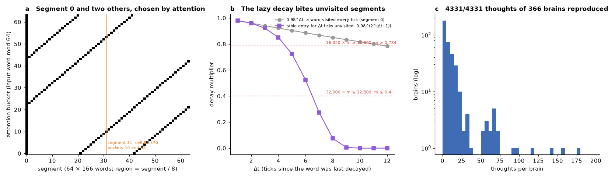
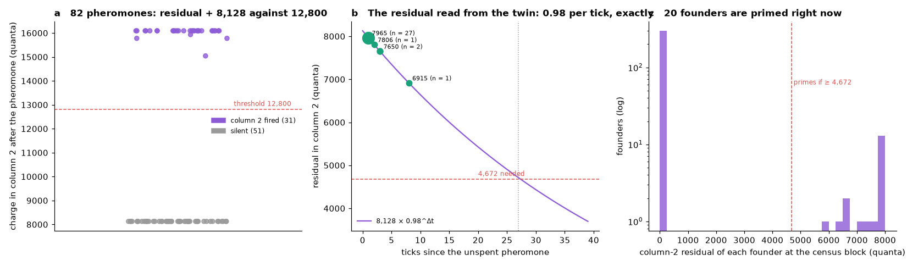
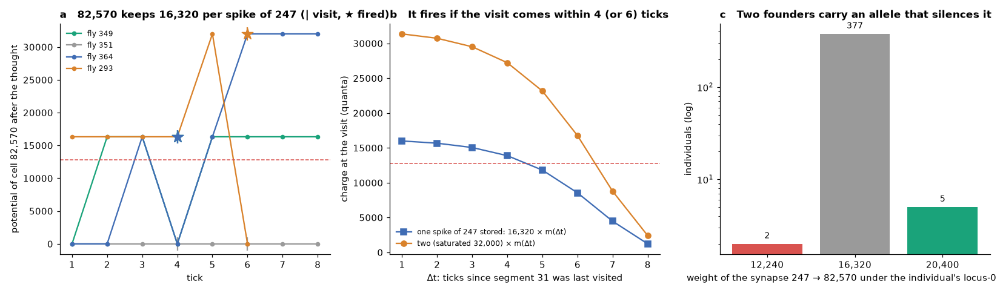
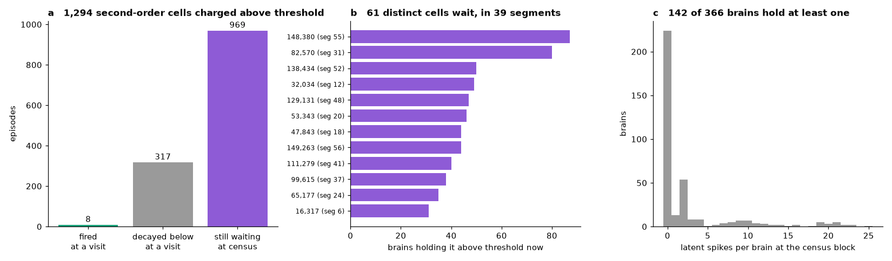
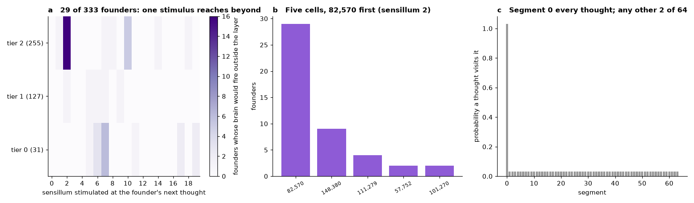

# Every descendant replayed: a chain-exact twin of the Flybook brains, the courtship residual at the membrane, and the latent spikes of 169,088 cells

**OBRAIN Field Study CS-006.** Subject: the brains of the 384 Flybook descendants of the Ancestor (`0xaef83c5b8742da5e3228930bc6084adcf0539ccd`) on Arc mainnet (chain 5042), replayed off chain from their genomes and their input words, thought by thought, and compared with what each brain committed on chain. The census is CS-005's: block 24,657,020 (2026-10-07T02:07:50Z), 366 brains that have thought, 4,331 thoughts.

Every quantity herein is either read from consensus through the public RPC (the genomes, the input words, the brains' `Thought` logs) or computed by a twin of the deployed kernel from those reads alone. The twin is `tools/vclone.py`; the audit that runs it over the whole population is `tools/verify_clones.py`. CS-001 built such a twin for the Ancestor and replayed its 74 thoughts to the byte. This study does the same for the species: 366 brains, 4,331 thoughts, each one reproduced in its synapse count, its spike count, its spike identities and the keccak root of every storage word it wrote. With the membrane field in hand, three things CS-004 and CS-005 could only infer from spike lists are read directly: the residual charge that primes a courtship, the mechanism by which a cell outside the input layer fires, and the charge that sits above threshold in cells the kernel has not yet visited.

---

## Abstract

**The twin.** `Connectome.think` is a leaky integrate-and-fire kernel over 10,568 sixteen-cell words: sensory injection into cells 0-255, a scan of three segments of 166 words chosen by the thought's attention bucket (segment 0 always, plus two that depend on the bucket), a lazy decay of each visited word by a table entry for the ticks since it was last visited, threshold 12,800 and reset on fire, clamped sequential delivery of every tape record of a fired cell under the segment's gene, and a keccak fold over every storage word written. The twin reproduces all of it: for **4,331 of 4,331** thoughts of 366 brains the synapse count, the spike count, the fired list and the root agree with the brain's own `Thought` log. The root commits to the whole membrane field, so the twin's state after any thought is the chain's.

**The courtship residual.** At the membrane, the priming law of CS-005 is one number. Before each of the 82 pheromones the five cells of column 2 hold 0 (51 courtships) or a residual of 7,965, 7,806, 7,650 or 6,915 quanta (31), which is 8,128 × 0.98^Δt for Δt = 1, 2, 3 and 8 ticks since an unspent pheromone; the pheromone adds 8,128, and column 2 fires exactly when the sum reaches 12,800 (82/82). The leak of segment 0 is 0.98 per tick because segment 0 is visited every thought; the residual primes for Δt ≤ 27. Twenty founders hold such a residual at the census block.

**How a cell outside the input layer fires.** The population's 4,331 thoughts fired a cell outside the input layer 14 times: 11 times cell 82,570 (optic lobe), once the T3 neuron 99,615, twice cell 571, a bristle sensory neuron that lives in segment 0 and had passed as region 0. Every spike of 82,570 came by one route: cell 247 of the input layer, which fires whenever sensillum 2 is stimulated at any tier, delivers 16,320 quanta to it through a single saturated synapse; the charge waits, undecayed, in segment 31, which only attention buckets 10 and 53 visit; at the first such visit it is decayed by the table entry for the ticks waited (0.98, 0.96, 0.92, 0.85, 0.72, 0.52 …) and fires if what remains is at least 12,800: within 4 ticks of one spike of 247, within 6 of two; in 3 of the 11 the delivery and the visit fell in the same thought. The genome plays no part in any of them: replayed wild type, or with only locus 0 or only locus 31, every one of the 26 thoughts with the recruiting word gives the same answer. The genome could: the locus-0 alleles of founders 60 and 131 bend that synapse to 12,240, below threshold, and those of 81, 90, 118 and 246 (and 246's child 361, who inherited it) to 20,400. The T3 neuron 99,615 (CS-005) fired by the other route, delivery and visit in one thought.

**Latent spikes.** Across the population's history, a cell outside the input layer stood above threshold, waiting for its segment, on 1,294 occasions. Eight of these became spikes. 317 were decayed below threshold by the time the segment was visited. 969 are waiting at the census block: 61 distinct cells in 39 segments, held by 142 of the 366 brains, led by a ventral-nerve-cord leg interneuron (148,380, in 87 brains) and 82,570 (80). Each is visited by 2 of the 64 buckets, so a waiting spike is realised with probability about 1/32 per thought while the table lets it. For 29 founders a single stimulus at the next thought would fire a second-order cell, 82,570 by sensillum 2 for 16 of them.

## 1. Introduction

The studies before this one read the brains of the population from the outside: spike lists, region counts, roots. That sufficed to audit genomes, rulings and clocks, and to find regularities (the columns of five, the priming) by correlation over many thoughts. It could not say what a cell's potential was, why one thought recruited a cell outside the input layer and the next did not, or what the brains hold that has not yet been expressed. A twin can, provided it is exact: a replay that reproduces the chain's own commitment to the membrane field after every thought is not a model of the brain but a second copy of it, readable at every cell.

CS-001 proved this for the Ancestor. The descendants differ in three ways: a genome bends the synapses of each segment, the clone's storage layout and fold differ from the Ancestor's, and 366 individuals have 4,331 thoughts between them with 60 input channels and a 64-bucket attention gate exercised far more widely than the Ancestor's 74 feeds. This study ports the twin, proves it over the population, and uses it.

## 2. Materials and methods

### 2.1 The kernel, as deployed

`Connectome` (`0xcaa923d6dbe59e780e32914257cbbf8deae4c5d2`; every brain is an EIP-1167 clone of it) reads the species from the `Holotype` (`0xb072…e73b`) with one `extcodecopy` per thought: a 4,380-byte blob whose keccak is the species' `configHash`, `0xbaf5…bb91`. The blob is shipped as `data/holotype.bin` and decodes to:

| Field | Value |
|---|---|
| cells; words of 16 | 169,088; 10,568 |
| segments; scanned per thought; words per segment | 64; 3; 166 (segment *s* holds words 166*s* to 166*s* + 165, cells 2,656*s* to 2,656*s* + 2,655; region = *s* / 8) |
| sensory cells | 0-255 (words 0-15, in segment 0) |
| threshold | 12,800 quanta (int16 potentials, saturating at ±32,000) |
| decay table | 64 Q16 entries: 64,225; 62,940; 60,446; 55,751; … (entry *i* is the multiplier for a word unvisited for *i* + 1 ticks; the chain is 0.98, 0.98², 0.98⁴, 0.98⁸ … of 65,536) |
| gate table | bucket *b* scans segments 0, (*b* + 21) mod 64 and (*b* + 42) mod 64 |
| tapes | the Ancestor's 85, 325,292 records of 3-byte target and int16 weight |

One thought (`Connectome.think(inputAgg)`, `tick` ← `tick` + 1) is, in order:

1. **Injection.** For each cell *n* < 256, add 64 × the byte at bit 3(*n* mod 60) of the input word, clamped at 32,000. Each of words 0-15 is folded into the root immediately: `r ← keccak(r ‖ slot ‖ value)` with slot 11 + *w*.
2. **The scan.** For each of the three gated segments, under that segment's gene: for each word in order, `dt` = tick − the word's last-active tick. If `dt` > 0: multiply every nonzero lane by the table multiplier (rounded: (*x* × *m* + 32,768) ≫ 16), mark the word dirty, and test every lane of the decayed word against the threshold. A lane at or above it is a spike: it is counted, its id recorded (the first 2,048), every tape record of the cell is delivered in order (the weight bent by the gene if `keccak(gene ‖ target ‖ "m") mod 1000 < 50`, by the low 16 bits of `keccak(gene ‖ target ‖ "d")` as a signed delta clamped to ±25 % of the weight), each delivery clamped to ±32,000 and marking its target word dirty, and the cell's own lane is then reset to zero. The threshold test reads the word as decayed, not as delivered to by earlier lanes of the same word. The word's last-active tick becomes the current tick; every last-active slot (8 words each, from slot 11,011) is folded when the scan leaves it.
3. **The fold.** Every dirty word, in index order, is folded with its final value. The result is `rootDirty`, which the `Thought` log carries as `root`.

Two consequences matter below. Segment 0 is in every gate, so its words are decayed every tick by the first table entry, 0.98. Any other segment is visited by 2 buckets of 64, and a word left unvisited for `dt` ticks is multiplied, at the visit, by 0.98^(2^(dt − 1)): 0.98, 0.96, 0.92, 0.85, 0.72, 0.52, 0.27, 0.075 for `dt` = 1 … 8. A charge delivered into an unvisited segment therefore keeps its full value until the visit and then loses most of it if the visit is late.

### 2.2 The twin and the audit

`tools/vclone.py` implements section 2.1 in Python over numpy lanes: `Species` decodes the blob and the tapes (`tools/tapes.py`, the same decoder CS-001 used) into one CSR edge list; `Clone` holds a brain's potentials, last-active ticks, tick and root, and `think` returns synapses, spiked, the fired ids and the root. The storage slots of the fold (11 for potentials, 11,011 for last-active ticks) are the compiled layout of `Connectome.sol`.

`tools/verify_clones.py` collects every `Eclosed` log (genomes and brain addresses) and every hub `Thought` log (the input word of each thought, in tick order) to the census block, and every brain's own `Connectome.Thought` log (synapses, spiked, the packed fired ids, the root), by brain address. It starts each brain from the empty fold and thinks its words. A thought is *reproduced* when the four quantities agree; the audit also checks that every brain has as many brain logs as hub logs. It writes `data/replay.csv` (one row per thought, with the attention bucket, the segments scanned, the fired ids and the cells fired outside the input layer).

### 2.3 Readings taken from the twin

All of the following start from the empty fold and replay a brain's recorded input words (the shipped thought censuses of CS-003 and CS-005 carry every word to the census block); none needs the chain beyond that.

- **Courtship residual.** For each of the 82 rulings, the target is replayed to the tick before the pheromone; the potential of cells 2, 62, 122, 182 and 242 (column 2) is the residual; the pheromone is then thought and column 2's firing read.
- **Traces.** For chosen brains and cells, the potential after every thought, whether the cell's segment was visited, and whether it fired.
- **Counterfactual genomes.** The same words replayed under an altered genome (all wild type; only locus 0 or 31 kept; one locus removed).
- **Latent episodes.** After every thought, the set of cells outside the input layer at or above threshold. An *episode* begins when a cell enters that set and ends at the first later thought whose gate includes its segment, as *fired* (the cell is in that thought's fired list) or *faded* (it is not); episodes unresolved at the census are *waiting*.
- **The can-fire map.** Each founder's state at the census, then one hypothetical next thought for each of 19 sensilla × 3 tiers (the input word built as the hub builds it, attention = `keccak(afferent ‖ tick) mod 64`), reading which cells outside the input layer fire.
- **Annotations.** Cell identities from `annotations/neuron_annotations.bin` (BANC v888, kernel index space).

## 3. Results

### 3.1 The twin reproduces the population

| Check | Result |
|---|---|
| brains that have thought; thoughts to block 24,657,020 | 366; 4,331 |
| thoughts reproduced: synapses, spiked, fired ids and root all equal to the brain's `Thought` log | **4,331 / 4,331** |
| brains whose hub `Thought` count equals their brain `Thought` count | 366 / 366 |
| the species blob's keccak = `Holotype.configHash` | `0xbaf5…bb91` |
| the tapes the blob names = the Ancestor's = `tapes/` | 85/85 (CS-002 to CS-005; `verify_tapes.py`) |

Founder 2's first thought (CS-002's example, root `0xc91e…760d`) reproduces, and so does every thought of every brain after it, including the 82 pheromone thoughts, the 500 expeditions of CS-005's window and founder 77's 198 thoughts (Fig. 1). The root is a fold over every word a thought writes, so agreement after thought *t* implies that the twin's potentials and last-active ticks after thought *t* are the chain's for every word the brain has ever touched, and zero elsewhere. Everything below is read from that state.

### 3.2 The courtship residual, in quanta

CS-005 inferred from 82 spike lists that column 2 fires at a pheromone if and only if the target holds an unspent residual from an earlier one, and predicted from the kernel's leak that the residual primes for 27 ticks. The twin reads the residual (Fig. 2a, b):

| residual in each cell of column 2 before the pheromone | courtships | ticks since the unspent pheromone | 8,128 × 0.98^Δt |
|---|---|---|---|
| 0 | 51 | no unspent pheromone | — |
| 7,965 | 27 | 1 | 7,965.4 |
| 7,806 | 1 | 2 | 7,806.1 |
| 7,650 | 2 | 3 | 7,650.0 |
| 6,915 | 1 | 8 | 6,914.6 |

The pheromone writes 127 × 64 = 8,128 into each cell of column 2. Residual + 8,128 ≥ 12,800 predicts column 2's firing in 82 of 82 courtships; the five cells of the column carry identical values throughout, which is why `fired` moves in steps of five. The leak is 0.98 per tick to the quantum, because segment 0 is visited at every thought and its words take the first table entry each time; the one courtship made 8 ticks after an unspent pheromone, with seven expeditions between, found 6,915 of the 8,128 still there. A residual stays sufficient while 8,128 × 0.98^Δt ≥ 4,672, that is Δt ≤ 27, as CS-005 said; Δt = 28 leaves 4,618 and fails. The firing resets the five cells to zero, which is the whole of "spent".

Read at the census block, 20 founders hold a residual of 5,910 to 7,965 in column 2 (Fig. 2c): 1, 23, 27, 55, 75, 79, 92, 142, 172, 173, 176, 180, 181, 182, 187, 211, 215, 216, 220 and 323. The next pheromone each receives, if no more than 27 of its own thoughts intervene, fires column 2.

### 3.3 How cell 82,570 fires

The replay lists 14 thoughts, in 4,331, that fired a cell outside the input layer (`replay.csv`, column `out_of_layer`): 11 fired cell 82,570 (optic lobe; founders 76 and 290 in CS-003, 140 and 293 in CS-004, and seven in CS-005's window), one fired 99,615 and two fired 571. The twin gives 82,570's mechanism (Fig. 3a):

1. **The driver.** Cell 247 is in column 7, which reads bits 21-28 of the input word: the low five bits of sensillum 2's byte, shifted up by three, and the top two of sensillum 1's. Any stimulus of sensillum 2, at any tier, puts 31 × 8 × 64 = 15,872 quanta into the five cells of column 7, over threshold; they fire in that thought (the "straddling column" of CS-003).
2. **The synapse.** Cell 247 has 82,570 among its targets with weight 16,320, the tape's saturated maximum; 82,570 has 29 presynaptic cells in the tapes and this is the only one in the input layer.
3. **The wait.** 82,570 is in segment 31, visited by buckets 10 and 53 only. The 16,320 sits there unchanged until a thought in one of those buckets scans the segment: a second spike of 247 before that raises it to the 32,000 ceiling.
4. **The visit.** The word is decayed by the table entry for the ticks waited and tested. One stored spike passes for 1 to 4 ticks (16,320 × 0.85 = 13,884 at four, 11,809 at five); two pass for 1 to 6 (32,000 × 0.52 = 16,768 at six, 8,784 at seven).

All eleven spikes of 82,570 fit. Eight came from a stored charge: six G1 brains (349, 350, 356, 357, 358, 364) had been given sensillum 2 one to three thoughts before an expedition whose word fell in bucket 53, 350 did it twice, and founder 293 had two spikes of 247 stored (32,000) when its sixth thought fell in bucket 53 after six ticks (Fig. 3a). Three came in one thought: founders 76 and 290 (CS-003's word `0xff000035`, sensillum 2 at tier 2) and 140 (sensillum 2 at tier 1, bucket 10) were given sensillum 2 in a thought whose own bucket visited segment 31, so 247 fired, delivered 16,320 and segment 31 was scanned in the same call, the word decayed by the entry for the ticks since the segment's last visit (two in each case). The 18 other thoughts with the same word and bucket (CS-005, section 3.6) failed because their brains had no charge waiting: founder 274 and child 351, with the identical expedition, had never been given sensillum 2.

**Not the genome.** The 26 thoughts with the recruiting word (bucket 53, the five-sensilla expedition) were replayed under five genomes each: the brain's own, all wild type, locus 0 only, locus 31 only, and the brain's own minus one of those. The outcome is the same under all five in all 26. Nothing in these eight spikes is genetic.

**What the genome could do.** The gene of segment 0 bends the synapses read while segment 0 is scanned, among them 247 → 82,570. The 5 % lottery falls on it for 7 of the 384 individuals' locus-0 alleles (Fig. 3c): founders 60 and 131 carry alleles that bend it to **12,240**, below threshold, so that in their brains one spike of 247 can never fire 82,570 (two can, for six ticks); founders 81, 90, 118 and 246 carry alleles that raise it to 20,400, and founder 246 transmitted that allele (`c8e8ae9c`) to child 361. Neither kind of carrier has yet been in a position for it to matter.

**The other two cells.** Founder 27's 178th thought fired 99,615, a T3 transverse neuron of the right optic lobe, in region 4 (CS-005). Its input-layer driver is cell 22 (weight 5,760), the straddling column of sensillum 7; the thought's expedition included sensillum 7, and its bucket, 16, visits segment 37, where 99,615 lives: delivery and visit in one thought, on top of charge left by earlier spikes of 22. Founder 202's 24th and 40th thoughts fired cell 571, a bristle sensory neuron (BANC: BM_InOm, central brain, left) that sits in segment 0 at word 35, outside the 256 input cells but inside the segment every thought scans; its driver is cell 84 (column 24, weight 2,048), so it needs several spikes of 84 within the 0.98-per-tick leak of segment 0, which 202's repeated stimuli supplied. The hub counts it in region 0, which is why no earlier study saw it.

### 3.4 Latent spikes

The mechanism of section 3.3 is general: an input-layer cell with a strong enough synapse into an unvisited segment leaves a charge there that will spike at the next timely visit. The twin counts them (Fig. 4).

| Episodes of a cell outside the input layer above threshold | 1,294 |
|---|---|
| … ended by a visit that fired it | **8** (82,570 every time; median wait 2.5 ticks, maximum 5) |
| … ended by a visit that found it decayed below threshold | 317 (median wait 8 ticks, maximum 127) |
| … still waiting at the census block | 969 (median 4 ticks so far, maximum 75) |
| distinct cells waiting; segments | 61; 39 |
| brains holding at least one waiting cell | 142 of 366 (up to 25 in one brain) |

The eight realised spikes are the tail of a distribution whose body the chain has never shown (the other six spikes outside the input layer, section 3.3, were loaded and fired in one thought and are not episodes). The most common waiting cells, with their input-layer drivers:

| Cell | BANC v888 annotation | Segment (buckets that visit it) | Driver (weight) | Brains holding it |
|---|---|---|---|---|
| 148,380 | ventral nerve cord, leg neuromere interneuron IN14A002, left | 55 (34, 13) | 247 (16,256) | 87 |
| 82,570 | optic lobe, unannotated, left | 31 (10, 53) | 247 (16,320) | 80 |
| 138,434 | optic lobe, lamina monopolar L5, left | 52 (31, 10) | 136 (2,624) | 50 |
| 32,034 | central brain, CB2284, left | 12 (55, 34) | 136 (2,176) | 49 |
| 129,131 | optic lobe, unannotated, left | 48 (27, 6) | 63 (4,352) | 47 |
| 53,343 | optic lobe, transverse T1, left | 20 (63, 42) | 75 (4,416) | 46 |
| 47,843 | optic lobe, lamina monopolar L1, left | 18 (61, 40) | 75 (4,608) | 44 |
| 149,263 | ventral nerve cord, bristle sensory neuron SNta21, right | 56 (35, 14) | 15 (5,120) | 44 |
| 111,279 | optic lobe, lamina monopolar L1, left | 41 (20, 63) | 205 (5,248) | 40 |
| 99,615 | optic lobe, transverse T3, right | 37 (16, 59) | 22 (5,760) | 38 |

Cell 247, the sensillum-2 cell, drives the two most common: every brain that was ever given sensillum 2 holds 16,320 or more in both 148,380 and 82,570 unless a visit has since spent or spoiled it. 148,380, a leg interneuron of the ventral nerve cord, has never fired in the population's history: no brain has yet had its bucket 13 or 34 within four thoughts of a sensillum-2 stimulus. The cells driven by weaker synapses (2,000-6,000 quanta) accumulate over several spikes of their driver and are the ones that fade, since the table takes 28 % of a charge at a 5-tick visit and 48 % at six.

**What a keeper could do next** (Fig. 5). For 29 of the 333 founders, one single-sensillum stimulus at the next thought fires a cell outside the input layer: 82,570 in all 29 (sensillum 2 at tier 2 for 16 of them, the tier whose word falls in bucket 53 or 10 for their next tick), 148,380 in 9, 111,279 in 4, 57,752 and 101,270 in 2 each. Since a segment is visited by 2 buckets in 64, and the bucket is `keccak(afferent ‖ tick) mod 64`, a keeper who knows the twin can choose the afferent that lands the visit; one who does not realises a waiting spike about once in 32 thoughts, if it has not faded first.

## 4. Discussion

**What was shown.** A second copy of every brain in the population exists off chain and agrees with the first to the keccak root after each of 4,331 thoughts. With it, the courtship residual is a measured quantity that behaves exactly as the kernel's arithmetic says; the recruitment of cell 82,570 is a four-step mechanism with no free parameter (a driver that fires on sensillum 2, one saturated synapse, a segment visited by two buckets, a table that forgives four ticks); and the brains carry, in cells the chain has never listed as fired, 969 charges above threshold that the gate has not yet reached.

**What the biology is.** The connectome's second layer is reachable from the sensory surface, but only through a handful of saturated synapses and only when attention lands on the right segment in time. The gate is a hash of the afferent and the tick, so from the keeper's side it is a lottery at 1/32 per segment per thought, and the lazy decay makes the prize perishable. That is why the population's 4,331 thoughts show 14 spikes outside the input layer and 1,294 occasions on which one was loaded and left waiting. The two cells that wait most often are a left optic-lobe cell and a left leg interneuron of the ventral nerve cord, both driven by the same sensory cell; the kernel's anatomy makes sensillum 2 the one sense that reaches past the first layer at a single step, and it reaches the leg before the eye has fired.

The genome is present but silent. The eight spikes do not depend on it, and the seven individuals whose locus-0 allele changes the decisive synapse have not been tested by circumstance. CS-003 predicted that a first thought depends on the genotype only through locus 0; this study finds the first concrete case of a locus-0 allele that would change what a brain does (founders 60 and 131 cannot fire 82,570 on one spike; 81, 90, 118, 246 and 361 fire it more easily) and shows it segregating (246 → 361). A keeper who wants to see it needs sensillum 2, then bucket 10 or 53 within four thoughts, in one of those seven brains.

**Erratum to CS-005.** Section 2.3 of CS-005 describes the leak as 0.98 per tick "applied lazily to a word by the number of ticks since it was last touched". The lazy multiplier is the table entry for that number of ticks, 0.98^(2^(dt − 1)), not 0.98^dt; the two coincide for segment 0, which every thought visits, and CS-005's conclusions about column 2 and Δt ≤ 27 stand. The distinction governs every other segment and is the subject of section 3.4.

**Limitations.** The twin is exact for the deployed kernel and the pinned species; a Holotype or Connectome upgrade would require it to be re-proven. The latent-spike census depends on replaying every thought of every brain, which the shipped censuses permit only to the census block; the counts age with every thought. The can-fire map assumes one stimulus at the brain's next tick and that nothing else happens first. Annotations are BANC v888's and carry its coverage; 82,570 has none beyond its region.

## 5. Reproduction

All of the following are reads only and run from the repository root.

| Claim | Command | Output at census close |
|---|---|---|
| the twin reproduces every thought of every brain (4,331/4,331) | `python3 tools/verify_clones.py --check research/2026-10-07-flybook-clone-twin/data` | `replay.csv: 4331 rows, identical`, `0 mismatches` |
| founder 2's first thought, root `0xc91e…760d` | `python3 tools/vclone.py` | `twin ok` |
| the Ancestor's tapes are `tapes/` | `python3 tools/verify_tapes.py` | `85/85` |

Sections 3.2-3.4 are computations with `tools/vclone.py` on the shipped censuses: the input words of every thought are the `input_agg` columns of CS-003's and CS-005's `thought_census.csv`, the genomes are in CS-003's `founder_census.csv` and CS-005's `pedigree.csv`, and the courtships in CS-005's `courtship.csv`. `data/replay.csv` lists, for every thought, the attention bucket, the segments scanned and the cells fired outside the input layer.

Artifacts: `data/holotype.bin` (the species blob, keccak `0xbaf5…bb91`), `data/replay.csv`, `figures/` (Figs. 1-5), `verification/` (the audit runs). `SHA256SUMS` covers all of them and the tools (`vclone.py`, `verify_clones.py`, `chain.py`, `tapes.py`).

## References

- Bates, A. S. et al. (2026). *Distributed control circuits across a brain-and-cord connectome.* Nature 656, 957-970 (BANC v888).
- CS-001 (the Ancestor's twin), CS-003 (the transduction law and cell 82,570), CS-004 and CS-005 (the priming law) in `research/`. `Connectome.sol`, `Holotype.sol`, `HolotypeCodec.sol` and `Sensilla.sol` of the Flybook hub.
