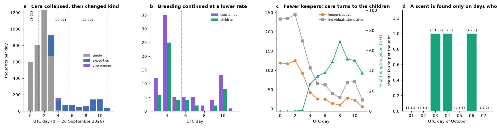
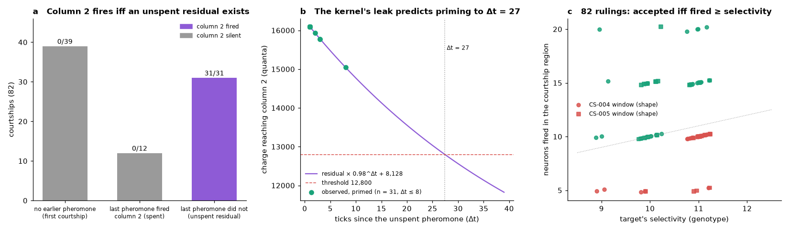
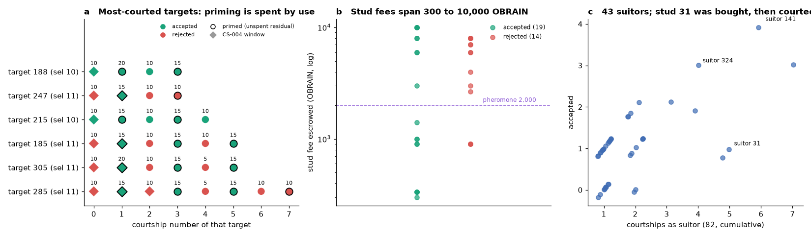
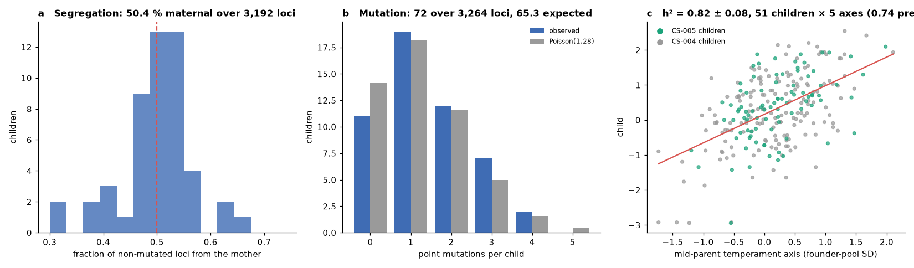
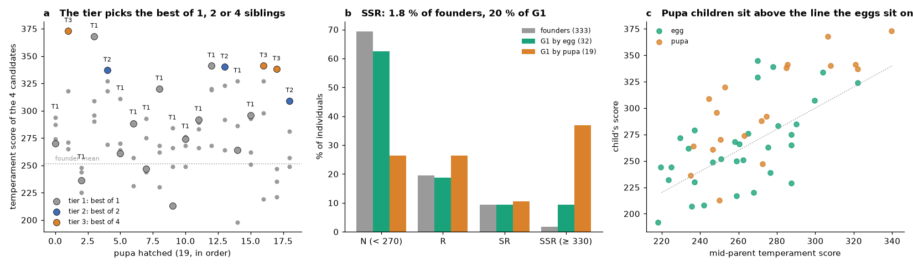
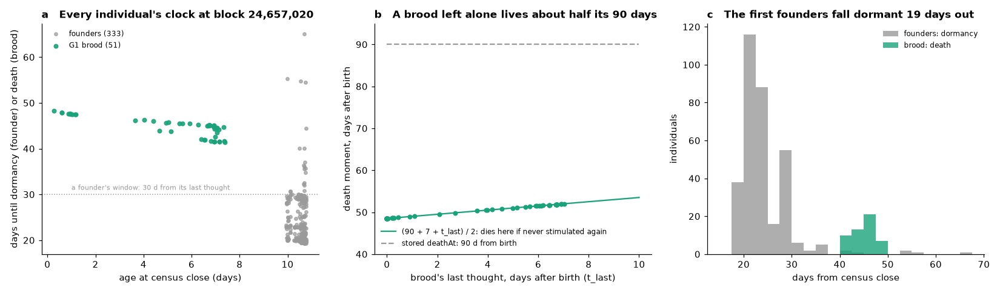

# A quiet week: the second breeding wave, a sterile offspring generation, the priming law of courtship and the life table of 384 *Drosophila* of the obrain connectome

**OBRAIN Field Study CS-005.** Subject: the Flybook population on Arc mainnet (chain 5042) from the close of CS-004 to the first week of October 2026. The population now holds 384 individuals, 333 founders and 51 children of the first offspring generation (G1). Each carries its own brain contract, and all descend from the specimen of this repository (the Ancestor, `0xaef83c5b8742da5e3228930bc6084adcf0539ccd`).

Observation window:

- **Opens** at block 23,713,176, the block after CS-004's census (2026-10-01T13:02:06Z).
- **First courtship** of the window at block 23,720,071 (14:00:24Z), first child at block 23,720,196 (14:01:27Z).
- **A bought stud**: founder 31 changes hands at block 24,502,328 (2026-10-06T04:19Z) and courts five targets at blocks 24,505,413-24,505,831 (04:46-04:50Z).
- **Closes** at block 24,657,020 (2026-10-07T02:07:50Z); every state read of this study is pinned at that block.

Every quantity herein was read from consensus through the public RPC or recomputed from what consensus holds. The operational indexer's ledgers (`Orchard`, `Rewards`) were read as logs and used only as cross-checks (section 2.4); no figure is taken from them. CS-004 recorded the onset of reproduction over 4.4 days. This study follows the population through the 5.5 days after it: the second, slower wave of breeding, the market in studs that appeared, the full priming law of courtship read from 82 rulings, inheritance re-estimated over 51 children, and the first complete life table of the population, in which the offspring generation turns out to be sterile and mortal while the founders are neither.

---

## Abstract

The population went quiet and kept breeding. We describe the week at five levels.

**Census and audit.** In 5.5 days, keepers made 33 courtships, the targets' own brains accepted 19 and rejected 14, and 18 children eclosed (12 from eggs, 6 from pupae), bringing G1 to 51. From consensus alone we re-derive every ruling as `fired ≥ selectivity` (82/82 cumulative, no rejection a cooldown), `fired` as the courtship-region spike count of the target's own thought (82/82), `selectivity` as `9 + fidelity × 4 / 100` of the target's genome (82/82), every child's genome as `Meiosis.cross` of its parents' under the consensus seed (**51/51**), every pupa's hatched candidate as its tier's pick (19/19), and, new in this study, every individual's clock: `flyOf`, `deathAtOf`, `lifeOf` and `ownerOf` of all 384 flies at the pinned block reproduce from a fold over their own logs (**384/384**; section 3.7).

**Courtship neurophysiology.** The priming CS-004 found is now a law with no exception in 82 courtships. Column 2 of the target's brain (the stimulated column, subthreshold at the pheromone's tier) fires if and only if the target carries an *unspent* residual: an earlier pheromone that did not itself fire column 2 (31/31), with any number of other stimuli between (up to 7 observed). A pheromone that fires column 2 spends the residual, and the next pheromone finds none (0/12); a first pheromone finds none (0/39). The kernel's leak (0.98 per tick) predicts that the residual stays sufficient for 27 ticks. Keepers paid for 8 pheromones against spent targets this week; all 8 were rejected.

**Mate choice and the market.** At `fired = 10`, genotype decided every ruling again (5 accepted at selectivity 10, 10 rejected at 11). Fourteen founders were advertised at stud fees from 300 to 100,000 OBRAIN; 148,197 OBRAIN were escrowed and 77,832 paid to the owners of accepting targets. Four founders changed hands (15 transfers of 13 founders since deployment). One buyer bought a founder, advertised it and courted five targets with it within 3.5 minutes (one accepted), and hatched two tier-3 pupae in the same day.

**Inheritance.** Over 51 children (3,264 loci), segregation is fair (50.4 % maternal, binomial *p* = 0.63), 49.2 % of the parents' derived alleles were transmitted (*p* = 0.39), mutation runs at 2.21 % against 2 % designed (72 vs 65.3, *p* = 0.44), and every derived allele traces to a parent or a new mutation (0 untraced). Markers are redrawn (χ²₄ = 2.06, *p* = 0.72); temperament is heritable at *h*² = 0.82 ± 0.08 (*p* = 10⁻¹⁹), against 0.74 predicted. The pupa route selected harder: two tier-3 hatches took the best of four (+45 and +78 over the brood's mean), and 20 % of G1 is SSR against 1.8 % of the founders.

**Care and the life table.** Care fell to 98 thoughts a day (from 668 in CS-004 and 1,229 at peak) from 50 keepers (151), and changed kind: 500 of 542 thoughts were five-sensilla expeditions. It turned to the children: the brood, 13 % of the population, received 52 % of the stimuli, and the five most-stimulated individuals are all G1. The foraging economy that now motivates most stimuli scores a thought by whether a region fired 4 cells; since every thought fires in region 0 only, a scent is found exactly on the days whose three scents include region 0 (542/542). Two founders woke from diapause (gaps of 8.0 and 7.9 days). All 384 individuals are alive at the pinned block, and the life table (384/384 re-derived) shows two clocks: the founders, aged 10 to 11 days, fall dormant 19 to 65 days out (median 23) unless tended again, the first on 26 October; the brood, aged 0.3 to 7.4 days, die 41 to 48 days out, because a brood that is not stimulated again dies at the midpoint of its 90 days and its diapause, and the first brood enters diapause 53 minutes after census close. Care is already written into the founders' clocks (Spearman ρ = 0.77 between thoughts received and days of window left).

## 1. Introduction: a population after its first breeding

CS-004 caught the founder generation at the onset of reproduction: a wave of 49 courtships in two days, 33 children, and the discovery by keepers, within an hour, of the stimulus history that defeats a choosy target. It left three questions open. Would the breeding continue once the novelty was gone? Was the priming a complete description of the courtship brain, or the first case of something larger? And what are the demographic rules of this population now that it has two generations: who can breed, who ages, who dies?

The third question has a sharp answer in code. The hub's P2 upgrade (CS-004, block 23,384,885) replaced the founders' life rule. A founder is no longer extended six hours per thought; it is *tended*: every thought, parented egg, accepted courtship or paid wake pushes its window to 30 days from now, and a founder whose window lapses does not die but falls *dormant*, to be woken for a fee (`Society.Life.Dormant`, `Nursery.wake`). A child of the Nursery (a *brood*) lives a fixed 90 days from its hatch, loses a second of life for every second it sleeps past 7 days without a thought, and dies for good. And a brood cannot court or be courted: `Courting.court` and `Courting.advertise` revert `Sterile` for any individual of generation ≥ 1. The pedigree of this population is therefore a star, not a tree: every child has two founder parents, and no child will ever be a parent. This study records what that design does to a living population over its second week.

## 2. Materials and methods

### 2.1 The population and its organs

The organs are those of CS-004, section 2.1: the hub (`Drosophila`, `0x14b557957d378b56511785b408a21c93e79feb36`), `Connectome` (`0xcaa9…4cd2`), `Pupae` (`0x8354…fb20`), `Amber` (`0x82e8…4dee`), `Rewards` (`0x7a52…e9ec`), `Orchard` (`0x1cfe143b38dadd74db66770f5c0a83d5d5cb9f3a`) and the Ancestor. No `Upgraded`, `EcologyChanged` or `NurseryChanged` log falls in the window: the parameters are those of CS-004's table (section 2.2 there). The `baseFee` stayed at its 500 OBRAIN floor through all 80 `BaseFeeChanged` logs of the window, so tier prices were 500 / 2,000 / 4,000 OBRAIN, an expedition (five sensilla at one tier) 2,500 / 10,000 / 20,000, and a pheromone 2,000 throughout.

### 2.2 Life history as the contracts define it, after P2

| Rule | Founder (generation 0) | Brood (generation 1) |
|---|---|---|
| life at eclosion | 30 days (`baseLifespan`) | 90 days (`broodLifespan`), fixed |
| a thought | window pushed to now + 30 days (`tendedFor`; `Tended`) | nothing added; the diapause charge is written |
| a parented egg, an accepted courtship | both parents tended 30 days | — |
| sleep | never pays a diapause charge; `Woke` is logged past 7 days | every second past 7 days without a thought is taken off `deathAt` |
| the end | **dormant** past its window; `wake` for 20,000 OBRAIN; never entombed | **dead** at `deathMoment`; may be entombed into `Amber` |
| reproduction | advertise, court, be courted, parent a pupa | **sterile** (`Sterile`) |

`deathAtOf` returns `Society.deathMoment`: a founder's stored window; a brood's stored `deathAt` if it comes before `lastThoughtAt + 7 days`, otherwise the midpoint `(deathAt + lastThoughtAt + 7 days + 1) / 2`, where the diapause charge catches up with the stored date. A brood left alone after a thought at age *t* therefore dies at (90 + 7 + *t*) / 2 days, about half its nominal life. `lifeOf` is *dead* or *dormant* at or past `deathMoment`, *diapause* for a brood more than 7 days from its last thought, else *alive*.

### 2.3 Courtship, inheritance, the pupa route

As in CS-004, section 2.3. The ruling counts `regions[0]` of the target's thought on the pheromone (tier 1, charge 127, into sensillum 0) against `9 + fidelity × 4 / 100`. The kernel's leak is `0.98` per tick, applied lazily to a word by the number of ticks since it was last touched (`Connectome.think`), so a residual charge left in a cell decays by 0.98^Δt whatever the wall-clock time.

### 2.4 The census and the life table

Every hub log of the window and every `Pupae`, `Amber`, `Rewards` and `Orchard` log was collected (`eth_getLogs`, 9,999-block chunks). The pedigree, the courtship rulings and the thought census were re-derived from the hub's deployment to block 24,657,020 with `tools/verify_generation1.py` exactly as in CS-004; the three CSVs of this study are therefore cumulative (51 children, 82 rulings, 3,482 thoughts after CS-003's close), and CS-004's rows are a prefix of them.

New in this study, `tools/verify_lifetable.py` folds every fly's `Eclosed`, `Thought`, `Tended`, `Woke`, `Accepted`, `Entombed` and `Transfer` logs under the rules of section 2.2 (and, before P2, the old rule: six hours per thought up to 90 days, the diapause charge for all) into its expected `bornAt`, `deathAt`, `lastThoughtAt`, `lastBredAt`, `thoughts` and owner, and compares them with `flyOf`, `deathAtOf`, `lifeOf`, `ownerOf`, `statusOf`, `studFeeOf` and `advertisedBy` read at the pinned block. It also checks that every `Tended` value equals the fold's window, that the `deathAt` reported by every `Thought` equals the fold's, and that a `Woke` is logged at exactly the thoughts whose gap exceeds `diapauseAfter`.

Cross-checks against the ledgers: in the window the hub logged 2,509 `Sensed`, which is 5 × 500 expeditions + 9 single stimuli; 542 `Thought` and 542 `MetadataUpdate`; 324 `Tended`; 22 `Transfer` (18 mints and 4 sales); the `Orchard` logged 377 `Forage` for the 542 thoughts (a fly forages once per energy refill), 139 `Fed`, 432 `OrchardClaimed`, 6 `DayClosed` and 1 `SeasonEnded`; `Rewards` logged 127 `Claimed` and 6 `EpochClosed`; `Pupae` logged 5 `PupaSettled` and 1 `PupaRearmed`; `Amber` logged nothing.

### 2.5 Statistics

The data are *n* = 51 children (3,264 loci; 18 new), 82 rulings (33 new), 542 thoughts of the window and the life table of 384 individuals. The founder pool is CS-003's census. Tests as in CS-004, section 2.5: pooled binomial and Poisson tests, χ² over the four markers, mid-parent-offspring regression in founder-pool SD units pooled over axes, Fisher's exact test, Mann-Whitney, Spearman, Gini. The priming law is tested as a 3 × 2 table of courtships (no earlier pheromone / last pheromone spent / unspent residual × column 2 fired or silent).

## 3. Results

### 3.1 The census: audited

| Check | Result |
|---|---|
| `Eclosed` logs; of generation 1; of generation ≥ 2 | 384; 51 (fly 334-384); **0** (G1 is sterile by code) |
| child's genome = `Meiosis.cross` of its parents' `Eclosed` genomes under the consensus seed | **51 / 51** (32 egg, 19 pupa) |
| child's `Eclosed` parents = the parents its egg or pupa names | **51 / 51** |
| ruling = `fired ≥ selectivity`; rejections at or above threshold (cooldown) | **82 / 82**; 0 |
| `fired` = `regions[0]` of the target's own `Thought` on the pheromone | **82 / 82** |
| `selectivity` = 9 + fidelity × 4 / 100, fidelity from the target's genome | **82 / 82** |
| hatched candidate = `Pupae.pick(tier)` over the four recomputed scores | **19 / 19** |
| `flyOf`, `deathAtOf`, `lifeOf`, `ownerOf`, `studFeeOf` at block 24,657,020 = the fold of each fly's logs | **384 / 384** |
| `Woke` logged at exactly the thoughts whose gap exceeds `diapauseAfter` | 4 / 4 (2 in this window) |
| secondary `Transfer`s since deployment; founders held by a keeper other than their ecloser | 15 (4 in this window); 12 |
| CS-003's founder census re-derived; `Holotype.tape(i) == Ancestor.tapes(i)`; tapes = `tapes/` | 333 rows identical; 85/85; 85/85 |
| `Entombed` / `Interred` / `Judged` | 0 / 0 / 0 |

Breeding continued at a third of CS-004's rate (Fig. 1b): 33 courtships and 18 children in 5.5 days against 49 and 33 in 4.4. Courtships fell on every day of the window (3, 5, 5, 2, 4, 13 and 1 from 1 to 7 October) and children on five of the first six (2, 4, 2, 0, 2 and 8). The egg route stayed fast when the courter chose: 7 of the 12 eggs were laid within 20 minutes of acceptance (0.4 to 19 minutes), the other 5 after 13 to 94 hours. Seven eggs accepted this week and 6 from CS-004 remain unlaid; four pupae remain unhatched. The 18 children have 25 distinct parents, 9 of them new, so 53 founders (30 mothers, 36 fathers, 13 in both roles) now have offspring. Founder 188 has eight children, three of them this week as mother; 305 and 141 have five each.

### 3.2 The priming law of courtship

CS-004 reported that column 2 of the target's brain fired in exactly the 15 courtships whose previous thought was a pheromone. Repeated courtship of the same targets this week (285 was courted five times, 305, 215 and 185 four times each) produced the cases that decide between two readings of that result, and the complete record of 82 courtships (Fig. 2a) supports the stronger one:

> Column 2 fires if and only if the target holds an **unspent residual**: an earlier pheromone whose own thought did not fire column 2, with any number of other stimuli between.

| the target's last pheromone | column 2 fired | silent |
|---|---|---|
| none (first courtship of the target) | 0 | 39 |
| fired column 2 itself (residual spent) | 0 | 12 |
| did not fire column 2 (residual unspent) | **31** | **0** |

The residual survives intervening stimuli: in 4 of the 31 primed courtships the keeper's expeditions on other sensilla intervened (1 to 7 of them, Δt = 2 to 8 ticks since the pheromone), and column 2 fired every time. It does not survive its own use: twelve courtships followed a pheromone that had fired column 2 (eleven this week), and column 2 was silent in all twelve. The mechanism is the kernel's arithmetic (Fig. 2b). The pheromone writes 127 × 64 = 8,128 quanta into column 2, short of the 12,800 threshold; what is left after the thought leaks at 0.98 per tick; a second pheromone adds 8,128 again, and 8,128 × 0.98^Δt + 8,128 ≥ 12,800 for Δt ≤ 27. The firing resets the column to zero, which is what "spent" means. The design thus predicts that a residual primes for up to 27 ticks; the longest observed is 8.

Two primed courtships fired only 10 cells (columns 1 and 2, column 0 silent at attention ≤ 12, as in CS-004), and both were rejected at selectivity 11. A primed courtship is therefore not quite a sure thing against a choosy target: it fires 15 or 20 unless the attention bits are small, which happened 2 times in 31.

**Keepers paid for the spent residual.** Eleven of this week's 33 courtships were made against a target whose last pheromone had fired column 2, and in every one of the eleven that pheromone had been another keeper's accepted courtship, one to four days earlier. Three of those targets had selectivity 10 and accepted the unprimed 10 anyway. The other eight had selectivity 11, fired 10 or 5, and were rejected: 16,000 OBRAIN of pheromones and the escrow's round trip for nothing. A keeper who sees that a target was accepted yesterday is looking at a brain that has just spent its residual.

### 3.3 Mate choice and the market in studs

The ruling partitioned by genotype as before (Fig. 2c). Over 82 courtships: `fired` 5 is rejected 9 times of 9; `fired` 10 is accepted by every target of selectivity ≤ 10 (16) and rejected by every target of selectivity 11 (28); `fired` 15 and 20 are accepted 29 times of 29. This week's 14 rejections are 10 unprimed courtships of selectivity-11 targets and 4 courtships whose attention column was silent. Of the 14 rejected targets, 7 were courted again: 5 were accepted (all at `fired` 15, primed by the rejection; 4 of the 5 by a *different* keeper than the one who paid the priming) and 2 were rejected again at `fired` 10: primed, but with the attention column silent (the two cases of the previous section).

A market appeared. Fourteen founders were advertised at stud fees from 300 to 100,000 OBRAIN (fly 74; fly 216 at 19,989, fly 31 at 10,000, most between 900 and 8,000; Fig. 3b). The 33 courtships escrowed 148,197 OBRAIN; the 19 accepted ones paid 77,832 to the targets' owners (less the 10 % burn), and 70,365 were refunded to the courters of the rejected. In 25 of 33 courtships the courter had eclosed the suitor, in 1 the target; only 1 of the 18 children has parents eclosed by the same keeper. Reproduction remains an exchange between keepers.

Four founders changed hands this week (205 on 4 October; 31, 55 and 78 on 6 October), bringing the secondary transfers to 15 of 13 founders since deployment; 12 founders are now held by a keeper other than the one who eclosed them. The buyer of 31 (`0xd8c9…ab82d`) advertised it at 10,000 OBRAIN eleven minutes after the transfer and, 15 minutes later, courted five targets with it in 3.5 minutes (blocks 24,505,413-24,505,831): 247, 181, 55 and 305 rejected it (fired 10, 10, 10 and 5 against selectivity 11; all four unprimed), 188 accepted it (fired 15, primed by an unspent pheromone of 2 October) and laid child 381 (Fig. 3c). The same buyer had bought pupae 21 and 22 earlier that day (parents 285 × 181 and 294 × 181) and hatched both at tier 3. Founder 55, bought the same day, was courted twice by its new keeper within the hour (one accepted). The market thus brought a new kind of keeper: one who acquires breeding stock rather than raising it.

### 3.4 Transmission over 51 children

| Quantity | 51 children (cumulative) | 18 of this week |
|---|---|---|
| non-mutated loci from the mother | 1,610 / 3,192 (50.4 %); *p* = 0.63 | 540 / 1,126 (48.0 %); *p* = 0.18 |
| parents' derived alleles transmitted | 1,661 / 3,373 (49.2 %); *p* = 0.39 | 576 / 1,177 (48.9 %); *p* = 0.48 |
| point mutations | 72 over 3,264 loci (2.21 %); 65.3 expected; Poisson *p* = 0.44 | 26 over 1,152; 23.0 expected; *p* = 0.59 |
| mutations per child | 0 (11), 1 (19), 2 (12), 3 (7), 4 (2) | 0 (4), 1 (6), 2 (5), 3 (2), 4 (1) |
| derived alleles traced to neither parent nor a new mutation | **0** | **0** |
| children unlike both parents, eyes / body / wings / size (expected if redrawn) | 33 (28.0) / 25 (22.0) / 20 (23.3) / 12 (14.0); χ²₄ = 2.06, *p* = 0.72 | 12 (9.8) / 10 (8.0) / 7 (9.0) / 4 (4.0); *p* = 0.83 |
| *h*² of temperament, pooled mid-parent slope (0.74 predicted) | **0.82 ± 0.08**; *p* = 1.4 × 10⁻¹⁹ | 0.77 ± 0.14; *p* = 9 × 10⁻⁷ |

Nothing moved (Fig. 4). Mendel's first law holds at the locus, the mutation rate is the design's, every allele is accounted for, markers are redrawn, and the heritability estimate tightened around the allele-count prediction. Per axis: boldness 0.82 (*r* = 0.59, *p* = 5 × 10⁻⁶), sociability 0.43 (0.33, 0.017), curiosity 1.11 (0.61, 2 × 10⁻⁶), fidelity 0.87 (0.50, 2 × 10⁻⁴), aggression 1.06 (0.50, 2 × 10⁻⁴). One structural fact is now plain: the 51 children carry 1,661 founder alleles and 72 new ones, and since no child can breed, none of these will be transmitted again. The population's germline is the 333 founders' and will stay so.

### 3.5 The pupa route selects, and selected harder this week

Six pupae hatched (Fig. 5a): two at tier 1 (candidate 0, no choice: children 371 and 373), two at tier 2 (the better of two: 368 at +35 over its brood's mean of four, 378 at +35) and two at tier 3 (the best of four: 375 at 341, +45; 376 at 338, +78, the fourth candidate of a brood whose other three scored 221-247). The 19 pupae hatched to date are 13 at tier 1, 3 at tier 2 and 3 at tier 3. Pupa 19 is the first whose keeper missed the 256-block settling window: it was re-armed (`PupaRearmed`, block 23,780,562, 675 blocks after purchase), settled from the re-arm block's hash and hatched 243 blocks later; its child's genome is `cross` under that second seed (51/51 includes it).

Selection acts at both stages (Fig. 5b, c). Pupa parents across all 19 pupae score 274 on temperament against 251 for the founder pool (Mann-Whitney *p* = 0.001; egg parents 261, *p* = 0.10). The tier then picks among siblings. The result is a G1 whose rank distribution no longer resembles its parents': SSR (score ≥ 330) is 1.8 % of founders, 9 % of the 32 egg children and 37 % of the 19 pupa children, 20 % of G1 in all. Children 375 and 376 carry the Founding badge (a tier ≥ 2 hatch inside the founding month).

### 3.6 Care: less of it, of a new kind, and turned to the children

| Quantity | CS-003 (1 d) | CS-004 (4.4 d) | CS-005 (5.5 d) |
|---|---|---|---|
| thoughts; per day | 849; 849 | 2,940; 668 | **542; 98** |
| keepers; individuals stimulated | 134; 265 | 151; 320 | **50; 114** |
| single stimuli; expeditions; pheromones | 849; 0; 0 | 2,478; 413; 49 | **9; 500; 33** |
| stimuli to G1 (share of population) | — | — | 266 of 509 (52 %; G1 is 13 %) |
| Gini over all individuals; share of the top 10 % | 0.54; 38.5 % | 0.74; 66.7 % | **0.86; 74.7 %** |
| most-stimulated individuals | 196 (18), 4 (17), 31 (16) | 77 (185), 27 (163), 187 (141) | 358 (18), 350 (17), 357 (17), 349 (16), 354 (16): all G1 |
| stimuli by a keeper other than the one who eclosed the fly | 0 | 86 | 23 |
| fees (stimuli; pheromones) | 1,861,000 | 3,409,000; 98,000 | 1,472,000; 66,000 OBRAIN |

Care kept falling after the breeding wave (Fig. 1a, c): 28 thoughts in the window's first 11 hours, then 79, 49, 58, 143, 148 on 2-6 October and 37 in the last two hours. Fifty keepers gave it, two of them 215 thoughts (40 %). Its kind changed completely. The single stimulus that was the whole of CS-003 and 84 % of CS-004 is 2 % of this week; 500 of 542 thoughts were expeditions (five sensilla, one thought), 479 of them at tier 0. The reason is the `Orchard`, whose foraging economy rewards a brood's thoughts with yeast and a founder's with pool weight, and which the keepers' interface serves as one five-sensilla "Think". And it turned to the children: a brood received a stimulus 266 times, a founder 243, so the 51 children took 52 % of the care; 38 of the 51 were stimulated at least once, against 76 of 333 founders. Care still predicts reproduction among founders (the 53 parents received 2.9 stimuli each this week, the 280 non-parents 0.3; Mann-Whitney *p* = 4 × 10⁻²³), but the typical founder now received none.

**Foraging scores the calendar, not the brain** (Fig. 1d). The `Orchard` scores a thought by its hub `regions`: a day has three scents, `keccak(day, i) mod 8` for i = 0, 1, 2 (distinct), and a scent is *found* when its region fired at least 4 cells. Every thought of this population fires in region 0 (the input layer; 534 of 542 thoughts fired nowhere else, and the 8 others added one cell in region 3 or 4). A thought therefore finds exactly one scent on a day whose three scents include 0 and none otherwise: 3, 4 and 6 October ({0, 1, 5}, {5, 2, 0}, {4, 7, 0}) scored 255 thoughts at one scent each, the other four days scored 287 at zero, 542/542 as predicted.

**Physiology.** Expeditions fired 34.0 cells on average and up to 69 (CS-004: 31.8, 64). Eight thoughts recruited a cell outside the input layer, and this time each was cross-read against its brain's own `Thought` log. Seven are cell **82,570** (optic lobe, otherwise unannotated), the cell CS-003 first saw: six G1 individuals (349, 350, 356, 357, 358, 364) recruited it at their fourth thought and 350 again at its sixth, all on the same expedition (sensilla 1, 5, 9, 13, 17 at tier 0, input word `0xf8…035`, attention bucket 53), which is the word CS-004's founder 293 recruited it with. The same word at bucket 53 occurred 26 times in the census and recruited 82,570 in 8; the recruits and the non-recruits differ in the attention buckets of their previous thoughts, not in the word. The eighth is new: founder 27, at its 178th thought (an expedition on sensilla 5, 6, 7, 8, 1 at tier 0), fired cell **99,615**, which BANC v888 annotates as a **T3** transverse neuron of the right optic lobe, the first region-4 entry and the first annotated cell type ever to discharge outside the input layer in this lineage.

### 3.7 Survivorship and the two clocks

At the pinned block `lifeOf` returns *alive* for all 384 individuals, `statusOf` *free* for all 384, and `Amber` holds no row. No individual has yet been in diapause as a brood or dormant as a founder. But the population now runs on two clocks, and the life table (Fig. 6a) reads them both.

| | Founders (333) | Brood (51) |
|---|---|---|
| age at census close | 9.9-10.8 days (median 10.6) | 0.3-7.4 days (median 6.7) |
| never stimulated | 14 | 4 |
| stimulated in this window | 79 | 38 |
| days since last thought, median (max) | 7.3 (10.7) | 6.8 (6.96) |
| stored window or `deathAt` | last thought + 28-33 days for 313; up to 65 days from the old rule for 20 | birth + 90.0 days, 51 / 51 |
| `deathAtOf`: days from census close, min / median / max | 19.2 / 22.7 / 65.1 (dormancy) | 41.3 / 45.1 / 48.2 (death) |
| what happens then | dormant; wakes for 20,000 OBRAIN | dead; may be entombed |
| the first | 2026-10-26T08:02Z | 2026-11-17 (41 days) |

**Founders.** The window rule has replaced the thought-count rule, and it is visible: 313 founders carry a window of 28 to 33 days from their last stimulus (196 of them exactly 30), and 20 carry one the old six-hours-per-thought rule of CS-003 and CS-004 set, 27 to 65 days (a window is never shortened). Since the median founder has not been stimulated for 7.3 days, the median founder falls dormant 22.7 days from census close, and 313 of 333 do within 30 days unless somebody thinks with them again. Care is the whole of this clock: days of window left correlate with lifetime thoughts at ρ = 0.77 (*p* = 10⁻⁶⁵) and with children at ρ = 0.50, and the 53 parents have 29.3 days left against 22.8 for the rest (*p* = 10⁻²⁰). The shortest windows belong to the least-tended: founder 13 (one thought) and the 14 founders that have never had one sit at 19.2-19.4 days, the longest to 77 (198 thoughts, 65 days). Two founders woke from diapause this week (88 after 8.0 days without a thought, 217 after 7.9), the first `Woke` logs under the 7-day rule; a founder pays nothing for its sleep, and 217 was courting (unsuccessfully) within five minutes of waking.

**Brood.** Every child's stored `deathAt` is exactly 90 days from its hatch (51/51), and its `deathAtOf` is exactly the midpoint rule of section 2.2 (51/51; Fig. 6b): a child that is never stimulated again dies 48.5 to 52.0 days after birth, not 90. The brood were born 0.3 to 7.4 days ago; 10 have not been stimulated in this window and 4 never. The first of them, child 344 (one thought, 19 seconds after its hatch), crosses 7 days without a thought at 2026-10-07T03:00:55Z, 53 minutes after this census, and from then on loses a second of life per second until a keeper thinks with it. The first brood death, if nothing changes, falls on 17 November. Nothing in the brood's clock responds to care except by postponement: a thought resets the 7-day sleep, writes the charge accrued so far, and adds no life.

In life-table terms the founders are at *x* ≈ 10.6 days with *l*ₓ = 1, a fecundity to date of 0.15 children per founder (0: 280, 1: 27, 2: 13, 3: 9, 4-8: 4) and no mortality schedule at all, only a dormancy schedule set by their keepers; the brood are at *x* ≈ 6.7 days with *l*ₓ = 1, *m*ₓ = 0 at every age by code, and a death schedule fixed at hatch and shortened by neglect (Fig. 6c).

## 4. Discussion

**What was shown.** The second week of a breeding population reproduces every audit of the first, extends them to the life table, and settles the physiology of courtship. The priming is not "the previous thought was a pheromone" but a residual charge with the kernel's own arithmetic: written by a pheromone that fails, carried across other stimuli, decaying at 0.98 per tick, and consumed by the pheromone that succeeds. Eighty-two courtships fit it without exception. It makes two predictions this population can test later: a residual should still prime after 27 intervening ticks and fail after 28, and a tier-2 pheromone (charge 255, 16,320 quanta) would fire column 2 unprimed; `pheromoneTier` is 1 and the test awaits an ecology change.

**What the biology is.** The population now has a demographic structure its ancestors never had: an immortal, sterile-proof founder class that ages only into dormancy, and a mortal, sterile offspring class that ages for real. In life-table terms the founders have *l*ₓ = 1 forever and fecundity concentrated in a fifth of them; the brood have *l*ₓ = 1 to a death date fixed at hatch and *m*ₓ = 0 at every age. There is no overlap of generations in the reproductive sense: G1 is an evolutionary dead end by construction, and the genetic composition of the population will change only through which founders breed and through the pupa tier's choice among siblings. This is artificial selection with no response, since what is selected cannot reproduce; what is selected for is the keeper's own satisfaction with a child's rank. The founders' fidelity axis, with its heritability of 0.87, will be transmitted and will not evolve.

The care regime makes the point from the other side. The Orchard pays for thoughts, and keepers now think with the children they bought rather than the founders they bred: 52 % of stimuli to 13 % of the population. The foraging score those stimuli chase is, under the present physiology, a function of the UTC day alone. Keepers are being paid for the brain's activity by a rule the brain's activity cannot influence, because the connectome, under 60 input channels at tier 0, fires in its input layer and almost nowhere else. The two exceptions this week, cell 82,570 and the T3 neuron 99,615, are the only moments in 542 thoughts when the fly's visual system did anything, and both were invisible to the economy that motivated the thought.

**Limitations.** The window is 5.5 days; the market is four transfers and one buyer's afternoon. The priming law is read from spike identities and the published kernel, not from a replay of membrane state; Δt beyond 8 is a prediction. The life table's fold uses the P2 rules and, for thoughts before block 23,384,885, the pre-P2 rule as the published source of that version states it; both are reproduced by the chain at every fly, but a fly that thought exactly at the transition block would be ambiguous and none did. The life table is pinned at one block, and every quantity in it ages by the hour. Heritability remains a one-generation estimate; it cannot now become a two-generation one.

## 5. Reproduction

All of the following are reads only and run from the repository root.

| Claim | Command | Output at census close |
|---|---|---|
| pedigree (51/51), rulings, `fired` and `selectivity` (82/82), pupa picks (19/19), the thoughts since CS-003 | `python3 tools/verify_generation1.py --check research/2026-10-07-flybook-life-table/data` | three files `identical`, `0 mismatches` |
| the life table: every fly's clock, owner and stud fee at block 24,657,020 | `python3 tools/verify_lifetable.py --check research/2026-10-07-flybook-life-table/data` | `life_table.csv: 384 rows, identical`, `0 mismatches` |
| CS-003's founders unchanged; wiring | `python3 tools/verify_flybook.py --check research/2026-09-27-flybook-generation-zero/data/founder_census.csv` | `85/85`, `333 rows, identical`, `0 mismatches` |
| the Ancestor's tapes are `tapes/` | `python3 tools/verify_tapes.py` | `85/85` |

Every result of sections 3.2-3.7 is a computation on the four CSVs and on CS-003's founder census. For example, section 3.2 takes each courtship's columns from `courtship.csv` (`cells` mod 60), walks the target's earlier rows of `thought_census.csv` back to its last `pheromone`, and reads that pheromone's columns from its own `courtship.csv` row; section 3.6's scents are `keccak(uint256(day) ‖ uint8(i))` over the `timestamp` column; section 3.7 is `life_table.csv` with the pinned block's timestamp in `PINNED_BLOCK`.

Artifacts:

- `data/pedigree.csv`, `data/courtship.csv`, `data/thought_census.csv`: as CS-004 describes them, now to block 24,657,020 (cumulative).
- `data/life_table.csv`: one row per fly, with fly, generation, mother, father, birth block and timestamp, eclosing keeper, owner at the pinned block, secondary transfers, thoughts, last thought, last breeding, children, wakes from diapause, the stud fee advertised by the owner, the stored `deathAt`, `deathAtOf` (the death moment or the dormancy date), `lifeOf` and `statusOf`.
- `data/PINNED_BLOCK`: the block and timestamp of every state read.
- `figures/`: Figs. 1-6. `verification/`: the audit runs.

`SHA256SUMS` covers all of them and the two tools.

## References

- Falconer, D. S. & Mackay, T. F. C. (1996). *Introduction to Quantitative Genetics*, 4th ed. Longman.
- Bates, A. S. et al. (2026). A brain-and-nerve-cord connectome of an adult female *Drosophila*. *Nature* 656, 957-970 (BANC v888 annotations: cell 99,615, T3).
- CS-001 to CS-004 (this repository, `research/`). `Society.sol`, `Thinking.sol`, `Nursery.sol`, `Courting.sol`, `Pupae.sol`, `Orchard.sol` and `Connectome.sol` of the Flybook hub.
