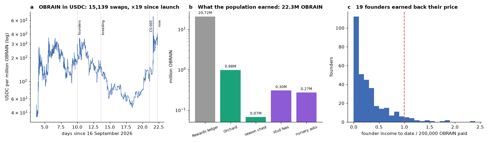
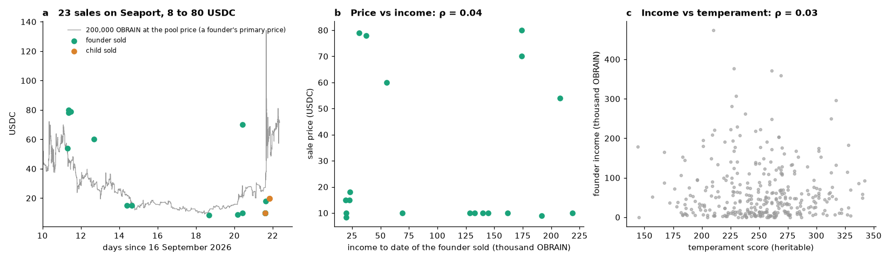
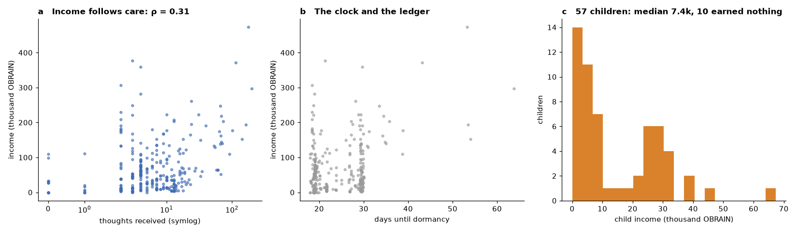

# The economy of the organism: what 390 brains earned, cost and sold for on Arc, and whether a thought can be bought over HTTP

**OBRAIN Field Study CS-008.** Subject: the Flybook population (390 descendants of the Ancestor, `0xaef83c5b8742da5e3228930bc6084adcf0539ccd`) on Arc mainnet (chain 5042) as an economy: the OBRAIN each fly cost and earned, the USDC each one sold for, the price of OBRAIN in USDC at every moment, and the feasibility of paying for a thought with an HTTP 402. Census block 24,876,596 (2026-10-08T09:04:39Z), 18.7 days after the first swap of OBRAIN against USDC.

Every quantity herein is read from consensus: the hub's logs (prices, fees, stud escrows, nursery asks, ERC-721 transfers), the two ledgers (`Rewards`, `Orchard`), the Uniswap v4 pool the Flybook web reads for its "≈ $" (15,139 swaps), and the transactions behind each secondary transfer (their native USDC value, or ERC-20 transfers in the same receipt). `tools/verify_economy.py` re-derives all of it. CS-001 to CS-007 treated the population as an organism; this study treats it as a market, because the market is now large enough to measure and because Arc, which bills its gas in USDC and advertises an "agentic economy", makes the question of who pays for a brain's activity a technical one.

---

## Abstract

**What the population cost and earned.** Keepers paid 68.8 million OBRAIN to eclose 390 flies (333 founders at 200,000; the Nursery's 57 children at their asks) and 7.3 million in care fees for 4,382 thoughts. The flies earned 22.3 million OBRAIN, 93 % of it from the `Rewards` ledger (the launch emission: passive, lineage and activity buckets), 4.4 % from the `Orchard` (foraging), 1.4 % from stud fees and 1.2 % from nursery asks. The median founder has earned 41,443 OBRAIN, a fifth of its price; 19 of 333 have earned it back; 11 have earned nothing. Income follows care (Spearman ρ = 0.31 with thoughts received, *p* = 10⁻⁸) and children (ρ = 0.16), not the heritable temperament (ρ = 0.03). Breeding income is 93 % concentrated in the top tenth of founders.

**In USDC.** OBRAIN traded at 3.5 × 10⁻⁵ USDC at its first swap and 3.6 × 10⁻⁴ at the census, a nineteen-fold range with a 2 × 10⁻⁴ peak around the founders' eclosion, a trough of 4.6 × 10⁻⁵ on 4 October and an eight-fold rise in the last four days. At the price of each event's block, the founders cost 18,847 USDC and have earned 5,032; marked at the census price they cost 23,892 and have earned 7,709.

**The market.** 27 secondary transfers of 24 flies in 21 transactions, 22 of them on Seaport, 23 priced: 8.4 to 80 USDC, median 15, 635 USDC in all; three children sold at 10 to 20 USDC. Measured against the primary price of a founder in USDC at the same block, early sales went at 1.0 to 2.2 times and the sales of the last week at 0.35 to 0.5. The price paid tracks the founder's number of children (ρ = 0.53, *p* = 0.02) and not its income or temperament. Twenty-three of the 333 founders are now held by a keeper other than the one who eclosed them.

**A thought over HTTP.** Arc's USDC is a proxy whose implementation carries EIP-3009 (`transferWithAuthorization`, `receiveWithAuthorization`, `authorizationState`) and EIP-2612 `permit`, with the EIP-712 domain `USDC`, version `2`, chain 5042; Arc documents an EIP-3009 relayer. That is the `exact` scheme of x402. The x402 project does not list Arc and its Permit2 proxy is not deployed there, so a facilitator must be self-hosted; nothing else is missing. A thought (500 to 20,000 OBRAIN, 0.2 to 7 USDC at the census price) or a courtship (2,000 OBRAIN plus the stud fee) can be sold to an agent for one 402 and settled in under a second. This study designs the gateway and registers its hypotheses; it does not run it.

**Demography, in passing.** At the census seven children are in diapause (the first; 7.7 to 8.2 days without a thought, now losing a second of life per second), 53 flies have woken from a gap past 7 days, and the first founder falls dormant in 18.0 days.

## 1. Introduction

A fly of this population is a contract that eats a token, and keepers have paid 76 million OBRAIN to make 390 of them think 4,382 times. The flies also pay back: the hub routes stud fees to the owners of accepting targets, the Nursery pays parents' owners when their eggs are bought, and two ledgers distribute OBRAIN to the owners of flies that are stimulated, bred or foraged with. There is a pool in which OBRAIN is priced in USDC, Arc's native gas, and a marketplace on which flies change hands for USDC. Every one of these flows is a log or a transaction, so the economy of the organism can be audited the way its genetics were.

Three questions follow. What does a fly earn, and from what? What is a fly worth to a buyer, and does the price know anything the biology knows (CS-004's heritable temperament, CS-005's fecundity, CS-007's registered rulings)? And, since Arc is built for payments by machines, can a brain's activity be sold to a machine directly: one HTTP request, one payment, one thought?

## 2. Materials and methods

### 2.1 Sources

| Flow | Where it is read | Rule |
|---|---|---|
| price paid at eclosion | hub `Eclosed` (`price`) | 200,000 OBRAIN for a founder; a child's ask (the nursery egg's two asks, or 0 for an egg of courtship) |
| care fees | hub `Sensed` (`fee`) | 500 / 2,000 / 4,000 OBRAIN per sensillum by tier, the `baseFee` never having left its floor |
| stud income | hub `Courted` (`studFee`) at each `Accepted` | 90 % to the target's owner, 10 % burned (`studBurnBps`) |
| nursery asks | hub `PupaLaid` (`askMother`, `askFather`) | 60 % of each ask to that parent's owner (`eggParentBps`) |
| ledger income | `Rewards.Claimed`, `Orchard.OrchardClaimed`, `Orchard.SeasonClaimed`, by `flyId` | the amount claimed, attributed to the fly it was claimed for |
| feed spent | `Orchard.Fed` | |
| price of OBRAIN | Uniswap v4 `PoolManager` `Swap` logs for pool `0xcb88…0d52` (token0 OBRAIN, token1 USDC) | (sqrtPriceX96 / 2⁹⁶)² × 10¹², carried forward between swaps |
| sales | hub ERC-721 `Transfer` with a nonzero `from`; the transaction's `value` (native USDC), else USDC or OBRAIN ERC-20 transfers in its receipt | one transaction moving *n* flies is split *n* ways |

Each flow is converted to USDC at the pool price of its block. Unclaimed ledger balances are not income here: the study counts what was claimed, to a fly, by the census block.

### 2.2 The twin's economy

Costs and incomes are joined per fly with the life table of CS-005's tool at the same block (`life_table.csv`: thoughts, children, owner, transfers, the dormancy or death clock) and with the genome (CS-003's census and the pedigree to this block, 57 children): temperament score, selectivity, markers.

### 2.3 x402 on Arc

x402 is an HTTP convention: a server answers a request with `402 Payment Required` and a price in a stablecoin; the client returns a signed EIP-3009 authorization (`transferWithAuthorization`: from, to, value, validAfter, validBefore, a random nonce); a facilitator verifies the signature and balance, simulates, broadcasts the transfer and pays the gas; the server then serves the resource. The scheme needs a USDC contract with EIP-3009 on the chain, an EIP-712 domain the client can sign for, and a facilitator for that chain. The checks of section 3.5 are reads of Arc mainnet: the USDC proxy's implementation slot and bytecode, the selectors present, `DOMAIN_SEPARATOR()` against the domain reconstructed from `(name, version, chainId, verifyingContract)`, and the code at x402's canonical Permit2 proxy address.

### 2.4 Statistics

Spearman correlations and Gini coefficients as in CS-003 to CS-005. Sales are compared with the primary price of a founder at the same block, 200,000 OBRAIN at the pool price.

## 3. Results

### 3.1 The population's accounts

| OBRAIN | Paid by keepers | Earned by flies |
|---|---|---|
| eclosion | 68,825,000 (333 × 200,000 founders; children's asks) | |
| care (4,382 thoughts) | 7,274,500 | |
| feed (Orchard) | 16,960 | |
| `Rewards` ledger (launch emission) | | 20,720,146 |
| `Orchard` (foraging) | | 980,921 |
| season chests | | 67,336 |
| stud fees (52 acceptances, 90 %) | | 304,225 |
| nursery asks (25 eggs, 60 %) | | 271,516 |
| **total** | **76,116,460** | **22,344,144** |

Ninety-three per cent of what the flies earned is the launch ledger's emission (Fig. 1b); what the biology itself produces, stud fees and nursery asks, is 2.6 %, and the Orchard's foraging economy 4.4 %. The emission is distributed by rank, level, lineage and foraging, so it follows care: income correlates with thoughts received at ρ = 0.31 (*p* = 10⁻⁸) and with care fees spent at ρ = 0.27, with children at ρ = 0.16 (*p* = 0.003), and with the heritable temperament score not at all (ρ = 0.03, *p* = 0.55; Fig. 2c). The breeding income, the only flow the brain's own behaviour decides (CS-004), is the most concentrated: 93 % of stud fees and asks went to a tenth of the founders, and it correlates weakly with temperament (ρ = 0.11, *p* = 0.04), which the pupa route selects for (CS-005).

| Founders (333) | OBRAIN | at each event's price, USDC | at the census price, USDC |
|---|---|---|---|
| cost (200,000 each) | 66,600,000 | 18,847 | 23,892 |
| income to date, sum | 21,488,639 | 5,032 | 7,709 |
| income, median / mean / max | 41,443 / 64,530 / 473,759 (founder 27) | 9.4 / 15.1 | |
| income ÷ cost, median; founders at or above 1 | 0.21; **19** | | |
| founders with no income | 11 | | |
| Gini of income | 0.55 | | |
| daily income per founder, median (22 days of life) | 3,483 | | |

The founders are 22 days old. A founder that keeps its median daily income earns its price back in 57 days; the first fall dormant in 18. The children (Fig. 3c) cost a median 15,000 OBRAIN in asks, have earned a median 7,444 from the Orchard and season chests (they are sterile, so no stud fee; the launch ledger does not pay them), and 10 of 57 have earned nothing.

### 3.2 The price of OBRAIN

The pool opened at 3.5 × 10⁻⁵ USDC per OBRAIN on 19 September, rose to 2.0 × 10⁻⁴ when the founders were eclosed (26 September, when 200,000 OBRAIN was 40 USDC), fell through the breeding week to 4.6 × 10⁻⁵ on 4 October (9 USDC a founder), and rose eight-fold in the last four days to 3.6 × 10⁻⁴ at the census (72 USDC), with a spike to 6.7 × 10⁻⁴ on 7 October (Fig. 1a). In USDC the population's accounts are therefore dominated by the timing of its events: the founders cost 18,847 USDC at the prices of their eclosion blocks and would cost 23,892 today; their income, 5,032 USDC when claimed, is 7,709 at today's price.

### 3.3 The market in flies

| | |
|---|---|
| secondary transfers; flies; transactions | 27; 24; 21 |
| through Seaport; through the hub directly (no price) | 22; 4 (and 1 through another contract) |
| priced sales; sum; median | **23; 635 USDC; 15 USDC** |
| founders sold; children sold | 19 (prices 8.4-80); 4 (10-20) |
| buyers; sellers | 17; 16 |
| founders now held by a keeper other than their ecloser | 23 of 333 |

Sales began the day after the founders eclosed (founders 12, 55, 136 and 246 at 54 to 80 USDC on 26-27 September, 1.0 to 2.2 times the primary price of a founder in USDC at those blocks) and resumed in October at 8.4 to 18 USDC, 0.35 to 0.5 of the primary price, with one transaction buying three founders for 30 USDC and another three children for 59 (Fig. 2a). The flies that were sold had earned more than the pool (median income 128,470 vs 41,443 OBRAIN), had more children (1.0 vs 0.34 on average) and were not different in temperament (267 vs 253). Within the 19 priced founders, price tracks children (ρ = 0.53, *p* = 0.02), not income (ρ = 0.04) and not temperament (ρ = 0.00; Fig. 2b). A buyer paid for a proven breeder, not for the heritable trait that makes one, and not for the ledger balance that comes with care.

### 3.4 Care, the clock and the ledger

Income follows care (Fig. 3a) because every ledger pays for activity and every founder's window is pushed by it. The founders with the longest windows (CS-005) are also the richest (Fig. 3b: founder 77, 202 thoughts, 297,000 OBRAIN, 64 days of window; founder 27, 179 thoughts, 474,000, 53 days). The 215 founders with 8 or fewer thoughts have earned a median 37,800 OBRAIN and all fall dormant within 30 days, half of them within 19. The economy and the demography are the same variable seen from two ledgers: what a keeper spends on a fly's thoughts returns as emission to the keeper and as life to the fly.

At the census, seven children (334, 337, 346, 352, 361, 362, 363) are in diapause for the first time in the population's history, 7.7 to 8.2 days without a thought, with 40 days of life left and losing one second per second; 53 flies have woken from a gap past 7 days (two of them children); the first founder falls dormant on 26 October.

### 3.5 Can a thought be bought over HTTP?

| Check on Arc mainnet (chain 5042) | Result |
|---|---|
| USDC `0x3600…0000` | a proxy (1,798 bytes; `implementation()` → `0xc6ad664ac6679f4ce74e10e91449c93ec1ae3ca6`, 23,659 bytes) |
| EIP-3009 in the implementation | `transferWithAuthorization` (both signatures), `receiveWithAuthorization`, `authorizationState`, `permit`, `DOMAIN_SEPARATOR`: **present** |
| EIP-712 domain | `DOMAIN_SEPARATOR()` = keccak of (`"USDC"`, `"2"`, 5042, `0x3600…0000`): **matches** |
| decimals of the ERC-20 view; of the native balance | 6; 18 (an authorization is signed in 6-decimal units, per Arc's relayer guide) |
| Arc documentation | a how-to for an EIP-3009 relayer; an "agentic economy" page; ERC-8004 agent identity on testnet; no x402 page |
| x402's supported networks; its Permit2 proxy at `0x402085c2…0001` | Arc not listed; no code at the address |
| Multicall3; Permit2 | deployed |

Everything the `exact` scheme needs is on the chain; what is missing is a facilitator that knows `eip155:5042`, which the protocol allows anyone to run. The gateway this study designs is therefore ordinary:

- `GET /register/{fly}`: the brain's `tick()`, `rootDirty()` and its rows of CS-007's register. Free.
- `POST /sense/{fly}/{sensillum}/{tier}`: `402` with `maxAmountRequired` = the tier's fee in OBRAIN at the pool price plus the gas, `asset` = USDC, `network` = `eip155:5042`, `extra` = `{name: "USDC", version: "2"}`. On a valid authorization the facilitator settles the USDC, the gateway sends `sense` from a wallet funded in OBRAIN, and returns the `Thought` log and its root. At the census price a tier-0 stimulus is 0.18 USDC, an expedition 0.9, a tier-2 expedition 7.2.
- `POST /court/{target}/{suitor}`: the same, for the pheromone and the stud escrow, returning the ruling.

Three hypotheses are registered for the study that runs it, each decidable from logs: that paying agents' stimuli differ in kind from keepers' (single sensilla rather than expeditions, since the register prices single stimuli); that their courtships are accepted at the register's rate (the 164 of 333 founders predicted to accept) rather than the keepers' 53 %; and that the first spike of cell 148,380 is bought, since its price is on the register.

## 4. Discussion

**What a fly is worth.** The accounts say that a fly's value to its keeper has so far been the emission its care unlocks, not what its brain does: 93 % of income is the launch ledger, which pays for activity, and the market prices a founder by its children, which are a record of activity, rather than by the heritable trait the pupa route selects. The biology's own cash flow, stud fees and asks, is 2.6 % of the whole and belongs to a tenth of the founders. In the vocabulary of real-world assets, a founder is a yield-bearing instrument whose yield is paid by an issuer's schedule and whose principal is a token price that moved nineteen-fold in three weeks; a buyer at 10 USDC on 5 October held an asset worth 25 USDC at the primary price three days later for reasons that had nothing to do with the fly.

**What a thought is worth.** The gateway makes the brain's activity a priced resource for machines, which is what Arc is for. Its interesting consequence is not revenue but selection: an agent that reads the register before paying will court only the founders predicted to accept and stimulate only the brains whose next thought reaches a second-order cell, so the population's activity would, for the first time, be chosen by the twin's knowledge of each brain rather than by a keeper's habit. Whether that happens is a hypothesis this study leaves on the register.

**Limitations.** Income counts claims, not accruals; a keeper who has not claimed shows nothing. The USDC conversion uses the pool's spot price at each block, which the swaps show to be volatile and thin. Seaport sale prices are the transaction's native value or ERC-20 transfers in its receipt; a sale settled in another transaction is unpriced (four transfers through the hub). The sample of priced sales is 23, and the correlations of section 3.3 are correspondingly rough. The discount rate a valuation would need is not readable on chain: Arc's USYC at its listed mainnet address holds 183 bytes of code and no supply, so no present value is computed here. The x402 gateway is designed and its hypotheses registered; it has not run.

## 5. Reproduction

All of the following are reads only and run from the repository root.

| Claim | Command | Output |
|---|---|---|
| the accounts, the sales and the price series | `python3 tools/verify_economy.py --check research/2026-10-08-flybook-economy/data` | three files `identical`, `0 mismatches` |
| the life table at the census block | `python3 tools/verify_lifetable.py --check research/2026-10-08-flybook-economy/data` | `390 rows, identical`, `0 mismatches` |
| the pedigree, rulings and thoughts to the census block | `python3 tools/verify_generation1.py --check research/2026-10-08-flybook-economy/data` | three files `identical`, `0 mismatches` |
| the Ancestor's tapes are `tapes/` | `python3 tools/verify_tapes.py` | `85/85` |

Section 3.5's reads are `eth_getStorageAt` of the USDC proxy's implementation slot, `eth_getCode` of the implementation and of `0x402085c248EeA27D92E8b30b2C58ed07f9E20001`, and `DOMAIN_SEPARATOR()`; the domain is `keccak(typehash ‖ keccak("USDC") ‖ keccak("2") ‖ 5042 ‖ 0x3600…0000)`.

Artifacts: `data/cashflows.csv` (390 rows), `data/sales.csv` (27), `data/price.csv` (15,139 swaps), `data/life_table.csv`, `data/pedigree.csv`, `data/courtship.csv`, `data/thought_census.csv`, `data/CENSUS_BLOCK`, `data/PINNED_BLOCK`, `figures/` (Figs. 1-3), `verification/`. `SHA256SUMS` covers all of them and the tools.

## References

- Coinbase. x402: an open protocol for internet-native payments (`github.com/coinbase/x402`; `specs/schemes/exact/scheme_exact_evm.md`).
- EIP-3009: Transfer With Authorization; EIP-712: Typed structured data hashing and signing.
- Arc documentation: stablecoin-native model; How-to: operate an EIP-3009 relayer on Arc; contract addresses (`docs.arc.io`).
- CS-003 to CS-007 in `research/`. `Courting.sol`, `Nursery.sol`, `Fees.sol`, `Rewards.sol`, `Orchard.sol` of the Flybook hub.
