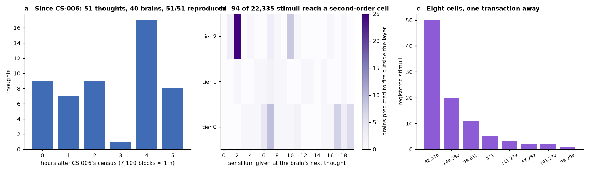
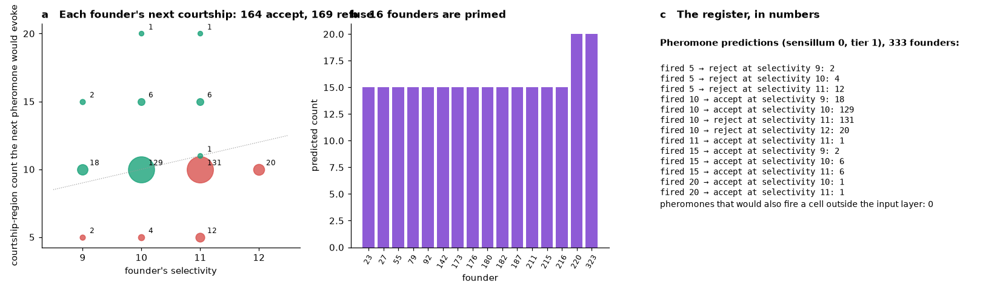
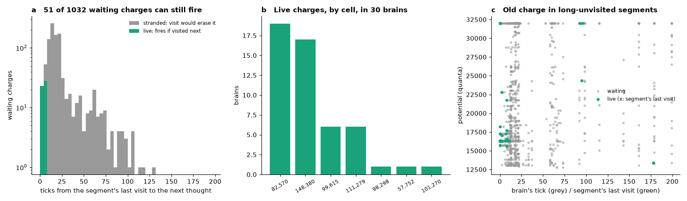

# Registered before the fact: what each of 386 brains does at its next thought, the ruling of every founder's next courtship, and which of 1,032 waiting charges can still fire

**OBRAIN Field Study CS-007.** Subject: the 386 Flybook descendants of the Ancestor (`0xaef83c5b8742da5e3228930bc6084adcf0539ccd`) on Arc mainnet (chain 5042), at block 24,700,042 (2026-10-07T08:11:39Z). This study is not a census of what happened. It is a register of what will happen, computed by the twin of CS-006 from each brain's state at that block, hashed and published before any of it could be tested, together with the only test available at the time of writing: the 51 thoughts the population had between CS-006's census and the registration block, none of which the twin had seen when it was proven.

Every quantity herein is computed by `tools/vclone.py` from reads of consensus (genomes, input words, the brains' `Thought` logs) to block 24,700,042, by `tools/predict_next.py`, and is reproducible from the chain. The register is `data/predictions.csv` and `data/waiting.csv`; `data/PREREGISTRATION.sha256` pins them and the tool, and the commit that first published them (`b2548f0`, 2026-10-07T08:14Z) is the time stamp. From that block on, every `Thought` a keeper causes is a test of a row, and the next study will count the outcomes.

---

## Abstract

**Out of sample.** CS-006 proved the twin on 4,331 thoughts to block 24,657,020. Between that block and 24,700,042 the population had 51 more, by 40 brains (two of them, 385 and 386, born in the interval), with input words chosen by keepers who did not know the twin. The twin reproduces all 51 to the root (4,382/4,382 cumulative). One of them, founder 187's 161st thought, fired a cell outside the input layer (571, the bristle neuron of segment 0 that CS-006 identified), as the twin says it had to.

**The register.** For each of the 386 brains at its state at block 24,700,042, and for each of 57 stimuli a keeper can give in one transaction (19 sensilla at tiers 0, 1 and 2; for founders also the pheromone), the register states the attention bucket, the three segments scanned, the spike count, the courtship-region count, the cells fired outside the input layer and the keccak root the brain would commit: 22,335 rows. Ninety-four of them fire a second-order cell, in 53 brains: 82,570 by 50 stimuli (25 of them sensillum 2 at tier 2), the ventral-nerve-cord leg interneuron 148,380, which has never fired in the population's history, by 20 stimuli in 17 brains (the cheapest: founder 13, sensillum 6 at tier 0, 500 OBRAIN), the T3 neuron 99,615 by 11, cell 571 by 5, and 111,279, 57,752, 101,270 and 98,298 by 8 together.

**The next courtship of every founder.** The pheromone rows predict the ruling of each founder's next courtship whoever the suitor: 164 founders would accept and 169 refuse. Sixteen are primed (residual in column 2 from an unspent pheromone) and would fire 15 or 20, accepting at any selectivity; 147 would fire 10 and accept at selectivity 9 or 10; 151 would fire 10 and refuse at 11 or 12; 18 would fire 5 and refuse; one (a region-0 count of 11 from a cell outside the 256) accepts at 11.

**Live and stranded charge.** The brains hold 1,032 charges at or above threshold in cells outside the input layer, in 149 brains and 62 cells. The lazy decay is applied at a segment's visit for the ticks since its *previous* visit, so a charge in a segment visited long ago (or never, in an old brain) is erased at the visit that could have fired it. Of the 1,032, **51** in 30 brains fire if their segment is visited at the next thought; 981 are stranded, 677 of them in segments never visited. This corrects the reading of CS-006's 969 "waiting" charges, and CS-006 carries the correction.

## 1. Why a register

A twin that reproduces the past to the root is a strong claim about a deterministic machine, but every one of its 4,331 confirmations was of a thought already on chain when the twin was run. The clean test is the one that cannot be fitted: name the outcome, publish the name, let the world act. The Flybook makes this easy. A keeper's stimulus is one transaction with four arguments (fly, sensillum, tier, and implicitly the tick), the brain's answer is one log, and both are public. So the register names, for every brain and every single-stimulus transaction a keeper could send next, the exact log the brain will write.

Two kinds of prediction in the register are worth more than the rest. The *pheromone* rows predict the ruling of each founder's next courtship before any suitor is named, because the ruling depends on the target's brain and genome alone (CS-004, CS-005). The *second-order* rows name the stimulus that will make a cell beyond the sensory layer fire, including one, 148,380, that no brain has ever fired: a leg interneuron of the ventral nerve cord, one synapse from the sensillum-2 cell, waiting in 106 brains and reachable at the next thought in 17.

## 2. Materials and methods

### 2.1 The state at the registration block

`tools/predict_next.py` collects every `Eclosed` log (genomes) and every hub `Thought` log (input words, in tick order) to block 24,700,042 and replays each brain from the empty fold with `Clone` (CS-006, section 2.1), giving its potentials, last-active ticks, tick and root at that block. `tools/verify_clones.py --to 24700042` confirms that these states are the chain's: 4,382 thoughts, 4,382 reproduced (`data/replay.csv`).

### 2.2 The 57 stimuli

A keeper's single stimulus is `sense(fly, sensillum, tier)`, which writes charge 31, 127 or 255 into sensillum 1-19 (sensillum 0 is written only by `court`), followed by one thought on the input word `inputAgg = attention | Σ charge(s) << (6 + 9s)` with `attention = keccak(afferent ‖ tick) mod 64` (`Sensilla.inputAgg`). The tick is the brain's current count plus one, so the word, and therefore the bucket, is fixed by the stimulus alone. The register thinks each stimulus from a copy of the state and records bucket, segments, spikes, the courtship-region count (fired cells in segments 0-7, the number `Courting.resolve` compares with `9 + fidelity × 4 / 100`), the cells fired at index ≥ 256, and the root. For founders it adds the pheromone (sensillum 0 at tier 1, charge 127), the stimulus a courtship delivers.

A row is valid for the brain's *next* thought only; it records the tick it stands at (`tick_before`) and the root the brain holds (`root_before`), both readable on chain (`tick()`, `rootDirty()`), so a reader can tell whether a row is still live before a transaction is sent. An expedition (five sensilla in one thought) is not in the register; the twin computes it on request in the same way.

### 2.3 Waiting charge and its clock

`data/waiting.csv` lists, per brain, every cell at index ≥ 256 whose potential is at or above 12,800, with its segment, the two buckets that visit the segment, the potential, and `fires_if_visited_within`: the largest `dt` for which potential × table(dt) ≥ 12,800. The kernel applies table(dt) with `dt` = the current tick minus the segment's last-active tick, which is the tick of the segment's previous visit, or 0 if it has never been visited. A charge is *live* if, at the brain's next thought, that `dt` is at most `fires_if_visited_within`; otherwise it is *stranded*: the first visit will decay it below threshold.

### 2.4 The pre-registration

`data/predictions.csv`, `data/waiting.csv`, `data/REGISTERED_BLOCK` and `tools/predict_next.py` were hashed into `data/PREREGISTRATION.sha256` and committed to the public repository as `b2548f0` at 2026-10-07T08:14Z, before this text was written and before any transaction tested a row. `python3 tools/predict_next.py --check research/2026-10-08-flybook-predictions/data` regenerates the register from the chain at block 24,700,042 and diffs it.

## 3. Results

### 3.1 Out of sample: 51 thoughts the twin had not seen

| | |
|---|---|
| thoughts between blocks 24,657,021 and 24,700,042 | 51, by 40 brains, over 4.6 hours (24,661,929 to 24,694,765) |
| brains born in the interval | 2 (children 385 and 386; 386 thought three times) |
| reproduced by the twin (synapses, spiked, fired ids, root) | **51 / 51** (4,382 / 4,382 cumulative) |
| fired a cell outside the input layer | 1: founder 187, tick 161, cell 571 (segment 0; bucket 26) |

The 51 words were keepers' choices made after CS-006's census, in brains at ticks 1 to 161; the twin's prediction of each root, given the word, was correct every time (Fig. 1a). Cell 571's spike in founder 187 followed the route CS-006 described for founder 202: several spikes of cell 84 within segment 0's 0.98 leak.

### 3.2 The register of next thoughts

22,335 rows for 386 brains (Fig. 1b, c). The spike counts a single stimulus evokes are those of CS-003's transduction law, 5 to 20 in steps of five for tier 1 and above and smaller at tier 0, with the brain's residual adding or not. The rows that matter are the 94 that fire a cell outside the input layer:

| Cell (annotation) | Stimuli | Brains | Cheapest stimulus |
|---|---|---|---|
| 82,570 (optic lobe) | 50 | 43 | sensillum 2 at tier 2 for 25 of them; sensillum 10 at tier 2 for 8 |
| 148,380 (VNC leg interneuron IN14A002, left) | 20 | 17 | founder 13: sensillum 6, tier 0; 76: sensillum 3 or 15, tier 0; 16 and 34: sensillum 17, tier 0; children 368, 378, 379, 380: sensillum 17, tier 0 |
| 99,615 (optic lobe T3, right) | 11 | 6 | founder 9: sensillum 17, tier 0 |
| 571 (bristle neuron, segment 0) | 5 | 1 | founder 287, five different stimuli |
| 111,279 (lamina L1) | 3 | 3 | founders 76, 170, 171: sensilla 4, 6, 5 at tier 0 |
| 57,752; 101,270; 98,298 | 2; 2; 1 | | founder 140 (57,752), 235 (101,270), 27 (98,298) |

Cell 148,380 has never fired in 4,382 thoughts. Any of the 20 stimuli above, sent as that brain's next transaction, fires it; the register names the bucket (13 or 34), the full spike list and the root. Founder 13's row costs 500 OBRAIN.

### 3.3 The ruling of every founder's next courtship

The pheromone row of each founder (Fig. 2) gives the courtship-region count its brain will produce at its next pheromone, which decides its next courtship against its own selectivity, whoever the suitor and whenever it comes, provided no other thought intervenes (a thought spends the row):

| predicted count | at selectivity 9 | 10 | 11 | 12 | ruling |
|---|---|---|---|---|---|
| 5 | 2 | 4 | 12 | 0 | refuse |
| 10 | 18 | 129 | 131 | 20 | accept at 9-10 (147), refuse at 11-12 (151) |
| 11 | | | 1 | | accept |
| 15 | 2 | 6 | 6 | | accept (14) |
| 20 | | 1 | 1 | | accept (2) |

164 founders would accept and 169 refuse. The 16 primed founders (23, 27, 55, 79, 92, 142, 173, 176, 180, 182, 187, 211, 215, 216, 220, 323) carry a column-2 residual from an unspent pheromone and will fire 15 or 20 (20 for 220 and 323, which hold a residual in columns 2 and 3); the 18 at count 5 are founders whose next pheromone word carries attention bits of 0 to 11, too few to fire column 0. CS-006's list of 20 primed founders, read at block 24,657,020, lost 1, 75, 172 and 181 to thoughts in the interval. The one count of 11 is founder 140, whose brain adds one input-layer cell with residual charge to the usual ten.

### 3.4 Live and stranded charge

| | |
|---|---|
| charges at or above threshold outside the input layer | 1,032 in 149 brains, 62 cells |
| most held | 148,380 (106 brains), 82,570 (98), 138,434 (50), 129,131 (48), 32,034 (48), 53,343 (45) |
| in segments the brain has never visited | 677 |
| **live**: fire if the segment is visited at the next thought | **51**, in 30 brains: 82,570 (19), 148,380 (17), 99,615 (6), 111,279 (6), 98,298, 57,752, 101,270 (1 each) |
| stranded: the first visit erases them | 981 |

The clock of the lazy decay runs from the segment's previous visit (Fig. 3). A brain at tick 60 whose segment 55 has never been visited holds 148,380 at 16,256 or 32,000, but its first visit applies table(61), which is zero to Q16 precision; the charge is gone and the segment's clock restarts. The 51 live charges are in young brains (segments at `dt` ≤ 6 at the next thought) or in brains whose segment was visited within the last few thoughts and recharged since. CS-006 counted 969 waiting charges at block 24,657,020 and described them as realisable at 1/32 per thought; that was true only of the few with a recent visit, and CS-006 now says so.

What follows for the population: a second-order spike needs a driver spike and a visit within four to six ticks *of the previous visit*, not of the driver. In an old brain the way to fire 82,570 or 148,380 is therefore two visits close together, the first to reset the segment's clock (and lose what was there), the second, after a fresh spike of 247, to fire. Both visits are attention buckets, 2 in 64 each, unless the keeper chooses the words; the register gives the one-step choices and the twin gives the two-step ones on request.

## 4. Discussion

**What this study is.** A pre-registration. Its content is a table that any transaction on the Flybook can falsify, published with its hash before the first such transaction. Its only result so far is the out-of-sample one: 51 thoughts chosen by others after the twin was proven, 51 reproduced. The rest is a promise with a time stamp.

**What would falsify it.** Any brain whose next `Thought` log, for one of the 57 registered stimuli, shows a different spike count or a different root than its row. Any founder whose next courtship is ruled against its pheromone row. Any of the 20 named stimuli for 148,380 that does not fire it. Since the kernel is deterministic and the twin exact, a miss would mean a difference between the deployed bytecode and the published source, or a state change outside `think` (an upgrade of `Connectome` or the `Holotype`); the register is therefore also a watch on the contracts.

**What to do with it.** The cheapest decisive experiment is founder 13, sensillum 6, tier 0: the register says bucket 13, segments 0, 34 and 55, and the first spike of a ventral-nerve-cord leg interneuron in the lineage's history, with the root the brain will commit. The register also names, for every founder, whether its next suitor will be accepted; a keeper who courts one of the 151 founders predicted to refuse at count 10 is paying 2,000 OBRAIN for a rejection the twin already wrote down. The allele test of CS-006 (founders 60 and 131, whose locus-0 allele bends the 247 → 82,570 synapse to 12,240) is not in the register, because at their state no single stimulus visits segment 31 while a charge is live; it needs two transactions in close succession, which the twin can compose when a keeper is ready.

**Limitations.** Rows are spent by any thought, including the keeper's own expeditions, and the population thinks about a hundred times a day; readers must check `tick()` against `tick_before` before relying on a row. The register covers single stimuli and the pheromone, not expeditions. The time stamp is a git commit on a public repository, which is weaker than an on-chain commitment; the next study may anchor the hash on chain.

## 5. Reproduction

All of the following are reads only and run from the repository root.

| Claim | Command | Output |
|---|---|---|
| the register is what the twin computes at block 24,700,042 | `python3 tools/predict_next.py --check research/2026-10-08-flybook-predictions/data` | `predictions.csv: 22335 rows, identical`, `waiting.csv: 1032 rows, identical`, `0 mismatches` |
| every thought to block 24,700,042 reproduced (4,382/4,382) | `python3 tools/verify_clones.py --check research/2026-10-08-flybook-predictions/data` | `replay.csv: 4382 rows, identical`, `0 mismatches` |
| the pre-registration hashes | `sha256sum -c research/2026-10-08-flybook-predictions/data/PREREGISTRATION.sha256` | `OK` × 4 |
| the Ancestor's tapes are `tapes/` | `python3 tools/verify_tapes.py` | `85/85` |

Artifacts: `data/predictions.csv` (22,335 rows: fly, generation, tick and root before, sensillum, tier, input word, attention, segments, spiked, courtship-region count, cells outside the input layer, root), `data/waiting.csv` (1,032 rows), `data/replay.csv` (4,382 rows to the registration block), `data/REGISTERED_BLOCK`, `data/PREREGISTRATION.sha256`, `figures/` (Figs. 1-3), `verification/`. `SHA256SUMS` covers all of them and the tools.

## References

- CS-006 (the twin, `tools/vclone.py`), CS-005 (the priming law), CS-004 (the ruling), CS-003 (the transduction law) in `research/`. `Connectome.sol`, `Sensilla.sol`, `Courting.sol` of the Flybook hub.
