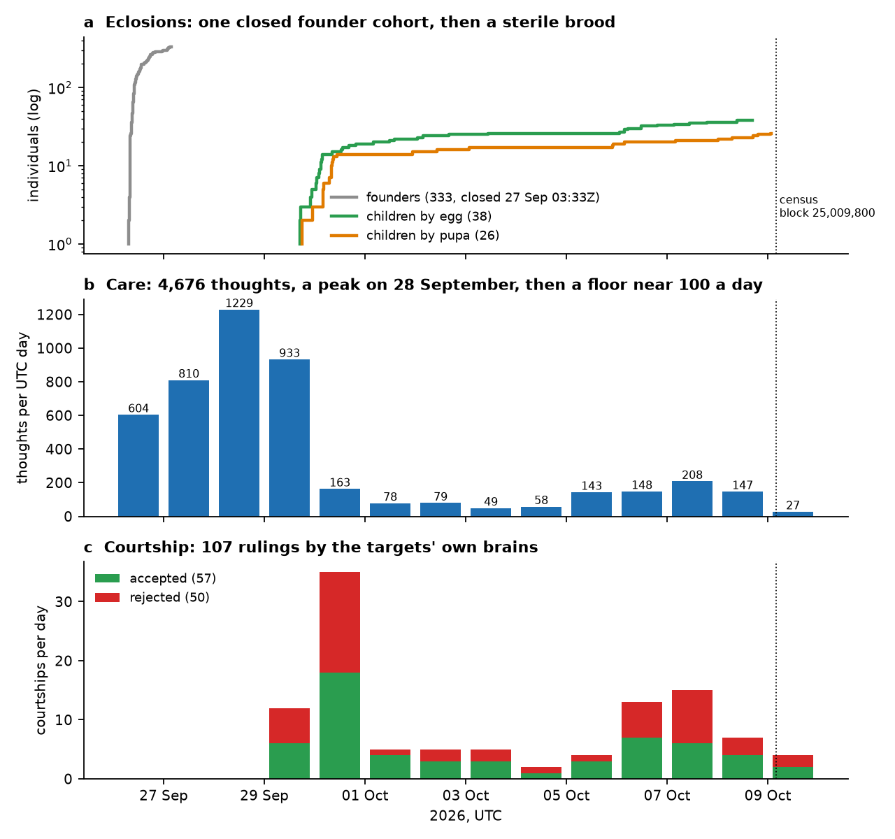
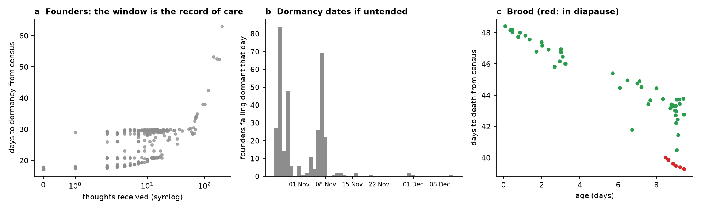
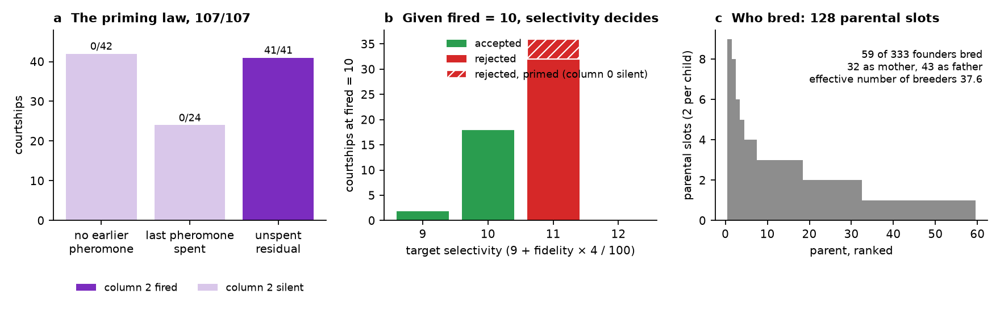
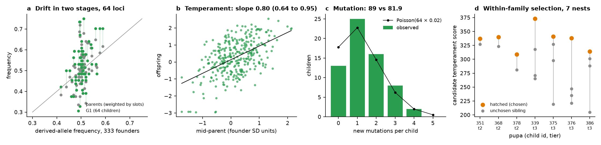
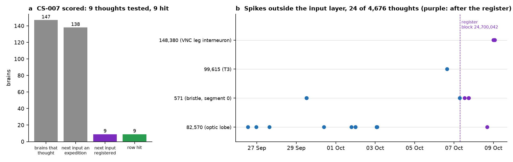

# Thirteen days of a population dealt by consensus: the demography, mating system and inheritance of 397 *Drosophila* of the obrain connectome, and what a population biology on a public ledger is for

**Series:** OBRAIN field studies, CS-009. **Chain:** Arc mainnet (chain ID 5042), read through `https://rpc.mainnet.arc.io`. **Window:** blocks 22,703,390 to 25,009,800 (the Flybook hub's deployment, 2026-09-25T14:40Z, to the census, 2026-10-09T03:51Z; 13.55 days). **State pinned at** block 25,009,800. **Previous:** CS-008 (the economy, census block 24,876,596). **Tools:** `tools/verify_flybook.py`, `tools/verify_generation1.py`, `tools/verify_lifetable.py`, `tools/verify_clones.py`, `tools/predict_next.py`, and, new, `tools/score_register.py`.

## Abstract

This study re-derives the Flybook's whole record, from the hub's deployment to a census 13.55 days later, and re-tests on it every regularity the seven windowed studies found. The founders are 12.0 to 12.9 days old; no individual has died or fallen dormant; nothing here is projected to a date the chain has not reached.

**The record.** 397 individuals (333 founders, 64 children: 38 by egg, 26 by pupa), 4,676 thoughts by 185 keepers, 107 courtships (57 accepted), 69 secondary transfers. From the chain's logs and state as served by one RPC endpoint: every genotype replays from its seed (333/333, 64/64), every ruling is `fired ≥ selectivity` of the target's own brain and genome (107/107), every pupa pick is its tier's (26/26), every clock folds from its fly's logs (397/397), and the twin reproduces every thought to the root (4,676/4,676). These are checks of contract identities and are reported as counts, not tests.

**Demography.** 390 alive, 7 brood in diapause, 0 dead, 0 dormant. The founders' contracted windows close 17.2 to 63.0 days after the census (first on 26 October; 318 of 333 within 30 days if untended), and the window is the record of paid care (ρ = 0.68). The brood die 39.3 to 48.4 days out, the first on 17 November.

**The mating system.** The priming law holds in 107/107: column 2 fires if and only if an unspent residual is present (41/41 against 0/66). The count then rules: at `fired = 10` selectivity decides 56/56; 14 unprimed courtships fired 5 and were rejected whatever the genome. No assortment by genotype was detected (permutation *p* = 0.50). 59 founders have bred; the effective number of breeders is 37.6.

**Inheritance, 64 children, 4,096 loci.** Segregation 51.0 % maternal (95 % CI 49.2 to 52.8); 50.4 % of derived alleles transmitted (48.9 to 51.9); 89 mutations against 81.9 (2.17 %, CI 1.8 to 2.7); 0 untraced. Allele-frequency change decomposes exactly: founders to parents 0.0062 (random assignment of the observed family sizes predicts 0.0059, *P* = 0.39), parents to G1 0.0025 (Mendelian sampling with 2 % mutation predicts 0.0021, *P* = 0.16); temporal *F* = 0.033. Markers are redrawn (108 unlike both parents, 107.7 expected). Temperament regresses on the mid-parent at 0.80 (cluster-bootstrap 95 % CI 0.64 to 0.95; 0.76 on the 13 children since CS-005), the additive share of a deterministic genotype-to-phenotype map; one axis of five, sociability, falls below it (0.44, CI 0.10 to 0.70). The pupa route is within-family selection among sterile siblings (a differential of +61 over the unchosen candidates) with a second channel, re-arming the seed, which 6 of the 26 hatched pupae used; neither can be transmitted.

**Care.** 4,569 paid thoughts (7,542,000 OBRAIN) and 107 pheromones paid within courtships; Gini 0.63 over founders; founders that later bred had already received 23.8 paid thoughts before their first breeding event against 8.9 over the whole window for those that never bred (*p* = 10⁻⁹).

**The register of CS-007, scored.** 147 registered brains have thought; 138 received an expedition the register did not cover; 9 received a registered stimulus (all pheromones), and the 9 thoughts match the register in spike count, root and ruling. None of the 32 live charges in brains that have thought was visited (19 sit in brains that have not), so the live predictions are untested; all 30 visited charges were stranded ones and were erased as predicted. These hits confirm the twin, which already reproduces all 294 post-registration thoughts. The leg interneuron 148,380, never fired before, fired three times on 9 October in three newborn brains, by the route CS-006 described: sensillum 2 at the first thought, attention bucket 13 at the second.

**What it is for.** Section 4 asks what the organism did to the chain (5,126 distinct transactions and 27.7 billion gas, 5.9 million per thought), what the chain did to the organism (a dealt germline with a known grinding exposure, nurture priced per transaction and written into the demography, rules that a timelock can still change), and what such a population is worth to the world: not its brains (24 of 4,676 thoughts reached a cell outside the input layer) but a biology whose every datum is re-derivable, with its trust assumptions stated.

## 1. Introduction: thirteen days, eight studies, one record

The Flybook hub was deployed at block 22,703,390 (2026-09-25T14:40Z). Its first founder eclosed seventeen hours later, its last founder on 27 September, its first courtship and first child on 29 September. CS-002 to CS-008 each described a window of this history: the founding (CS-002, CS-003), the first breeding (CS-004), the second (CS-005), the brains replayed (CS-006), their next thoughts registered (CS-007), the accounts (CS-008). Each found regularities on a few days' data and left them as claims to be tested on more.

This study re-derives the whole record at one block and tests the claims on all of it. It is deliberately not a thirty-day study. The founders were given 30 days of life at eclosion and a further 30 at every thought, so the first dormancy cannot come before 26 October, and the first brood death, under the diapause rule, not before 17 November; neither has happened, and a survivorship curve of this population at thirteen days is a flat line at 1. What the record does hold, in a form no natural population offers, is a complete pedigree with no missing parent, 107 mate-choice decisions each made by a nervous system whose input, threshold and output are committed, and a care regime in which every act of nurture has a timestamp and a price.

Section 4 asks what such a population is for. The question is practical: eight studies have now been written about 397 animals whose nervous systems, in 4,676 thoughts, did almost nothing beyond their sensory layer. If the value of the preparation were in the behaviour of its brains, that would be a poor return. The claim of section 4 is that the value lies elsewhere, in the kind of biology that becomes possible when the organism is a public, deterministic record, and that this value comes with trust assumptions the earlier studies left implicit.

## 2. Materials and methods

### 2.1 The population and its organs

The organs are those of CS-004, section 2.1: the hub (`Drosophila`, `0x14b557957d378b56511785b408a21c93e79feb36`, a UUPS proxy), `Connectome`, `Pupae`, `Amber`, `Rewards`, `Orchard` and the Ancestor, whose 85 tapes are the species' wiring (`tools/verify_tapes.py`, 85/85). The hub was upgraded once in the window ("P2", block 23,384,885, which opened the Nursery and changed the life rules; CS-004), and its `Ecology` was changed at block 23,384,728; the tools model both versions. At the pinned block `paused()` is false and `upgradesRenounced()` is false: the guardian (`0xf9727f05c3ee11b630a5fab9573bd24e9c47d1d8`, an externally owned account) can still pause births, stimuli and courtships, and the timelock (`0x52533111a4419295d8c5ce5801276946b47bfe1d`, minimum delay 48 hours) can still upgrade the hub and change its parameters (`data/hub_state.txt`).

The life-history rules are those of CS-005, section 2.2: a founder is given 30 days at eclosion and `max(window, now + 30 days)` at every thought, parented egg, accepted courtship and wake, and falls *dormant*, never dead, past its window; a brood is given a fixed 90 days, loses a second of life for every second past 7 days without a thought, dies at its `deathMoment`, and is sterile. `tools/verify_lifetable.py` reproduces the clock of all 397 individuals from their logs at the pinned block under these rules, which would fail for any fly whose clock a changed constant had touched.

Randomness. A founder's genome is seeded by `keccak(blockhash(n − 1), flyId, keeper)` (`Hatchery.sol`), an egg's by `keccak(blockhash(n − 1), eggId, rootDirty)` computed in the same call as the ruling (`Courting.sol`), a pupa's by `keccak(preSeed, blockhash(laidBlock))`, the hash of the laying block, which is unknown when the laying executes and public from the next block (`Pupae.sol`). Section 4.2 discusses what each can and cannot be steered by.

### 2.2 The census and its trust assumptions

Every CSV of this study is cumulative from the hub's deployment and is produced by a tool that re-derives it from the chain:

| Tool | Re-derives | Shipped as |
|---|---|---|
| `verify_flybook.py` (CS-002) | the 333 founders: tapes, brains, genotypes from `keccak(blockhash(n − 1), flyId, keeper)` | CS-003's `founder_census.csv`, unchanged |
| `verify_generation1.py` (CS-004) | the pedigree (`Meiosis.cross` under the consensus seed), every ruling, every pupa pick, the thought census since CS-003 | `pedigree.csv`, `courtship.csv`, `thought_census.csv` |
| `verify_lifetable.py` (CS-005) | every fly's `bornAt`, `deathAt`, `lastThoughtAt`, `lastBredAt`, `thoughts`, owner, status and `deathMoment` as a fold over its own logs, diffed against `flyOf`, `deathAtOf`, `lifeOf`, `ownerOf` at the pinned block | `life_table.csv`, `PINNED_BLOCK` |
| `verify_clones.py` (CS-006) | every thought of every brain with the twin: synapses, spikes, fired cells, root | `replay.csv` |
| `score_register.py` (new) | CS-007's register against `replay.csv` and `courtship.csv` | `register_score.csv`, `courtship_score.csv`, `waiting_score.csv` |

What a reader trusts when they trust these files:

- *One endpoint.* Every log and every state read comes from `rpc.mainnet.arc.io`. The tools do not verify logs against block receipt roots nor state against a header, and do not cross-check a second endpoint; the pinned state reads need an archive-capable node. A reader who wants independence from that endpoint must run a node or repeat the runs against another.
- *Finality.* `tools/chain.py` caches only chunks more than 256 blocks below the head; that is a cache policy, not a finality argument. The runs rely on Arc's own finality, which its public description gives as commitment by a permissioned validator set and which we did not verify; every shipped verification is a `--fresh` run that reads the chain again.
- *The horizon of `--check`.* `verify_generation1.py` and `verify_clones.py` re-derive to the last block present in the shipped CSV (25,007,868), not to the census block; a row dropped from the tail would not be caught by them. The tail is covered by the life table: `verify_lifetable.py` reads every fly's `thoughts` at block 25,009,800, and the per-fly counts in `replay.csv` equal it for 397/397 (section 5 gives the one-line check).
- *The species blob.* The twin runs on `holotype.bin`, an off-chain copy of the species' configuration pinned to the on-chain `configHash`; the 4,676 matching roots validate it empirically but do not prove it byte for byte.
- *Source versus bytecode.* The Solidity cited is the published source; nothing in the tools verifies it against the deployed bytecode. The twin agrees with the chain on every path the population has exercised, and on no other.

### 2.3 Scoring the register

CS-007 named, for each of 386 brains at its tick at block 24,700,042 and for each of 57 single-transaction stimuli, the spike count, the cells fired outside the input layer and the root of its next thought (22,335 rows), and listed 1,032 charges at or above threshold outside the input layer, 51 of which could fire at the next thought ("live": the segment's last visit within `fires_if_visited_within` ticks of the next tick) and 981 of which the lazy decay would erase ("stranded"). `tools/score_register.py` takes each brain's first thought after that block from `replay.csv` (asserting that its tick is the registered tick plus one), looks up the register row with the same input word, and compares spike count, out-of-layer cells and root. A brain whose next input word is none of the 57 (an expedition of five sensilla) has spent its rows untested. A pheromone row is also the ruling of the courtship at the target's registered tick: accept iff `courtship_region ≥ selectivity`; the 9 scored courtships are therefore the same 9 thoughts as the 9 scored rows, not an additional test. A waiting charge is marked live or stranded from the register's own `replay.csv` and scored by whether the brain's next thought visited its segment and whether the cell then fired.

The register's time stamp is git commit `b2548f0`, author-dated 2026-10-07T08:14:10Z, two hours before the first post-registration thought (10:19:31Z). A git date is self-asserted; `PREREGISTRATION.sha256` covers the register's files but not the twin, whose `tools/vclone.py` (sha256 `d3b6e734…`, unchanged since commit `08f6e71`, 06:58Z the same day) is pinned only by git history. Since the register is a deterministic function of public state at block 24,700,042 and of that code, what it commits is the code, not the outcomes; a hit confirms the twin's implementation. The next register will anchor its hash in the calldata of an Arc transaction.

### 2.4 Statistics

The data are 64 children (4,096 loci), 107 rulings, 4,676 thoughts, 397 clocks and the register scores. Quantities the contracts fix (a ruling, a window, a genome) are reported as counts of identities, with no *p*-value; where a *p*-value accompanies such a count in the figures it describes the sample, not a hypothesis about nature. *p*-values are given for what the design leaves random: segregation, transmission, mutation, assortment, and the keepers' behaviour. Proportions carry Wilson 95 % intervals. About fifteen tests are reported. All but one are either far below 10⁻⁵ or far above 0.05; the exception, pupa versus egg (*p* = 0.03), would not survive a Bonferroni correction and is explained in section 3.4 by the 7 tier-2 and tier-3 choices, which are measured directly.

*Heritability.* The five temperament axes are `12 × (derived alleles among the six genes) + keccak(the six genes) mod 29`; the map from genotype to axis is deterministic, so the broad-sense heritability is 1 and the slope of offspring on mid-parent estimates the additive share. Axes are centred and scaled by the founder pool's mean and SD and pooled (320 pairs from 64 children). Because the 320 pairs are 5 correlated axes of 64 children with parents appearing up to 9 times, the interval is a cluster bootstrap over children (5,000 resamples), for the pooled slope and for each axis; the OLS standard error is also given. Three subsets (without the 7 pupae chosen at tiers 2 and 3, egg children only, the 13 children since CS-005) are reported.

*Breeders and drift.* The effective number of breeders is 1 / Σ pᵢ², with pᵢ each parent's share of the 128 parental slots (the founder-equivalents statistic of Lacy 1989; it is not the Crow–Kimura variance *N*ₑ). Allele-frequency change is decomposed into two stages, founders (333 genomes) to parental pool (each parent weighted by its slots) and parental pool to G1, as the mean over loci of the squared frequency difference. The expectation for the first stage is simulated by giving the observed family sizes to random founders (5,000 draws; its closed form under drift with *N*ᵦ breeders is the mean of p(1 − p)/*N*ᵦ); for the second, by Mendelian sampling of the actual parent pairs with 2 % mutation (5,000 draws; its closed form without mutation is Σ over children of ¼·[parents differ] / 64², averaged over loci). The temporal standardized variance is *F* = mean(Δp²) / mean(p₀(1 − p₀)) over the founder-to-G1 change (the form of Krimbas and Tsakas 1971 and Pollak 1983; Nei and Tajima's 1981 per-locus *F*c gives the same value here, 0.033), and 1/*F* is the corresponding haploid *N*ₑ with G1 taken as a full census, no sampling correction.

*Mate choice and markers.* The genetic distance between two genomes is the number of the 64 loci at which they differ (word-level; CS-004 used derived-or-not, which is also reported). Assortment is tested by permuting fathers over the 64 pairs (5,000 permutations). The marker redraw expectation for each child and marker is 1 − f(mother's value) − f(father's value) (1 − f when the parents share it), with f the founder frequency of the value.

*Care.* The 107 courtship pheromones are thoughts at zero fee and are excluded from paid care; the Gini is over all thoughts. The care-and-reproduction comparison uses paid thoughts received before the fly's first breeding event (an accepted courtship, or a pupa laid, as either parent), so that breeding cannot have caused the care; non-breeders are counted over their whole window, which makes the comparison conservative.

## 3. Results

### 3.1 The record, audited

| | at block 25,009,800 | audit |
|---|---|---|
| individuals | 397: 333 founders, 64 children (38 by egg, 26 by pupa) | genotypes 333/333 and 64/64 |
| thoughts | 4,676 by 185 keepers on 381 brains (16 never stimulated); 4,569 paid, 107 pheromones | twin 4,676/4,676 to the root; per-fly counts equal `flyOf.thoughts` 397/397 |
| courtships | 107: 57 accepted (38 eggs hatched, 19 not yet), 50 rejected, on 42 targets (one courted 11 times) | rulings 107/107; no rejection a cooldown |
| pupa hatches | 26 (19 at tier 1, 3 at tier 2, 4 at tier 3) | picks 26/26 |
| clocks, owners, statuses | 397; 71 wakes from a gap past 7 days in 70 flies; 69 transfers of 56 flies | fold 397/397 |
| life | 390 alive, 7 in diapause, 0 dead, 0 dormant | |
| addresses | 193 keepers, courters and owners, of which 49 hold code at the pinned block (48 EIP-7702 delegations, 1 deployed contract) | `addresses.csv` |

Since CS-005's census (block 24,657,020) the population added 13 children, 25 courtships and 345 thoughts; since CS-008's (24,876,596), 7 children and 115 thoughts. Fig. 1 is the whole record by UTC day.

### 3.2 Demography: two classes, one living state, a contracted schedule

The founders eclosed between 2026-09-26T07:22Z and 2026-09-27T03:33Z and are 12.0 to 12.9 days old at the census. None is dormant; the stored windows close 17.2 to 63.0 days after the census (median 20.8), the first on 2026-10-26T08:36Z, and 318 of 333 would close within 30 days if no keeper tended them again (Fig. 4b). Eleven founders have exactly the window they were born with, having never been stimulated, bred or woken. The window is the record of care by construction (each paid thought sets it to now + 30 days), so its correlation with thoughts received (ρ = 0.68; Fig. 4a) is an identity, not a finding; the finding is its shape: a floor at 17 days for the untouched and a ceiling at 63 for founder 77, stimulated 202 times.

The brood are a different class (Fig. 4c): mortal, sterile, aged 0.1 to 9.5 days, with death moments 39.3 to 48.4 days out, the first on 2026-11-17T10:23Z. Seven of them have not thought for 8.5 to 9.0 days and are in diapause, their death moment moving toward them at the midpoint rule of CS-005, section 2.2. No individual of either class has died. What this section reports is therefore not a life table (*l*ₓ = 1 at every age, *q*ₓ undefined) but the contracted schedule of dormancy and death, which the next studies will observe or see rewritten by care.

### 3.3 The mating system

**The ruling.** All 107 rulings are `fired ≥ selectivity`, with `fired` the courtship-region count of the target's own thought on the pheromone and `selectivity` `9 + fidelity × 4 / 100` of its genome. The founders' selectivities are 9 (22 founders), 10 (140), 11 (151) and 12 (20): 162 accept at a count of 10, 171 do not. (CS-007's "164 would accept, 169 refuse" counted each founder's next count, primed or not, against its selectivity; the two figures differ by priming state, not by genotype.) `fired` took four values: 5 (14 courtships), 10 (56), 15 (31) and 20 (6). Of the 57 accepted courtships, 38 eggs have hatched into children and 19 are fixed but not yet hatched; the 26 other children came by the pupa route.

**The priming law** (Fig. 2a). CS-004 found and CS-005 stated it: column 2 of the target's input layer (the stimulated column, subthreshold at the pheromone's tier) fires if and only if the target carries an unspent residual, a charge left by an earlier pheromone that did not itself fire column 2. Over 107 courtships: 0 of 42 first pheromones fired column 2, 0 of 24 that followed a spent pheromone, 41 of 41 that followed an unspent one, at 1 to 8 ticks' distance. Priming raises the count, it does not fix the ruling: the 41 primed courtships fired 15 (31), 20 (6) or 10 (4, in which column 0 stayed silent), and the 4 at a count of 10 were rejected at selectivity 11. CS-006 read the residual at the membrane (8,128 × 0.98^Δt quanta) and predicted it primes for Δt ≤ 27 ticks; the record still contains no courtship at Δt between 9 and 27, so that prediction stands untested.

**Given the count, selectivity decides** (Fig. 2b). At `fired = 10` (52 unprimed courtships and the 4 primed ones above, hatched in Fig. 2b), 20 were accepted (2 at selectivity 9, 18 at 10) and 36 rejected (all at 11), with no exception; the rule is deterministic and no *p*-value is attached to it. Genotype does not decide alone: of the 66 unprimed courtships, 14 fired 5 (column 1 only, because the pheromone word's attention bits were too few to fire column 0), 8 of them at selectivity 9 or 10, and all 14 were rejected. The ruling is a function of brain state and genome together, which is why CS-007 could register it only one thought ahead.

**No assortment.** Parents differ at a mean 48.8 of 64 loci; permuting fathers over the 64 pairs gives 48.2 (permutation *p* = 0.50). On CS-004's derived-or-not distance the figures are 31.7 against 31.5 (*p* = 0.81).

**Who bred** (Fig. 2c). 59 of 333 founders are parents: 32 as mother (the courted target), 43 as father (the suitor), 16 in both roles. Family sizes are skewed (one founder has 9 children, 27 have one; the six largest families hold 28 % of the 128 parental slots), and the effective number of breeders is 37.6. Studbooks and laboratory lines compute the same statistic from complete pedigrees; what is particular here is that the pedigree is complete by construction rather than by record-keeping, and that it describes the keepers' choices rather than a lineage's prospects, since the offspring cannot breed. The 19 unhatched eggs will change it.

### 3.4 Inheritance over 64 children

**Transmission** (Fig. 3). Over the 3,049 loci at which the parents differ and no mutation struck, 1,555 (51.0 %, 95 % CI 49.2 to 52.8) are maternal (binomial *p* = 0.28). Of the parents' 4,123 derived alleles at unmutated loci, 2,078 (50.4 %, CI 48.9 to 51.9) were transmitted (*p* = 0.62). 89 loci mutated against 81.9 expected at the designed 2 % (2.17 %, CI 1.8 to 2.7; Poisson *p* = 0.46), with the per-child counts following Poisson(1.28) (Fig. 3c). Every derived allele in every child traces to its mother, its father or a new mutation (0 untraced), as it must, since `Meiosis.cross` reproduces all 64 genomes.

**Drift in two stages** (Fig. 3a). The derived-allele frequency over the 64 loci is 0.504 in the founders, 0.515 in the parental pool (weighted by family size) and 0.529 in G1; the largest shift at one locus is 0.242, and no locus is fixed or lost. The mean squared shift from founders to G1 is 0.0081. Its first stage, founders to parental pool, is 0.0062: random assignment of the observed family sizes to founders gives 0.0059 (*P*(≥ observed) = 0.39; the closed form with 37.6 breeders gives 0.0066). Its second, parental pool to G1, is 0.0025: Mendelian sampling of the actual parent pairs with 2 % mutation gives 0.0021 (*P* = 0.16; 0.0019 without mutation). The temporal standardized variance is *F* = 0.033, a haploid *N*ₑ of about 31 for the one transition, consistent with the 37.6 breeders. In a natural population this decomposition needs an estimated pedigree and a model of family-size variance; here both stages are computed from the actual parents, and neither departs from its expectation.

**Markers are redrawn.** The four visible markers are hashes of whole eight-locus groups, so a child's marker is a fresh draw unless it inherits a group intact. Over 256 child-markers, 108 are unlike both parents against 107.7 expected from the founder frequencies of the values (*p* = 1.00). The marker names, taken from the classical *Drosophila* mutants, name nothing heritable.

**Temperament: the additive share of a deterministic map** (Fig. 3b). The slope of offspring on mid-parent, pooled over the five axes, is 0.80 (OLS SE 0.07; child-cluster bootstrap SE 0.08, 95 % CI 0.64 to 0.95). Per axis, with child-cluster 95 % intervals: boldness 0.77 (0.49 to 1.05), sociability 0.44 (0.10 to 0.70), curiosity 1.07 (0.77 to 1.38), fidelity 0.91 (0.45 to 1.32), aggression 0.95 (0.47 to 1.41). Curiosity's interval includes the pooled value; sociability's does not, and its difference from the other four axes is −0.47 (−0.82 to −0.17). The allele-count model gives every axis the same expected share, so the sociability departure is unexplained; it is one of five axes examined. Without the 7 pupae chosen at tiers 2 and 3, which were selected on the response variable, the slope is 0.78 ± 0.08 (57 children); on egg children alone 0.79 ± 0.10 (38); on the 13 children since CS-005, the only out-of-sample set, 0.76 ± 0.16. The expected value is the additive share of the axis in the founder pool, 0.725 (the variance of the 12 × allele-count term over the variance of the axis), plus the small covariance the hash residue contributes when all six genes come from one parent. CS-004's 0.83 and CS-005's 0.82 were on nested subsets of these children, not replicates.

**Within-family selection on sterile offspring** (Fig. 3d). The pupa route lets a keeper hatch the best-scoring of 1, 2 or 4 candidate genomes from one cross. It has been used 26 times: 19 at tier 1 (no choice among candidates), 3 at tier 2 and 4 at tier 3. A second channel exists at every tier: a pupa that nobody settles within about two minutes re-arms and draws a new seed, so an owner can decline to settle and redraw (section 4.2). Of the 26 hatched pupae 6 were re-armed (pupae 3, 6, 7, 8, 19 and 29; `data/hub_state.txt`), and 9 re-armed pupae have not hatched. The 6 score 280.7 against 293.2 for the 20 settled at once (Mann-Whitney *p* = 0.56), and the 4 re-armed at tier 1 score 251.8 against the egg children's 263.9 (*p* = 0.70); with six, this bounds nothing tightly, but there is no sign that re-arming was used to select. The 7 chosen candidates score 336.0 against 275.1 for the 15 unchosen siblings (Fig. 3d), a differential of +61 within families; tier-1 pupae (273.5) do not differ from egg children (263.9; Mann-Whitney *p* = 0.48), and the mid-parents of the two routes are the same (266.5 and 265.7), so the pupa-versus-egg difference (290.3 against 263.9, *p* = 0.03) is the 7 choices. The breeder's equation does not apply: the chosen are sterile, and the gene pool that will produce the next children is the same 333 founders.

### 3.5 Care

4,569 thoughts have been paid for, 7,542,000 OBRAIN in care fees, and 107 pheromones were thought at zero fee within courtships. By UTC day (Fig. 1b, all thoughts): 604, 810, 1,229 and 933 on 26 to 29 September, then 163, 78, 79, 49, 58, 143, 148, 208, 147, and 27 in the 3.9 hours of 9 October before the census. Of the 3,827 stimuli since CS-003's close, 2,487 were single sensilla, 1,233 five-sensilla expeditions and 107 pheromones; the brood, 16 % of the population, received 12 % of them.

Care is concentrated: Gini 0.63 over the 333 founders (0.62 over all 397; all thoughts), 52 % of thoughts to the top tenth, 16 individuals never stimulated, one stimulated 202 times. It precedes reproduction: the 59 founders that bred had received 23.8 paid thoughts each before their first breeding event (an accepted courtship or a pupa laid; 9 of the 59 bred only by pupa), against 8.9 over the whole window for the 274 that have not bred (*p* = 10⁻⁹); over the whole window the breeders' figure is 28.2. Whether care causes breeding or an active keeper does both is not decided by this: the comparison shows only that the breeders were the cared-for before they bred.

### 3.6 The register of CS-007, scored

CS-007 registered, at block 24,700,042 (2026-10-07), what each of 386 brains would do at its next thought under each of 57 stimuli, the ruling of each founder's next courtship, and which of 1,032 waiting charges could still fire. Since then the population has had 294 thoughts by 155 brains (8 of them born after the register), 24 courtships and, on 9 October, the first spikes of a cell the register named.

**Nine events** (Fig. 5a). 147 registered brains have thought. For 138, the next input was a five-sensilla expedition, a word the register did not cover, so their rows were spent untested. For 9, the next input was a registered stimulus, in every case the pheromone, and the 9 thoughts match their rows in spike count, cells outside the input layer (none) and root; being pheromones, they are also the 9 courtships at the targets' registered ticks, ruled as the rows said (4 accepted, 5 rejected). The other 15 courtships since the register fell on rows an intervening thought had spent. No single-sensillum stimulus of the register, in particular none of the 20 named for 148,380, was sent as a registered brain's next thought. The 9 thoughts are among the 294 post-registration thoughts the twin reproduces to the root; the register added a public precommitment, not independent evidence.

**Waiting charges.** Of the 51 charges the register called live, 32 sat in brains that have thought since and 19 in brains that have not; the next thought of none of the 32 visited its segment, so the register's live predictions are untested. Of the 981 stranded, 629 sat in brains that have thought; the next thought visited the segment of 30 of them (cells 148,380 six times, 61,079 three, 23,936, 25,504, 138,434, 39,605 and 107,821 twice, eleven others once), and all 30 were erased without firing, as the lazy-decay rule says a stranded charge must be; the other 599 sat in brains whose next thought did not visit their segment, and their rows are spent.

**The first spikes of 148,380** (Fig. 5b). The ventral-nerve-cord leg interneuron 148,380, which CS-006 found waiting in 87 brains and CS-007 in 106, and which no brain had fired in 4,382 thoughts, fired three times on 9 October: in brains 390 (block 24,982,730, 00:02Z), 396 (24,993,784, 01:36Z) and 397 (24,994,803, 01:44Z), each at its second thought, each by a different keeper, none of the three in the register because all were born after it. The route is the one CS-006 named and CS-007 priced: at the first thought an expedition that included sensillum 2 at tier 0 charged 148,380 to 16,256 quanta through cell 247's saturated synapse (threshold 12,800); at the second, an expedition whose word fell in attention bucket 13 visited segments 0, 34 and 55, and segment 55, visited for the first time with the charge still above threshold after the decay for the ticks waited, fired it. In 396 and 397 the two thoughts were 320 and 570 seconds apart; in 390, 17 hours (the decay counts ticks, not seconds). The three second thoughts used the same expedition word, sensilla 8, 1, 2, 3 and 4 at tier 0. Since the register the population also fired 82,570 once (brain 179, tick 8) and the bristle cell 571 five times (brains 76, 77, 79, 287 and 355, by two keepers, five distinct expedition words). The twin reproduced all nine. These are confirmations of a mechanism, not of a registered individual prediction.

## 4. Discussion: the organism and the chain, each way, and what it is worth

### 4.1 What was shown

Every regularity found on a window holds on the record. The ruling is `fired ≥ selectivity` (107/107); the priming law has no exception (107/107); given the count, selectivity decides (56/56 at a count of 10); inheritance is Mendelian with the designed mutation rate (64/64 genomes, 4,096 loci); both stages of drift sit within their simulated expectations; markers are redrawn and the mid-parent slope is 0.80 on the cumulative sample and 0.76 on the 13 children added since CS-005, with one axis below the rest; and a pre-registered table of 22,335 individual predictions has been tested on 9 thoughts and 30 stranded charges without a miss, which confirms the twin that produced it. Section 3.6 adds the one event of the fortnight: a cell deep in the ventral nerve cord fired for the first time in the lineage, three times, by the mechanism the twin had described before it happened, in three brains that did not exist when it was described.

### 4.2 What the organism did to the chain

A living population with on-chain brains is, to the chain, a source of transactions, and its load can be measured as exactly as its genetics. To the census the four hub event kinds counted (Eclosed, Thought, Courted, Transfer) occupied 5,126 distinct transactions and 27.7 billion gas (`data/footprint.csv`, row `total_unique`; the rows overlap, since each courtship's thought is in the Courted transaction and each eclosion's mint in the Eclosed transaction): 4,676 thoughts in 4,667 transactions and 27.4 billion gas (5.9 million per thought, the cost of scanning three segments of 166 words and folding a root), 397 eclosions and 288 million gas, 107 courtships at 6.0 million each (a thought plus a ruling), and 69 secondary transfers in 62 transactions. In the chain's native unit, which Arc denominates in USDC at 18 decimals, the fees were 572 in all, 565.7 of them for thoughts: a thought's gas, 0.12 USDC, is about two-thirds of the cheapest care fee (500 OBRAIN, 0.18 USDC at CS-008's census price of 3.6 × 10⁻⁴) and a fifth of the mean paid fee (1,651 OBRAIN). Wakes, advertisements, nursery purchases, pupa settlements and the ledgers the population also drove (Orchard, Rewards, Seasons, the Uniswap pool, the secondary market) are not in this count; CS-008 measured the ledgers: 76 million OBRAIN paid in and 22 million earned, 93 % of it launch emission rather than anything the biology produced. The organism's demand on the chain is therefore bursty and care-shaped: four days above 600 thoughts and then a floor near a hundred (Fig. 1b), with each thought a transaction that writes a membrane field and a root.

The population's transactors include code. 49 of the 193 keeper, courter and owner addresses hold code at the pinned block: 48 are EIP-7702 delegations of ordinary accounts to seven delegate contracts (38 to `0x63c0…e32b`) and 1 is a deployed contract (`data/addresses.csv`, with each delegate's full address). The deployed contract appears only as an owner; no deployed contract is recorded as an ecloser, keeper or courter, so a seed grinder would have had to be one of the delegated accounts (46 of them eclosed or courted, the two calls whose seeds can be ground; 47 hold any caller role) or a contract whose code has since gone. A delegated account executes code in its own transactions, so the exposure below applies to it in principle; these are most likely smart-account wallets rather than grinders, but the record cannot tell. That matters because the hub's randomness is exposed to code: `blockhash(n − 1)` is known to anyone executing in block n, and the hub does not restrict callers to externally owned accounts, so a contract can compute a founder's genome before calling `eclose`, or call `court()` and revert if it dislikes the egg's seed, and retry each block; the proposer of a block, in Arc's validator set (which we take to be permissioned on Arc's public description and have not verified), can also influence the hash and the ordering. The pupa route is seeded by the hash of the laying block, unknown when the purchase executes, so a contract cannot precompute it; but the outcome is public from the next block, and an owner can decline to settle and, if no one else settles within about two minutes, let the pupa re-arm (one free re-arm, then back-offs of 1, 2, … 512 hours, about eleven rerolls in 42 days, as `Pupae.sol` documents). 15 pupae have re-armed (19 `PupaRearmed` logs, `data/hub_state.txt`), 6 of the 26 that hatched and 9 that have not; the first re-arm is the default for any pupa left unsettled for two minutes, so these counts are not evidence of rerolling, and section 3.4 finds no score difference in the re-armed. Pooled segregation and mutation statistics are insensitive to selection on a target trait and do not bound it; whether any of the 49 contracts ground a seed is not determined here. A biology that pays for randomness with block hashes therefore creates an incentive to write code that games the biology; whether anyone has is not visible in this record, but if they did, the code would be.

### 4.3 What the chain did to the organism

*It dealt the germline.* A founder's genotype is `keccak(blockhash(n − 1), flyId, keeper)` and a child's is `Meiosis.cross` under a seed from the accepting block, so anyone can replay all 397 and no party can choose a draw outright; the founder pool has the statistics of its recipe, segregation is fair, mutation is 2 %, because the chain executed the recipe as written. Earlier on-chain genetics put a label on the chain rather than a biology: CryptoKitties (2017) kept its gene-mixing contract unpublished at launch and expressed no phenotype beyond an image, and its `mixGenes` took the hash of a target block reached after the gestation, with the same reroll-by-delay exposure as the Flybook's pupa route. We have not measured that system and compare only its design.

*It made the phenotype decide.* A gene bends the synapses of one segment of a real connectome, below threshold and invisibly in most thoughts (CS-003's cryptic variation), and visibly in one place: the courtship, decided by the target's own brain, from its own membrane state, against a threshold its own genome sets. Mate choice is a neurophysiological event the contract executes and commits, which is why the priming law could be found by correlation (CS-004), read at the membrane (CS-006), and predicted to the root one thought ahead (CS-007, scored here). The brains are otherwise poor: a leaky integrate-and-fire kernel over static weights, which under 60 input channels fired a cell beyond the sensory layer in 24 of 4,676 thoughts. A reader looking for cognition will not find it here.

*It priced nurture and wrote it into the demography.* A thought costs from 500 OBRAIN (one sensillum at tier 0) to 20,000 (an expedition at tier 2), a pheromone is paid within the courtship, and each paid thought adds 30 days to a founder's window. Care therefore leaves a complete record, and the population's contracted schedule is a transcript of it (section 3.2). Section 3.5 shows what keepers did with a priced nurture: concentrated it on a tenth of the population, bred from 59 founders, and bought the children's rank with the pupa route. None of that is a finding about flies; it is a finding about the keepers, measured through the flies.

*It left the rules changeable.* The hub is an upgradeable proxy whose guardian can pause births, stimuli and courtships and whose timelock (minimum delay 48 hours) can upgrade it and change `Ecology`; it did so once in the window, and at the census neither pausing nor upgrading has been renounced. The recorded history cannot be edited; the rules that produce future history can.

### 4.4 What such a population is worth to the world

**A field study whose data are proven.** Every number in CS-002 to CS-009 is a pure function of logs and state that the tools fetch and re-derive, and every CSV ships with the program that produces it and the log of that program reading the chain again. A reader who doubts the heritability can regenerate the pedigree; one who doubts the pedigree can regenerate the genomes from the block hashes. This is stronger than reproducibility as usually meant (same data, same code, same result): it is re-derivability from a source the authors do not control, subject to the trust in one RPC endpoint stated in section 2.2. It proves the data, not the inferences; the referees of this study found a wrong expectation and a mislabelled statistic in a draft whose data were already proven. The series proposes re-derivability as the standard for any biology that lives on a ledger, and `tools/` as a worked example.

**Pre-registration to the individual.** CS-007 registered, for 386 animals, what each would do next, and this study scores it. A behavioural ecologist cannot register the next decision of each animal in a population; here it could cost one transaction (CS-007's cost one git commit). The result is modest (9 thoughts, 30 charges, no live charge tested) because keepers mostly sent words the register did not cover, and because a register of a deterministic machine commits the code rather than the outcomes. The next register should cover expeditions, which are now a third of all care, and anchor its hash on the chain.

**A teaching population.** `pedigree.csv` is 64 children with both parents' genomes and the seed of every cross; `courtship.csv` is 107 decisions with the deciding neuron count and the threshold; `life_table.csv` is 397 individuals with every clock. A student can test segregation, decompose drift into who bred and Mendelian sampling against simulated expectations (section 3.4 is the worked example), estimate an additive share and compare it with the one the genotype-phenotype map implies, and read a contracted schedule, against a ground truth that is not a simulation (other people are tending the organism on a public chain) and not a natural population (every parent is known). The data are CC BY-NC-SA and the tools AGPL. What the record cannot teach is why the keepers did what they did, nor anything the design fixed: segregation is fair and mutation is 2 % because they were coded so.

**A wiring diagram kept running in public.** The Ancestor is the wiring diagram of one adult female *Drosophila*'s central nervous system, run under a leaky integrate-and-fire kernel with static weights by consensus and read-only; the 397 descendants think with it. Its recorded history cannot be edited; its hub can be paused and upgraded (section 4.3). The connectome community spent a decade producing the wiring; this is one way of keeping a copy of it in use, and of letting anyone put a stimulus into it and read the answer.

**What the two directions add up to.** The chain gave the organism a dealt germline, a deciding phenotype, a priced nurture and an exact record; the organism gave the chain a measurable load, a market, and an incentive, so far unexercised as far as this record shows, for code to be written against its randomness. The value to the world is in the record: a population whose genetics, mating and care can be audited to the individual by anyone, cheaply, for as long as the chain is served, and whose limits (sterile offspring, a poor kernel, changeable rules, grindable seeds) are as visible as its results.

### 4.5 Limitations

The window is 13.55 days; section 3.2 is a schedule, not an observation, and the first dormancy, death and entombment are for a later study. The brood are sterile, so there is no second generation, no response to selection and no evolution; the effective number of breeders describes the keepers' choices, not a lineage's prospects, and the 19 unhatched eggs will change it. The additive share is a one-generation estimate from 64 children whose axes are correlated and whose parents repeat; the pooled and per-axis intervals are cluster-bootstrapped over children, which allows for the first but only partly for the second. Most counts in section 3 are identities of deterministic code and carry no inferential weight; the random quantities are segregation, transmission, mutation, assortment and the keepers' behaviour. The register's score is small and its untested rows prove nothing either way; the live predictions are untested. The priming law's prediction for 9 ≤ Δt ≤ 27 is untested. Everything is read through one RPC endpoint without header or receipt-root verification, the twin runs on an off-chain blob pinned to `configHash`, and the Solidity is not verified against bytecode. The seed draws can be ground by contracts and influenced by proposers, and the 49 code-holding addresses were classified by their code at one block, not examined for what they did. The footprint counts four kinds of hub transaction only, not the ledgers'; fees are in the chain's native unit (USDC at 18 decimals), and the comparison with OBRAIN uses CS-008's census price, not a price of this study's. Pupa re-arming is a second selection channel, on the seed rather than among candidates, and section 3.4 can only bound it loosely. The comparison with earlier on-chain genetics is of designs, not measurements.

## 5. Reproduction

All of the following are reads only and run from the repository root.

| Claim | Command | Output at census close |
|---|---|---|
| pedigree (64/64), rulings (107/107), pupa picks (26/26), thoughts since CS-003 | `python3 tools/verify_generation1.py --check research/2026-10-09-flybook-thirteen-days/data` | three files `identical`, `0 mismatches` |
| every fly's clock, owner and status at block 25,009,800 (397/397) | `python3 tools/verify_lifetable.py --check research/2026-10-09-flybook-thirteen-days/data` | `life_table.csv: 397 rows, identical`, `0 mismatches` |
| every thought replayed by the twin (4,676/4,676) | `python3 tools/verify_clones.py --check research/2026-10-09-flybook-thirteen-days/data` | `replay.csv: 4676 rows, identical`, `0 mismatches` |
| the replay is complete to the census block | `python3 -c "import csv,collections as C;d='research/2026-10-09-flybook-thirteen-days/data/';r=C.Counter(x['fly'] for x in csv.DictReader(open(d+'replay.csv')));print(sum(r[x['fly']]==int(x['thoughts']) for x in csv.DictReader(open(d+'life_table.csv'))))"` | `397` |
| the register of CS-007 is intact and scored | `sha256sum -c research/2026-10-08-flybook-predictions/data/PREREGISTRATION.sha256` then `python3 tools/score_register.py --register research/2026-10-08-flybook-predictions/data --data research/2026-10-09-flybook-thirteen-days/data --check research/2026-10-09-flybook-thirteen-days/data` | `OK` × 4; `9/9 rows hit`, `rulings and counts hit 9/9`, `1032 (51 live)`, `32 live, 0 of them visited`, three files `identical`, `0 differences, 0 misses` |
| the hub's governance state, the code and delegates at the 193 addresses, the pupa re-arms and the footprint (with its `total_unique` row) at block 25,009,800 | `python3 tools/hub_state.py --data research/2026-10-09-flybook-thirteen-days/data --check research/2026-10-09-flybook-thirteen-days/data` | `193 addresses, 49 hold code`, `paused False`, `upgradesRenounced False`, `addresses.csv … identical`, `hub_state.txt: identical`, `footprint.csv … identical` |
| the 333 founders unchanged; wiring | `python3 tools/verify_flybook.py --check research/2026-09-27-flybook-generation-zero/data/founder_census.csv` | `85/85`, `333 rows, identical`, `0 mismatches` (the tool also prints one line per child, 64 of them, saying inheritance is checked elsewhere; they are not failures) |
| the Ancestor's tapes are `tapes/` | `python3 tools/verify_tapes.py` | `85/85` |

Every statistic of section 3 is a computation on these CSVs and CS-003's founder census, with the definitions of section 2.4. Section 3.3's priming table takes each courtship's columns from `courtship.csv` (`cells` below 256, mod 60) and the target's previous courtship from the same file; section 3.4's parental pool weights each founder's genome by its rows in `pedigree.csv` and its Mendelian expectation sums ¼ over the parent pairs that differ at each locus; section 3.5's days are the `timestamp` columns of the two thought censuses in UTC and its paid thoughts are the rows whose `senses` is not `pheromone`; section 3.6 is the three score files. The hub's governance state, the code at the 193 addresses, the `PupaRearmed` logs and the receipts behind the footprint are read by `tools/hub_state.py` at block 25,009,800.

Artifacts: `data/pedigree.csv`, `data/courtship.csv`, `data/thought_census.csv`, `data/life_table.csv`, `data/replay.csv` (cumulative to block 25,009,800, as CS-004 to CS-006 describe them), `data/register_score.csv` (147 rows), `data/courtship_score.csv` (9), `data/waiting_score.csv` (661, with `live`), `data/addresses.csv` (193), `data/hub_state.txt`, `data/footprint.csv`, `data/PINNED_BLOCK`, `figures/` (Figs. 1-5), `verification/` (the `--fresh` runs of the six tools and `verify_tapes.py`). `SHA256SUMS` covers all of them and the tools.

## References

- CS-002 to CS-008 in `research/`. `Drosophila.sol`, `Connectome.sol`, `Meiosis.sol`, `Phenotype.sol`, `Courting.sol`, `Hatchery.sol`, `Pupae.sol`, `Society.sol`, `Ecology.sol` of the Flybook hub.
- Lacy, R. C. (1989). Analysis of founder representation in pedigrees: founder equivalents and founder genome equivalents. *Zoo Biology* 8, 111–123.
- Nei, M. & Tajima, F. (1981). Genetic drift and estimation of effective population size. *Genetics* 98, 625–640.
- Krimbas, C. B. & Tsakas, S. (1971). The genetics of *Dacus oleae*. V. Changes of esterase polymorphism in a natural population following insecticide control: selection or drift? *Evolution* 25, 454–460.
- Pollak, E. (1983). A new method for estimating the effective population size from allele frequency changes. *Genetics* 104, 531–548.
- Crow, J. F. & Kimura, M. (1970). *An Introduction to Population Genetics Theory*. Harper & Row.
- Falconer, D. S. & Mackay, T. F. C. (1996). *Introduction to Quantitative Genetics*, 4th ed. Longman.
- Axiom Zen (2017). CryptoKitties: collectible and breedable cats on the Ethereum blockchain (white paper); `KittyCore` and `GeneScience` on Ethereum mainnet. The `GeneScience` source was not published at launch; `mixGenes` takes the hash of a target block.
